# circular

`circular` is a Go-based dependency monitor for codebases parsed with Tree-sitter language grammars.

It scans source files, builds a module import graph, then reports:
- circular imports
- unresolved symbol references ("hallucinations")
- unused imports
- dependency depth/fan-in/fan-out metrics
- architecture layer-rule violations
- change impact (direct + transitive importers)
- complexity hotspots

It can run once (`--once`) or watch continuously with optional terminal UI mode (`--ui`).

## Disclaimer

This codebase is 100% AI-generated. Use it at your own risk and responsibility.

## Features

- Parses `.go` and `.py` files by default, with registry-based opt-in support for `javascript`, `typescript`, `tsx`, `java`, `rust`, `html`, `css`, `gomod`, and `gosum`
- Builds and updates a module-level dependency graph
- Detects import cycles across internal modules
- Detects unresolved references using local symbols, imports, stdlib, and builtins
- Detects unused imports and appends findings to TSV output
- Supports unused-import suppression via `exclude.imports` for known false-positive paths
- Applies language-scoped resolver policies for `go`, `python`, `javascript`/`typescript`/`tsx`, `java`, and `rust`
- Disables unused-import checks for unsupported/metadata-only languages to reduce false positives
- Computes module dependency metrics (depth, fan-in, fan-out)
- Traces shortest import chain between modules (`--trace`)
- Analyzes blast radius for a file/module (`--impact`)
- Validates optional architecture layer rules
- Reports top complexity hotspots from parser heuristics
- Emits outputs:
  - Graphviz DOT (`graph.dot` by default)
  - TSV edge list (`dependencies.tsv` by default)
  - Mermaid (`graph.mmd`, optional)
  - PlantUML (`graph.puml`, optional)
  - Marker-based Markdown diagram injection (optional)
- MCP POC runtime with stdio JSON tool protocol and allowlisted operations
- Live filesystem watch mode with debounce
- Optional Bubble Tea terminal UI for live issue monitoring
- Grammar provenance manifest verification (`grammars/manifest.toml`) with `--verify-grammars`

## Runtime Modes

- default (watch mode): run initial scan, print summary, write outputs, then watch for changes
- `--once`: run initial scan + analysis once, then exit
- `--trace <from-module> <to-module>`: print shortest internal import chain, then exit
- `--impact <file-or-module>`: print direct/transitive importer impact, then exit
- `--ui`: run watch mode with Bubble Tea UI
- MCP mode: set `[mcp].enabled=true` in config to start the MCP runtime (CLI modes are disabled)
- OpenAPI conversion uses `mcp.openapi_spec_path` or `mcp.openapi_spec_url` (mutually exclusive), validates with `kin-openapi`, and applies `mcp.operation_allowlist`

## Install / Build

Requirements:
- Go `1.24+` supported
- Go `1.23` is not supported by current dependencies
- `go.mod` pins `go 1.24`

Build:

```bash
go build -o circular ./cmd/circular
```

Run tests:

```bash
go test ./...
```

## Versioning

This project follows Semantic Versioning: `MAJOR.MINOR.PATCH`.

- `PATCH`: backward-compatible bug fixes and internal improvements with no public contract change.
- `MINOR`: backward-compatible features (for example new CLI flags, additive config fields, additive output fields).
- `MAJOR`: breaking changes to CLI behavior/flags, config schema, or output formats that downstream tooling relies on.

Before a version bump/release:
- Update root `CHANGELOG.md` with user-facing changes.
- Keep docs in `docs/documentation/` aligned with released behavior.

## Quick Start

1. Review default config:

```bash
cat data/config/circular.toml
```

2. Update `watch_paths` in `data/config/circular.toml` to your target project paths if needed.

3. Run a one-time scan:

```bash
go run ./cmd/circular --once
```

4. Run in watch mode:

```bash
go run ./cmd/circular
```

5. Run in UI mode:

```bash
go run ./cmd/circular --ui
```

## MCP Quick Start

1. Enable MCP in config (`data/config/circular.toml`):

```toml
[mcp]
enabled = true
allow_mutations = true
operation_allowlist = ["scan.run", "graph.cycles", "query.modules", "query.module_details", "query.trace", "system.sync_outputs", "system.sync_config", "system.select_project", "query.trends"]
```

2. Send a request over stdio:

```bash
cat <<'JSON' | go run ./cmd/circular --config data/config/circular.toml
{"id":"1","tool":"circular","args":{"operation":"query.modules","params":{"limit":5}}}
JSON
```

See `docs/documentation/mcp.md` for the full protocol and operation list.
For multi-client usage via systemd socket activation, see `docs/documentation/mcp.md`.

## Refresh Diagrams

Run a one-time scan to refresh generated diagram artifacts and markdown injections:

```bash
go run ./cmd/circular --config data/config/circular.toml --once
```

## CLI

Flags:
- `--config` path to TOML config (default `./data/config/circular.toml`)
- default discovery fallback order:
  - `./data/config/circular.toml`
  - `./circular.toml` (deprecated legacy)
  - `./data/config/circular.example.toml`
  - `./circular.example.toml`
- `--once` run one scan and exit
- `--ui` start terminal UI mode
- `--trace` print shortest import chain from one module to another, then exit
- `--impact` analyze direct/transitive impact for a file path or module, then exit
- `--verify-grammars` verify enabled language grammar artifacts and exit
- `--include-tests` include test files in analysis (default excludes tests)
- `--verbose` enable debug logs
- `--version` print version and exit

Positional arg:
- first positional argument overrides `watch_paths` with a single path
- in trace mode, exactly two positional arguments are required (`<from> <to>`)

Version in source: `1.0.0` (`internal/ui/cli/cli.go`).

## Configuration

Primary config file is TOML.

Example (`data/config/circular.example.toml`):

```toml
version = 2

grammars_path = "./grammars"
watch_paths = ["./src"]

[grammar_verification]
enabled = true

[paths]
project_root = ""
config_dir = "data/config"
state_dir = "data/state"
cache_dir = "data/cache"
database_dir = "data/database"

[config]
active_file = "circular.toml"
includes = []

[db]
enabled = true
driver = "sqlite"
path = "history.db"
busy_timeout = "5s"
project_mode = "multi"

[projects]
active = ""
registry_file = "projects.toml"

[[projects.entries]]
name = "default"
root = "."
db_namespace = "default"
config_file = "circular.toml"

[mcp]
enabled = false
mode = "embedded"
transport = "stdio"
address = "127.0.0.1:8765"
config_path = "circular.toml"
openapi_spec_path = ""
openapi_spec_url = ""
server_name = "circular"
server_version = "1.0.0"
exposed_tool_name = ""
operation_allowlist = ["scan.run", "graph.cycles", "query.modules", "query.module_details", "query.trace", "system.sync_outputs", "system.sync_config", "system.select_project", "query.trends"]
max_response_items = 500
request_timeout = "30s"
allow_mutations = false
auto_manage_outputs = true
auto_sync_config = true

[languages]
# Optional per-language overrides. Go/Python are enabled by default.

# [languages.javascript]
# enabled = true
# extensions = [".js", ".cjs", ".mjs"]
# [languages.java]
# enabled = true
# [languages.rust]
# enabled = true

[exclude]
dirs = [".git", "node_modules", "vendor", "__pycache__"]
files = ["*.tmp", "*.log"]
# Add entries here to suppress known-safe, project-specific unresolved references.
# This is intended for per-project configs (for example MCP server deployments).
symbols = ["self", "ctx", "p", "log", "toml", "sitter", "tea", "fsnotify"]
# Add entries here to suppress noisy unused-import detections for known-safe imports.
imports = ["fmt", "sort", "strings"]

[watch]
debounce = "1s"

[output]
dot = "graph.dot"
tsv = "dependencies.tsv"
mermaid = "graph.mmd"
plantuml = "graph.puml"

[output.paths]
root = ""
diagrams_dir = "docs/diagrams"

[[output.update_markdown]]
file = "README.md"
marker = "deps-mermaid"
format = "mermaid"

[[output.update_markdown]]
file = "README.md"
marker = "deps-plantuml"
format = "plantuml"

[alerts]
beep = true
terminal = true

[architecture]
enabled = false
top_complexity = 5

[[architecture.layers]]
name = "api"
paths = ["internal/api", "cmd"]

[[architecture.layers]]
name = "core"
paths = ["internal/core", "internal/engine/graph", "internal/engine/parser", "internal/engine/resolver"]

[[architecture.rules]]
name = "api-to-core-only"
from = "api"
allow = ["core"]

[[architecture.rules]]
name = "core-self-only"
from = "core"
allow = ["core"]
```

## Outputs

- DOT graph (default `graph.dot`) for visual inspection in Graphviz tools
- TSV import edges (default `dependencies.tsv`) with columns:
  - `From`, `To`, `File`, `Line`, `Column`
- Mermaid graph (optional `graph.mmd`) using `flowchart LR`
- PlantUML graph (optional `graph.puml`) using component/package view
- Optional markdown diagram injection via `[[output.update_markdown]]` markers:
  - `<!-- circular:<marker>:start -->`
  - `<!-- circular:<marker>:end -->`
- TSV unused import rows appended when findings exist:
  - `Type`, `File`, `Language`, `Module`, `Alias`, `Item`, `Line`, `Column`, `Confidence`
- TSV architecture violation rows appended when findings exist:
  - `Type`, `Rule`, `FromModule`, `FromLayer`, `ToModule`, `ToLayer`, `File`, `Line`, `Column`
- row ordering in DOT/TSV is map-iteration based and not guaranteed stable
- DOT module labels may include metrics:
  - `d=<depth> in=<fan-in> out=<fan-out>`
  - `cx=<top-complexity-score-in-module>`

## Dependency Diagrams

Mermaid:

```mermaid
%%{init: {'theme': 'base', 'themeVariables': {'textColor': '#000000', 'primaryTextColor': '#000000', 'lineColor': '#333333'}, 'flowchart': {'nodeSpacing': 80, 'rankSpacing': 110, 'curve': 'basis'}}}%%
flowchart LR
  circular_cmd_circular["circular/cmd/circular\n(0 funcs, 1 files)\n(d=13 in=0 out=1)"]
  circular_internal_core_app["circular/internal/core/app\n(21 funcs, 2 files)\n(d=8 in=3 out=7)"]
  circular_internal_core_config["circular/internal/core/config\n(29 funcs, 3 files)\n(d=1 in=4 out=1)\n(cx=101)"]
  circular_internal_core_watcher["circular/internal/core/watcher\n(5 funcs, 1 files)\n(d=0 in=1 out=0)"]
  circular_internal_engine_graph["circular/internal/engine/graph\n(37 funcs, 5 files)\n(d=4 in=5 out=2)"]
  circular_internal_engine_parser["circular/internal/engine/parser\n(45 funcs, 12 files)\n(d=3 in=5 out=3)"]
  circular_internal_engine_parser_extractors["circular/internal/engine/parser/extractors\n(2 funcs, 1 files)\n(d=4 in=0 out=1)"]
  circular_internal_engine_parser_grammar["circular/internal/engine/parser/grammar\n(6 funcs, 2 files)\n(d=2 in=1 out=1)"]
  circular_internal_engine_parser_registry["circular/internal/engine/parser/registry\n(4 funcs, 1 files)\n(d=1 in=2 out=1)"]
  circular_internal_engine_resolver["circular/internal/engine/resolver\n(13 funcs, 7 files)\n(d=5 in=3 out=3)"]
  circular_internal_engine_resolver_drivers["circular/internal/engine/resolver/drivers\n(17 funcs, 5 files)\n(d=0 in=1 out=0)"]
  circular_internal_mcp_adapters["circular/internal/mcp/adapters\n(11 funcs, 1 files)\n(d=9 in=4 out=3)"]
  circular_internal_mcp_contracts["circular/internal/mcp/contracts\n(33 funcs, 1 files)\n(d=0 in=10 out=0)"]
  circular_internal_mcp_openapi["circular/internal/mcp/openapi\n(3 funcs, 3 files)\n(d=1 in=1 out=1)"]
  circular_internal_mcp_registry["circular/internal/mcp/registry\n(6 funcs, 1 files)\n(d=0 in=1 out=0)"]
  circular_internal_mcp_runtime["circular/internal/mcp/runtime\n(21 funcs, 5 files)\n(d=11 in=1 out=13)"]
  circular_internal_mcp_schema["circular/internal/mcp/schema\n(2 funcs, 1 files)\n(d=1 in=1 out=1)"]
  circular_internal_mcp_tools_graph["circular/internal/mcp/tools/graph\n(1 funcs, 1 files)\n(d=10 in=1 out=2)"]
  circular_internal_mcp_tools_query["circular/internal/mcp/tools/query\n(4 funcs, 1 files)\n(d=10 in=1 out=2)"]
  circular_internal_mcp_tools_scan["circular/internal/mcp/tools/scan\n(1 funcs, 1 files)\n(d=10 in=1 out=2)"]
  circular_internal_mcp_tools_system["circular/internal/mcp/tools/system\n(7 funcs, 1 files)\n(d=1 in=1 out=1)"]
  circular_internal_mcp_transport["circular/internal/mcp/transport\n(6 funcs, 1 files)\n(d=2 in=1 out=2)"]
  circular_internal_mcp_validate["circular/internal/mcp/validate\n(2 funcs, 1 files)\n(d=1 in=1 out=1)\n(cx=81)"]
  circular_internal_shared_util["circular/internal/shared/util\n(5 funcs, 1 files)\n(d=0 in=7 out=0)"]
  circular_internal_shared_version["circular/internal/shared/version\n(0 funcs, 1 files)\n(d=0 in=2 out=0)"]
  circular_internal_ui_cli["circular/internal/ui/cli\n(7 funcs, 6 files)\n(d=12 in=1 out=9)\n(cx=87)"]
  circular_internal_ui_report["circular/internal/ui/report\n(8 funcs, 3 files)\n(d=7 in=2 out=2)"]
  circular_internal_ui_report_formats["circular/internal/ui/report/formats\n(13 funcs, 5 files)\n(d=6 in=1 out=3)\n(cx=123)"]
  __external_aggregate__["External/Stdlib\n(42 modules)"]

  classDef internalNode fill:#f7fbff,stroke:#4d6480,stroke-width:1px,color:#000000;
  class circular_cmd_circular,circular_internal_core_app,circular_internal_core_config,circular_internal_core_watcher,circular_internal_engine_graph,circular_internal_engine_parser,circular_internal_engine_parser_extractors,circular_internal_engine_parser_grammar,circular_internal_engine_parser_registry,circular_internal_engine_resolver,circular_internal_engine_resolver_drivers,circular_internal_mcp_adapters,circular_internal_mcp_contracts,circular_internal_mcp_openapi,circular_internal_mcp_registry,circular_internal_mcp_runtime,circular_internal_mcp_schema,circular_internal_mcp_tools_graph,circular_internal_mcp_tools_query,circular_internal_mcp_tools_scan,circular_internal_mcp_tools_system,circular_internal_mcp_transport,circular_internal_mcp_validate,circular_internal_shared_util,circular_internal_shared_version,circular_internal_ui_cli,circular_internal_ui_report,circular_internal_ui_report_formats internalNode;
  classDef externalNode fill:#efefef,stroke:#808080,stroke-dasharray:4 3,color:#000000;
  class __external_aggregate__ externalNode;
  classDef hotspotNode stroke:#8a4f00,stroke-width:2px,color:#000000;
  class circular_internal_core_config,circular_internal_mcp_validate,circular_internal_ui_cli,circular_internal_ui_report_formats hotspotNode;

  circular_cmd_circular --> circular_internal_ui_cli
  circular_internal_core_app --> circular_internal_core_config
  circular_internal_core_app --> circular_internal_core_watcher
  circular_internal_core_app --> circular_internal_engine_graph
  circular_internal_core_app --> circular_internal_engine_parser
  circular_internal_core_app --> circular_internal_engine_resolver
  circular_internal_core_app --> circular_internal_shared_util
  circular_internal_core_app --> circular_internal_ui_report
  circular_internal_core_config --> circular_internal_shared_version
  circular_internal_engine_graph --> circular_internal_engine_parser
  circular_internal_engine_graph --> circular_internal_shared_util
  circular_internal_engine_parser --> circular_internal_engine_parser_grammar
  circular_internal_engine_parser --> circular_internal_engine_parser_registry
  circular_internal_engine_parser --> circular_internal_shared_util
  circular_internal_engine_parser_extractors --> circular_internal_engine_parser
  circular_internal_engine_parser_grammar --> circular_internal_engine_parser_registry
  circular_internal_engine_parser_registry --> circular_internal_shared_util
  circular_internal_engine_resolver --> circular_internal_engine_graph
  circular_internal_engine_resolver --> circular_internal_engine_parser
  circular_internal_engine_resolver --> circular_internal_engine_resolver_drivers
  circular_internal_mcp_adapters --> circular_internal_core_app
  circular_internal_mcp_adapters --> circular_internal_core_config
  circular_internal_mcp_adapters --> circular_internal_mcp_contracts
  circular_internal_mcp_openapi --> circular_internal_mcp_contracts
  circular_internal_mcp_runtime --> circular_internal_core_app
  circular_internal_mcp_runtime --> circular_internal_core_config
  circular_internal_mcp_runtime --> circular_internal_mcp_adapters
  circular_internal_mcp_runtime --> circular_internal_mcp_contracts
  circular_internal_mcp_runtime --> circular_internal_mcp_openapi
  circular_internal_mcp_runtime --> circular_internal_mcp_registry
  circular_internal_mcp_runtime --> circular_internal_mcp_tools_graph
  circular_internal_mcp_runtime --> circular_internal_mcp_tools_query
  circular_internal_mcp_runtime --> circular_internal_mcp_tools_scan
  circular_internal_mcp_runtime --> circular_internal_mcp_tools_system
  circular_internal_mcp_runtime --> circular_internal_mcp_transport
  circular_internal_mcp_runtime --> circular_internal_mcp_validate
  circular_internal_mcp_runtime --> circular_internal_shared_util
  circular_internal_mcp_schema --> circular_internal_mcp_contracts
  circular_internal_mcp_tools_graph --> circular_internal_mcp_adapters
  circular_internal_mcp_tools_graph --> circular_internal_mcp_contracts
  circular_internal_mcp_tools_query --> circular_internal_mcp_adapters
  circular_internal_mcp_tools_query --> circular_internal_mcp_contracts
  circular_internal_mcp_tools_scan --> circular_internal_mcp_adapters
  circular_internal_mcp_tools_scan --> circular_internal_mcp_contracts
  circular_internal_mcp_tools_system --> circular_internal_mcp_contracts
  circular_internal_mcp_transport --> circular_internal_mcp_contracts
  circular_internal_mcp_transport --> circular_internal_mcp_schema
  circular_internal_mcp_validate --> circular_internal_mcp_contracts
  circular_internal_ui_cli --> circular_internal_core_app
  circular_internal_ui_cli --> circular_internal_core_config
  circular_internal_ui_cli --> circular_internal_engine_graph
  circular_internal_ui_cli --> circular_internal_engine_parser
  circular_internal_ui_cli --> circular_internal_engine_resolver
  circular_internal_ui_cli --> circular_internal_mcp_runtime
  circular_internal_ui_cli --> circular_internal_shared_util
  circular_internal_ui_cli --> circular_internal_shared_version
  circular_internal_ui_cli --> circular_internal_ui_report
  circular_internal_ui_report --> circular_internal_engine_graph
  circular_internal_ui_report --> circular_internal_ui_report_formats
  circular_internal_ui_report_formats --> circular_internal_engine_graph
  circular_internal_ui_report_formats --> circular_internal_engine_resolver
  circular_internal_ui_report_formats --> circular_internal_shared_util
  circular_cmd_circular -->|ext:1| __external_aggregate__
  circular_internal_core_app -->|ext:12| __external_aggregate__
  circular_internal_core_config -->|ext:6| __external_aggregate__
  circular_internal_core_watcher -->|ext:8| __external_aggregate__
  circular_internal_engine_graph -->|ext:6| __external_aggregate__
  circular_internal_engine_parser -->|ext:18| __external_aggregate__
  circular_internal_engine_parser_grammar -->|ext:7| __external_aggregate__
  circular_internal_engine_parser_registry -->|ext:4| __external_aggregate__
  circular_internal_engine_resolver -->|ext:2| __external_aggregate__
  circular_internal_engine_resolver_drivers -->|ext:5| __external_aggregate__
  circular_internal_mcp_adapters -->|ext:9| __external_aggregate__
  circular_internal_mcp_contracts -->|ext:1| __external_aggregate__
  circular_internal_mcp_openapi -->|ext:10| __external_aggregate__
  circular_internal_mcp_registry -->|ext:3| __external_aggregate__
  circular_internal_mcp_runtime -->|ext:10| __external_aggregate__
  circular_internal_mcp_tools_graph -->|ext:1| __external_aggregate__
  circular_internal_mcp_tools_query -->|ext:4| __external_aggregate__
  circular_internal_mcp_tools_scan -->|ext:1| __external_aggregate__
  circular_internal_mcp_tools_system -->|ext:1| __external_aggregate__
  circular_internal_mcp_transport -->|ext:8| __external_aggregate__
  circular_internal_mcp_validate -->|ext:3| __external_aggregate__
  circular_internal_shared_util -->|ext:5| __external_aggregate__
  circular_internal_ui_cli -->|ext:17| __external_aggregate__
  circular_internal_ui_report -->|ext:6| __external_aggregate__
  circular_internal_ui_report_formats -->|ext:5| __external_aggregate__

  linkStyle 62,63,64,65,66,67,68,69,70,71,72,73,74,75,76,77,78,79,80,81,82,83,84,85,86 stroke:#777777,stroke-dasharray:4 3;

  subgraph legend_info["Legend"]
    legend_metrics["Node line 1: module\nline 2: funcs/files\n(d=depth in=fan-in out=fan-out)\n(cx=complexity hotspot score)"]
    legend_edges["Edge labels: CYCLE=import cycle, VIOLATION=architecture rule violation, ext:N=external dependency count"]
  end
  classDef legendNode fill:#fff8dc,stroke:#b8a24c,stroke-width:1px,color:#000000;
  class legend_metrics,legend_edges legendNode;
```

<!-- circular:deps-mermaid:start -->

<!-- circular:deps-mermaid:end -->

PlantUML:

```plantuml
@startuml
skinparam componentStyle rectangle
skinparam packageStyle rectangle
skinparam linetype ortho
skinparam nodesep 80
skinparam ranksep 100
left to right direction

component "circular/cmd/circular\n(0 funcs, 1 files)\n(d=13 in=0 out=1)" as circular_cmd_circular
component "circular/internal/core/app\n(21 funcs, 2 files)\n(d=8 in=3 out=7)" as circular_internal_core_app
component "circular/internal/core/config\n(29 funcs, 3 files)\n(d=1 in=4 out=1)\n(cx=101)" as circular_internal_core_config
component "circular/internal/core/watcher\n(5 funcs, 1 files)\n(d=0 in=1 out=0)" as circular_internal_core_watcher
component "circular/internal/engine/graph\n(37 funcs, 5 files)\n(d=4 in=5 out=2)" as circular_internal_engine_graph
component "circular/internal/engine/parser\n(45 funcs, 12 files)\n(d=3 in=5 out=3)" as circular_internal_engine_parser
component "circular/internal/engine/parser/extractors\n(2 funcs, 1 files)\n(d=4 in=0 out=1)" as circular_internal_engine_parser_extractors
component "circular/internal/engine/parser/grammar\n(6 funcs, 2 files)\n(d=2 in=1 out=1)" as circular_internal_engine_parser_grammar
component "circular/internal/engine/parser/registry\n(4 funcs, 1 files)\n(d=1 in=2 out=1)" as circular_internal_engine_parser_registry
component "circular/internal/engine/resolver\n(13 funcs, 7 files)\n(d=5 in=3 out=3)" as circular_internal_engine_resolver
component "circular/internal/engine/resolver/drivers\n(17 funcs, 5 files)\n(d=0 in=1 out=0)" as circular_internal_engine_resolver_drivers
component "circular/internal/mcp/adapters\n(11 funcs, 1 files)\n(d=9 in=4 out=3)" as circular_internal_mcp_adapters
component "circular/internal/mcp/contracts\n(33 funcs, 1 files)\n(d=0 in=10 out=0)" as circular_internal_mcp_contracts
component "circular/internal/mcp/openapi\n(3 funcs, 3 files)\n(d=1 in=1 out=1)" as circular_internal_mcp_openapi
component "circular/internal/mcp/registry\n(6 funcs, 1 files)\n(d=0 in=1 out=0)" as circular_internal_mcp_registry
component "circular/internal/mcp/runtime\n(21 funcs, 5 files)\n(d=11 in=1 out=13)" as circular_internal_mcp_runtime
component "circular/internal/mcp/schema\n(2 funcs, 1 files)\n(d=1 in=1 out=1)" as circular_internal_mcp_schema
component "circular/internal/mcp/tools/graph\n(1 funcs, 1 files)\n(d=10 in=1 out=2)" as circular_internal_mcp_tools_graph
component "circular/internal/mcp/tools/query\n(4 funcs, 1 files)\n(d=10 in=1 out=2)" as circular_internal_mcp_tools_query
component "circular/internal/mcp/tools/scan\n(1 funcs, 1 files)\n(d=10 in=1 out=2)" as circular_internal_mcp_tools_scan
component "circular/internal/mcp/tools/system\n(7 funcs, 1 files)\n(d=1 in=1 out=1)" as circular_internal_mcp_tools_system
component "circular/internal/mcp/transport\n(6 funcs, 1 files)\n(d=2 in=1 out=2)" as circular_internal_mcp_transport
component "circular/internal/mcp/validate\n(2 funcs, 1 files)\n(d=1 in=1 out=1)\n(cx=81)" as circular_internal_mcp_validate
component "circular/internal/shared/util\n(5 funcs, 1 files)\n(d=0 in=7 out=0)" as circular_internal_shared_util
component "circular/internal/shared/version\n(0 funcs, 1 files)\n(d=0 in=2 out=0)" as circular_internal_shared_version
component "circular/internal/ui/cli\n(7 funcs, 6 files)\n(d=12 in=1 out=9)\n(cx=87)" as circular_internal_ui_cli
component "circular/internal/ui/report\n(8 funcs, 3 files)\n(d=7 in=2 out=2)" as circular_internal_ui_report
component "circular/internal/ui/report/formats\n(13 funcs, 5 files)\n(d=6 in=1 out=3)\n(cx=123)" as circular_internal_ui_report_formats
component "External/Stdlib\n(42 modules)" as __external_aggregate__ #DDDDDD

circular_cmd_circular --> circular_internal_ui_cli
circular_internal_core_app --> circular_internal_core_config
circular_internal_core_app --> circular_internal_core_watcher
circular_internal_core_app --> circular_internal_engine_graph
circular_internal_core_app --> circular_internal_engine_parser
circular_internal_core_app --> circular_internal_engine_resolver
circular_internal_core_app --> circular_internal_shared_util
circular_internal_core_app --> circular_internal_ui_report
circular_internal_core_config --> circular_internal_shared_version
circular_internal_engine_graph --> circular_internal_engine_parser
circular_internal_engine_graph --> circular_internal_shared_util
circular_internal_engine_parser --> circular_internal_engine_parser_grammar
circular_internal_engine_parser --> circular_internal_engine_parser_registry
circular_internal_engine_parser --> circular_internal_shared_util
circular_internal_engine_parser_extractors --> circular_internal_engine_parser
circular_internal_engine_parser_grammar --> circular_internal_engine_parser_registry
circular_internal_engine_parser_registry --> circular_internal_shared_util
circular_internal_engine_resolver --> circular_internal_engine_graph
circular_internal_engine_resolver --> circular_internal_engine_parser
circular_internal_engine_resolver --> circular_internal_engine_resolver_drivers
circular_internal_mcp_adapters --> circular_internal_core_app
circular_internal_mcp_adapters --> circular_internal_core_config
circular_internal_mcp_adapters --> circular_internal_mcp_contracts
circular_internal_mcp_openapi --> circular_internal_mcp_contracts
circular_internal_mcp_runtime --> circular_internal_core_app
circular_internal_mcp_runtime --> circular_internal_core_config
circular_internal_mcp_runtime --> circular_internal_mcp_adapters
circular_internal_mcp_runtime --> circular_internal_mcp_contracts
circular_internal_mcp_runtime --> circular_internal_mcp_openapi
circular_internal_mcp_runtime --> circular_internal_mcp_registry
circular_internal_mcp_runtime --> circular_internal_mcp_tools_graph
circular_internal_mcp_runtime --> circular_internal_mcp_tools_query
circular_internal_mcp_runtime --> circular_internal_mcp_tools_scan
circular_internal_mcp_runtime --> circular_internal_mcp_tools_system
circular_internal_mcp_runtime --> circular_internal_mcp_transport
circular_internal_mcp_runtime --> circular_internal_mcp_validate
circular_internal_mcp_runtime --> circular_internal_shared_util
circular_internal_mcp_schema --> circular_internal_mcp_contracts
circular_internal_mcp_tools_graph --> circular_internal_mcp_adapters
circular_internal_mcp_tools_graph --> circular_internal_mcp_contracts
circular_internal_mcp_tools_query --> circular_internal_mcp_adapters
circular_internal_mcp_tools_query --> circular_internal_mcp_contracts
circular_internal_mcp_tools_scan --> circular_internal_mcp_adapters
circular_internal_mcp_tools_scan --> circular_internal_mcp_contracts
circular_internal_mcp_tools_system --> circular_internal_mcp_contracts
circular_internal_mcp_transport --> circular_internal_mcp_contracts
circular_internal_mcp_transport --> circular_internal_mcp_schema
circular_internal_mcp_validate --> circular_internal_mcp_contracts
circular_internal_ui_cli --> circular_internal_core_app
circular_internal_ui_cli --> circular_internal_core_config
circular_internal_ui_cli --> circular_internal_engine_graph
circular_internal_ui_cli --> circular_internal_engine_parser
circular_internal_ui_cli --> circular_internal_engine_resolver
circular_internal_ui_cli --> circular_internal_mcp_runtime
circular_internal_ui_cli --> circular_internal_shared_util
circular_internal_ui_cli --> circular_internal_shared_version
circular_internal_ui_cli --> circular_internal_ui_report
circular_internal_ui_report --> circular_internal_engine_graph
circular_internal_ui_report --> circular_internal_ui_report_formats
circular_internal_ui_report_formats --> circular_internal_engine_graph
circular_internal_ui_report_formats --> circular_internal_engine_resolver
circular_internal_ui_report_formats --> circular_internal_shared_util
circular_cmd_circular -[#777777,dashed]-> __external_aggregate__ : ext:1
circular_internal_core_app -[#777777,dashed]-> __external_aggregate__ : ext:12
circular_internal_core_config -[#777777,dashed]-> __external_aggregate__ : ext:6
circular_internal_core_watcher -[#777777,dashed]-> __external_aggregate__ : ext:8
circular_internal_engine_graph -[#777777,dashed]-> __external_aggregate__ : ext:6
circular_internal_engine_parser -[#777777,dashed]-> __external_aggregate__ : ext:18
circular_internal_engine_parser_grammar -[#777777,dashed]-> __external_aggregate__ : ext:7
circular_internal_engine_parser_registry -[#777777,dashed]-> __external_aggregate__ : ext:4
circular_internal_engine_resolver -[#777777,dashed]-> __external_aggregate__ : ext:2
circular_internal_engine_resolver_drivers -[#777777,dashed]-> __external_aggregate__ : ext:5
circular_internal_mcp_adapters -[#777777,dashed]-> __external_aggregate__ : ext:9
circular_internal_mcp_contracts -[#777777,dashed]-> __external_aggregate__ : ext:1
circular_internal_mcp_openapi -[#777777,dashed]-> __external_aggregate__ : ext:10
circular_internal_mcp_registry -[#777777,dashed]-> __external_aggregate__ : ext:3
circular_internal_mcp_runtime -[#777777,dashed]-> __external_aggregate__ : ext:10
circular_internal_mcp_tools_graph -[#777777,dashed]-> __external_aggregate__ : ext:1
circular_internal_mcp_tools_query -[#777777,dashed]-> __external_aggregate__ : ext:4
circular_internal_mcp_tools_scan -[#777777,dashed]-> __external_aggregate__ : ext:1
circular_internal_mcp_tools_system -[#777777,dashed]-> __external_aggregate__ : ext:1
circular_internal_mcp_transport -[#777777,dashed]-> __external_aggregate__ : ext:8
circular_internal_mcp_validate -[#777777,dashed]-> __external_aggregate__ : ext:3
circular_internal_shared_util -[#777777,dashed]-> __external_aggregate__ : ext:5
circular_internal_ui_cli -[#777777,dashed]-> __external_aggregate__ : ext:17
circular_internal_ui_report -[#777777,dashed]-> __external_aggregate__ : ext:6
circular_internal_ui_report_formats -[#777777,dashed]-> __external_aggregate__ : ext:5

legend right
|= Item |= Meaning |
|Node line 1|Module name|
|Node line 2|Function/export count and file count|
|d|Dependency depth|
|in|Fan-in (number of internal modules importing this module)|
|out|Fan-out (number of internal modules this module imports)|
|cx|Top complexity hotspot score in the module|
|<color:#DDDDDD>Component</color>|External module|
|ext:N|Count of external dependencies from that module (aggregated mode)|
endlegend

@enduml
```

<!-- circular:deps-plantuml:start -->

<!-- circular:deps-plantuml:end -->

## Documentation

Full documentation is in `docs/documentation/`:
- `docs/documentation/README.md`
- `docs/documentation/cli.md`
- `docs/documentation/configuration.md`
- `docs/documentation/output.md`
- `docs/documentation/architecture.md`
- `docs/documentation/packages.md`
- `docs/documentation/limitations.md`
- `docs/documentation/ai-audit.md`

AI audit reports are in `docs/reviews/`:
- `docs/reviews/performance-security-review-2026-02-12.md`

## Project Layout

- `cmd/circular/` CLI app, orchestration, TUI
- `internal/core/config/` TOML config loading
- `internal/engine/parser/` Tree-sitter parsing and extractors
- `internal/engine/parser/registry/` language registry defaults/override validation
- `internal/engine/parser/grammar/` grammar manifest loading and artifact verification
- `internal/engine/parser/extractors/` extractor wrapper constructors
- `internal/engine/graph/` dependency graph + cycle detection
- `internal/engine/resolver/` unresolved reference detection
- `internal/engine/resolver/drivers/` language-specific resolver drivers
- `internal/core/watcher/` fsnotify watch + debounce
- `internal/mcp/runtime/` MCP runtime bootstrap + project context sync
- `internal/ui/report/` DOT/TSV/Mermaid/PlantUML generators + markdown injection
- `internal/ui/report/formats/` report format generators (DOT/TSV/Mermaid/PlantUML)
