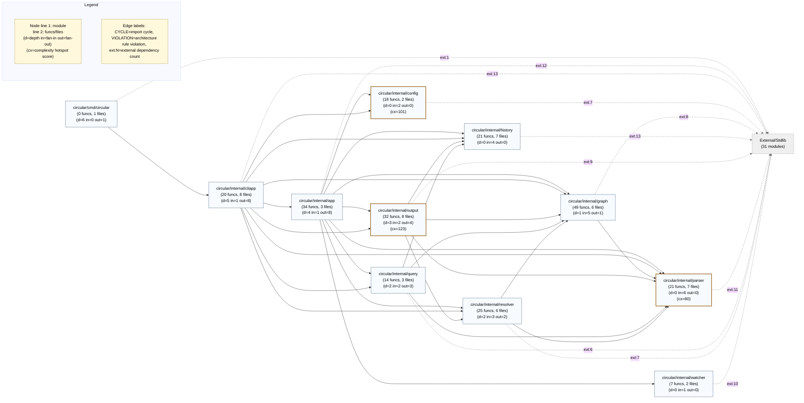
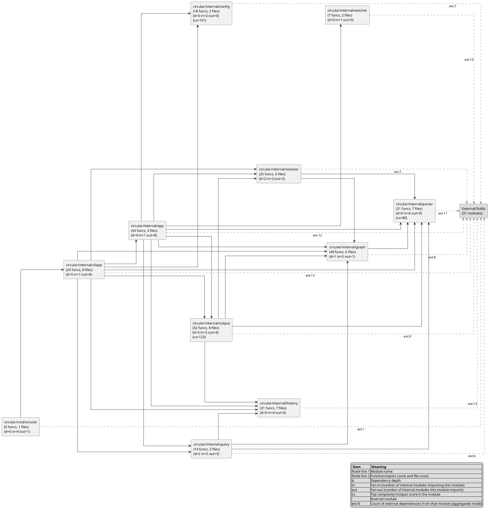

# circular

`circular` is a Go-based dependency monitor for Go and Python codebases.

It scans source files, builds a module import graph, then reports:
- circular imports
- unresolved symbol references ("hallucinations")
- unused imports
- dependency depth/fan-in/fan-out metrics
- architecture layer-rule violations
- change impact (direct + transitive importers)
- complexity hotspots

It can run once (`--once`) or watch continuously with optional terminal UI mode (`--ui`).

## Features

- Parses `.go` and `.py` files with Tree-sitter
- Builds and updates a module-level dependency graph
- Detects import cycles across internal modules
- Detects unresolved references using local symbols, imports, stdlib, and builtins
- Detects unused imports and appends findings to TSV output
- Computes module dependency metrics (depth, fan-in, fan-out)
- Traces shortest import chain between modules (`--trace`)
- Analyzes blast radius for a file/module (`--impact`)
- Validates optional architecture layer rules
- Reports top complexity hotspots from parser heuristics
- Emits outputs:
  - Graphviz DOT (`graph.dot` by default)
  - TSV edge list (`dependencies.tsv` by default)
  - Mermaid (`graph.mmd`, optional)
  - PlantUML (`graph.puml`, optional)
  - Marker-based Markdown diagram injection (optional)
- Live filesystem watch mode with debounce
- Optional Bubble Tea terminal UI for live issue monitoring

## Runtime Modes

- default (watch mode): run initial scan, print summary, write outputs, then watch for changes
- `--once`: run initial scan + analysis once, then exit
- `--trace <from-module> <to-module>`: print shortest internal import chain, then exit
- `--impact <file-or-module>`: print direct/transitive importer impact, then exit
- `--ui`: run watch mode with Bubble Tea UI

## Install / Build

Requirements:
- Go `1.24+` supported
- Go `1.23` is not supported by current dependencies
- `go.mod` pins `go 1.24`

Build:

```bash
go build -o circular ./cmd/circular
```

Run tests:

```bash
go test ./...
```

## Versioning

This project follows Semantic Versioning: `MAJOR.MINOR.PATCH`.

- `PATCH`: backward-compatible bug fixes and internal improvements with no public contract change.
- `MINOR`: backward-compatible features (for example new CLI flags, additive config fields, additive output fields).
- `MAJOR`: breaking changes to CLI behavior/flags, config schema, or output formats that downstream tooling relies on.

Before a version bump/release:
- Update root `CHANGELOG.md` with user-facing changes.
- Keep docs in `docs/documentation/` aligned with released behavior.

## Quick Start

1. Copy example config:

```bash
cp circular.example.toml circular.toml
```

2. Update `watch_paths` in `circular.toml` to your project path.

3. Run a one-time scan:

```bash
go run ./cmd/circular --once
```

4. Run in watch mode:

```bash
go run ./cmd/circular
```

5. Run in UI mode:

```bash
go run ./cmd/circular --ui
```

## CLI

Flags:
- `--config` path to TOML config (default `./circular.toml`)
- if default config is missing, it falls back to `./circular.example.toml`
- `--once` run one scan and exit
- `--ui` start terminal UI mode
- `--trace` print shortest import chain from one module to another, then exit
- `--impact` analyze direct/transitive impact for a file path or module, then exit
- `--verbose` enable debug logs
- `--version` print version and exit

Positional arg:
- first positional argument overrides `watch_paths` with a single path
- in trace mode, exactly two positional arguments are required (`<from> <to>`)

Version in source: `1.0.0` (`internal/cliapp/cli.go`).

## Configuration

Primary config file is TOML.

Example (`circular.example.toml`):

```toml
grammars_path = "./grammars"
watch_paths = ["./src"]

[exclude]
dirs = [".git", "node_modules", "vendor", "__pycache__"]
files = ["*.tmp", "*.log"]
symbols = ["self", "ctx", "p", "log", "toml", "sitter", "tea", "fsnotify"]

[watch]
debounce = "1s"

[output]
dot = "graph.dot"
tsv = "dependencies.tsv"
mermaid = "graph.mmd"
plantuml = "graph.puml"

[output.paths]
root = ""
diagrams_dir = "docs/diagrams"

[[output.update_markdown]]
file = "README.md"
marker = "deps-mermaid"
format = "mermaid"

[[output.update_markdown]]
file = "README.md"
marker = "deps-plantuml"
format = "plantuml"

[alerts]
beep = true
terminal = true

[architecture]
enabled = false
top_complexity = 5

[[architecture.layers]]
name = "api"
paths = ["internal/api", "cmd"]

[[architecture.layers]]
name = "core"
paths = ["internal/core", "internal/graph", "internal/parser", "internal/resolver"]

[[architecture.rules]]
name = "api-to-core-only"
from = "api"
allow = ["core"]

[[architecture.rules]]
name = "core-self-only"
from = "core"
allow = ["core"]
```

## Outputs

- DOT graph (default `graph.dot`) for visual inspection in Graphviz tools
- TSV import edges (default `dependencies.tsv`) with columns:
  - `From`, `To`, `File`, `Line`, `Column`
- Mermaid graph (optional `graph.mmd`) using `flowchart LR`
- PlantUML graph (optional `graph.puml`) using component/package view
- Optional markdown diagram injection via `[[output.update_markdown]]` markers:
  - `<!-- circular:<marker>:start -->`
  - `<!-- circular:<marker>:end -->`
- TSV unused import rows appended when findings exist:
  - `Type`, `File`, `Language`, `Module`, `Alias`, `Item`, `Line`, `Column`, `Confidence`
- TSV architecture violation rows appended when findings exist:
  - `Type`, `Rule`, `FromModule`, `FromLayer`, `ToModule`, `ToLayer`, `File`, `Line`, `Column`
- row ordering in DOT/TSV is map-iteration based and not guaranteed stable
- DOT module labels may include metrics:
  - `d=<depth> in=<fan-in> out=<fan-out>`
  - `cx=<top-complexity-score-in-module>`

## Dependency Diagrams

Mermaid:

<!-- circular:deps-mermaid:start -->

<!-- circular:deps-mermaid:end -->

PlantUML:

<!-- circular:deps-plantuml:start -->

<!-- circular:deps-plantuml:end -->

## Documentation

Full documentation is in `docs/documentation/`:
- `docs/documentation/README.md`
- `docs/documentation/cli.md`
- `docs/documentation/configuration.md`
- `docs/documentation/output.md`
- `docs/documentation/architecture.md`
- `docs/documentation/packages.md`
- `docs/documentation/limitations.md`
- `docs/documentation/ai-audit.md`

AI audit reports are in `docs/reviews/`:
- `docs/reviews/performance-security-review-2026-02-12.md`

## Project Layout

- `cmd/circular/` CLI app, orchestration, TUI
- `internal/config/` TOML config loading
- `internal/parser/` Tree-sitter parsing and extractors
- `internal/graph/` dependency graph + cycle detection
- `internal/resolver/` unresolved reference detection
- `internal/watcher/` fsnotify watch + debounce
- `internal/output/` DOT/TSV/Mermaid/PlantUML generators + markdown injection
