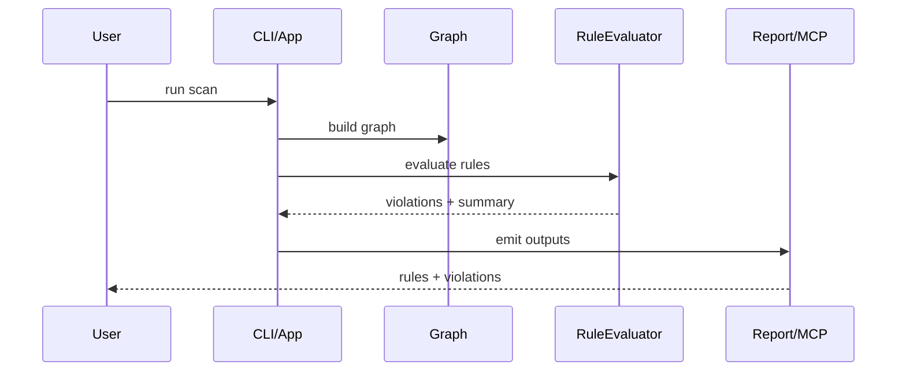
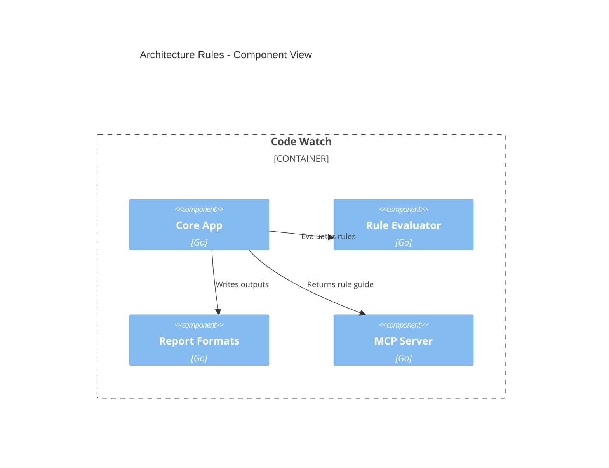
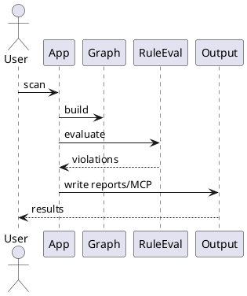
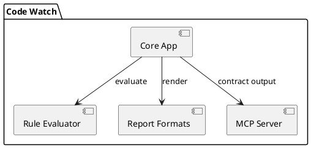

# Architecture Rules + Outputs Plan (Package Size + Import Rules)

## Overview
Goal: Add configurable architecture rules that cover package file-count limits and import constraints (including rule-specific excludes such as test files, `index.ts`, and `__init__.py`) and surface those rules + findings in CLI/UI/MCP outputs so AI tooling can use them as guidance.

Out of scope: Changing graph resolution logic or language grammars, or enforcing rules at build time.

Assumptions:
- Rules live under `architecture` in `circular.toml` with defaults applied in config loader.
- File-count rules operate on module/package boundaries as already defined by the parser/graph layer.
- Exclusions are rule-specific and extend existing global excludes without altering them.

Constraints:
- Must keep Hexagonal Architecture: rule definitions in `internal/core/ports` and orchestration in `internal/core/app` with adapters in `internal/engine`/`internal/ui`.
- Go 1.24.x compatibility.

## Inputs / Outputs
| Input | Source | Format | Validation |
| --- | --- | --- | --- |
| Architecture rules | `circular.toml` | TOML | `internal/core/config/validator.go` |
| File metadata | parser/graph | in-memory structs | non-nil module + path |
| Import edges | graph | in-memory structs | referenced module name |

| Output | Channel | Format | Consumers |
| --- | --- | --- | --- |
| Architecture rule summary | CLI/UI | text | humans + MCP |
| Rule violations | Reports | markdown/tsv/sarif | humans + integrations |
| MCP rule guide | MCP | tool response field | AI clients |

## Plan Overview
| Task ID | Goal | Owner | Depends On | Risk |
| --- | --- | --- | --- | --- |
| T1 | Define config schema for rule sets | Core | - | Medium |
| T2 | Add rule evaluation engine (package limits + import rules) | Engine | T1 | Medium |
| T3 | Wire outputs (CLI summary + markdown/tsv/sarif + MCP) | UI/MCP | T2 | Medium |
| T4 | Tests + docs | Core/UI | T1-T3 | Low |

## Tasks

- T1 Define config schema for architecture rule sets [ ]
  - Summary: Add `architecture.rules` in config to express file-count limits per module, rule-level exclusions, and import allow/deny lists.
  - Inputs/outputs:
    - Input: TOML under `architecture`
    - Output: `config.ArchitectureRules` + validation errors
  - File changes:
    - Update `internal/core/config/config.go` (new structs)
    - Update `internal/core/config/loader.go` (defaults)
    - Update `internal/core/config/validator.go` (validation)
    - Update `internal/core/ports/ports.go` (rule DTO)
  - Best practices and standards:
    - Keep DTOs in ports, not adapters.
    - Validate counts and patterns deterministically.
    - Avoid breaking existing config defaults.
  - Acceptance checks:
    - Invalid rules produce clear errors.
    - Defaults apply when rules are omitted.

- T2 Implement rule evaluation for package file-count limits + import rules [ ]
  - Summary: Compute file counts per module with rule-specific excludes (tests, `index.ts`, `__init__.py`) and evaluate allow/deny import policies.
  - Inputs/outputs:
    - Input: graph module/file/import data + rules
    - Output: `[]architecture.Violation` with location + reason
  - File changes:
    - Add `internal/engine/architecture/rules.go`
    - Add `internal/engine/architecture/evaluator.go`
    - Update `internal/engine/graph/graph.go` if new accessors are needed
  - Best practices and standards:
    - Do not pass infra-specific types into core.
    - Keep rules deterministic and order-independent.
    - Implement rule-level excludes separately from global excludes.
  - Acceptance checks:
    - Counts exclude `*_test.go`, `index.ts`, `__init__.py` when configured.
    - Import allow/deny lists match module patterns.

- T3 Wire rule outputs into CLI/UI/MCP and report formats [ ]
  - Summary: Include rule summaries in CLI, and emit violations in markdown/tsv/sarif; add an MCP output field for AI consumption.
  - Inputs/outputs:
    - Input: evaluated violations + rule config
    - Output: report sections + MCP structured payload
  - File changes:
    - Update `internal/core/app/service.go` (include violations)
    - Update `internal/core/app/presentation_service.go` (summary section)
    - Update `internal/ui/report/formats/markdown.go` (rule section)
    - Update `internal/ui/report/formats/tsv.go` (rule TSV rows)
    - Update `internal/ui/report/formats/sarif.go` (rule results)
    - Update `internal/mcp/contracts` + `internal/mcp/tools/*` (rule guide field)
  - Best practices and standards:
    - Keep output ordering stable and sorted.
    - Avoid breaking existing report schemas.
    - Ensure MCP contracts are additive.
  - Acceptance checks:
    - Rule count and violations appear in summary and reports.
    - MCP response includes a rules guide section.

- T4 Add tests + docs [ ]
  - Summary: Add unit tests for rule parsing/evaluation and document rules in `docs/documentation/` and config example.
  - Inputs/outputs:
    - Input: new rules + evaluator
    - Output: tests + docs + config example
  - File changes:
    - Add tests under `internal/engine/architecture/*_test.go`
    - Update `internal/core/config/config_test.go`
    - Update `docs/documentation/` and `circular.example.toml`
  - Best practices and standards:
    - Table-driven tests for rule cases.
    - Include edge cases for excludes and pattern matching.
    - Keep docs aligned with defaults.
  - Acceptance checks:
    - `go test ./...` passes.
    - Docs show rule examples and outputs.

## File Inventory
| File | Type | Classes (main methods) | Main functions (signature) | Purpose |
| --- | --- | --- | --- | --- |
| internal/core/config/config.go | update | ArchitectureRules | - | Config schema for rules |
| internal/core/config/loader.go | update | - | applyArchitectureRuleDefaults(cfg *Config) | Defaulting for new rules |
| internal/core/config/validator.go | update | - | validateArchitectureRules(cfg *Config) error | Validation of rules |
| internal/core/ports/ports.go | update | ArchitectureRule, ArchitectureViolation | - | Ports DTOs for rules + violations |
| internal/engine/architecture/rules.go | new | RuleSet (Parse/Normalize) | MatchModuleRule(module string) (Rule, bool) | Rule modeling + matching |
| internal/engine/architecture/evaluator.go | new | RuleEvaluator (Evaluate) | EvaluateRules(g *graph.Graph, rules RuleSet) []Violation | Rule evaluation |
| internal/core/app/service.go | update | - | EvaluateArchitectureRules(...) []Violation | Orchestrate evaluation |
| internal/core/app/presentation_service.go | update | - | PrintArchitectureRulesSummary(...) | CLI summary |
| internal/ui/report/formats/markdown.go | update | MarkdownGenerator | writeArchitectureRules(...) | Report section |
| internal/ui/report/formats/tsv.go | update | TSVGenerator | writeArchitectureRules(...) | TSV rows |
| internal/ui/report/formats/sarif.go | update | SARIFGenerator | ruleViolationResults(...) | SARIF results |
| internal/mcp/contracts/*.go | update | RuleGuide | - | MCP contracts for AI use |
| internal/mcp/tools/*/handler.go | update | - | includeRuleGuide(...) | MCP outputs |
| docs/documentation/architecture-rules.md | new | - | - | User-facing docs |
| circular.example.toml | update | - | - | Config example |

## Diagrams

### Mermaid Sequence Diagram

### Mermaid Component Diagram

### PlantUML Sequence Diagram

### PlantUML Component Diagram

## Risks and Mitigations
- Risk: Rule matching ambiguity (module naming differences). Mitigation: normalize module names and document matching rules.
- Risk: Output schema churn. Mitigation: additive fields only and versioned docs.
- Risk: Performance on large repos. Mitigation: precompute counts once per scan.

## Testing / Verification
- Unit tests for rule parsing, exclusions, and import allow/deny evaluation.
- Integration test for report outputs including rules section.
- Run `go test ./...`.

## Folder List
- docs/
- docs/plans/
- docs/documentation/
- internal/core/config/
- internal/core/ports/
- internal/core/app/
- internal/engine/architecture/
- internal/ui/report/formats/
- internal/mcp/
