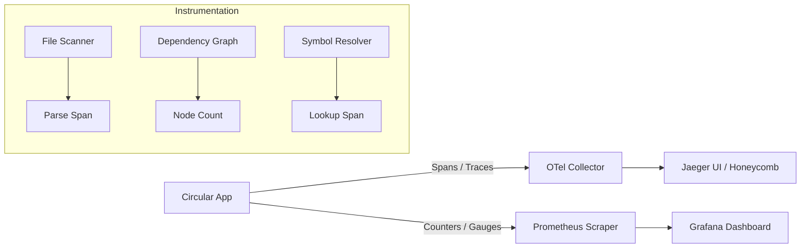

# Plan: Enhanced Observability (Medium Priority #5)
# docs/plans/2026-02-21-enhanced-observability.md

## 1. Objective
To provide deep insights into Circular's performance, health, and operational behavior through the integration of modern observability tools, specifically targeting OpenTelemetry for tracing and Prometheus for metrics.

## 2. Current Status & Gaps
The analysis report indicates the following deficiencies:
- **Logging:** Basic structured logging via `slog` is present but disconnected from request tracing.
- **Metrics:** No metrics are collected for core operations (e.g., parsing time, graph size, cycle detection duration).
- **Tracing:** No visibility into execution paths, especially for complex cross-component workflows (e.g., full scan, resolver logic).
- **Health Checks:** No standard health check mechanism for long-running processes (MCP server, watch mode).

## 3. Standards & Best Practices
- **Standard:** OpenTelemetry Go SDK for Tracing.
- **Standard:** Prometheus Go Client Library for Metrics.
- **Best Practice:** Context propagation throughout all function calls.
- **Best Practice:** Meaningful labels/attributes for metrics (e.g., `language`, `project_key`).

## 4. Implementation Phases

### Phase 1: Prometheus Metrics Infrastructure
| Task | Purpose | Files Involved |
|------|---------|----------------|
| Initialize `PrometheusService` | Central registry for all metrics | `internal/shared/observability/metrics.go` |
| Instrument `App.ProcessFile` | Track parsing time per file | `internal/core/app/scanner.go` |
| Track Graph Size | Gauge for node/edge count | `internal/engine/graph/graph.go` |
| Expose `/metrics` endpoint | Prometheus scraper target | `internal/ui/cli/server_metrics.go` |

### Phase 2: OpenTelemetry Tracing
| Task | Purpose | Files Involved |
|------|---------|----------------|
| Initialize `TracerProvider` | OTLP exporter setup | `internal/shared/observability/tracing.go` |
| Instrument `RunScan` | High-level trace for full scan | `internal/core/app/service.go` |
| Instrument Resolver Logic | Detailed spans for symbol lookup | `internal/engine/resolver/resolver.go` |
| MCP Request Tracing | Link MCP tools to trace IDs | `internal/mcp/runtime/server.go` |

### Phase 3: Health Checks & Lifecycle
| Task | Purpose | Files Involved |
|------|---------|----------------|
| Implement `HealthService` | Liveness/Readiness logic | `internal/core/app/health.go` |
| Expose `/health` endpoint | Monitoring system target | `internal/ui/cli/server_health.go` |
| Monitor Watch Mode | Alert if watcher stops responding | `internal/core/watcher/watcher.go` |

## 5. Mermaid Data Flow: Observability Pipeline


## 6. DO's and DONT's

| DO | DONT |
|----|------|
| Always use `ctx` for span propagation. | Don't log sensitive data (secrets, PII) in trace attributes. |
| Use high-cardinality labels sparingly in Prometheus. | Don't create new tracers in every function; use a global provider. |
| Record errors in spans using `span.RecordError`. | Don't introduce heavy overhead in the hot path of the parser. |
| Link MCP tool calls to parent trace IDs if possible. | Don't block the main application if the collector is down. |

## 7. Code Snippet: Example Instrumentation
```go
// Metrics Definition
var (
    parsingDuration = promauto.NewHistogramVec(prometheus.HistogramOpts{
        Name: "circular_parsing_seconds",
        Help: "Time spent parsing a source file.",
    }, []string{"language"})
)

// Tracing & Metrics Usage
func (p *Parser) Parse(ctx context.Context, path string) (*File, error) {
    ctx, span := tracer.Start(ctx, "Parser.Parse", trace.WithAttributes(
        attribute.String("file.path", path),
    ))
    defer span.End()

    start := time.Now()
    defer func() {
        parsingDuration.WithLabelValues(p.Language).Observe(time.Since(start).Seconds())
    }()

    // ... actual parsing logic ...
}
```
