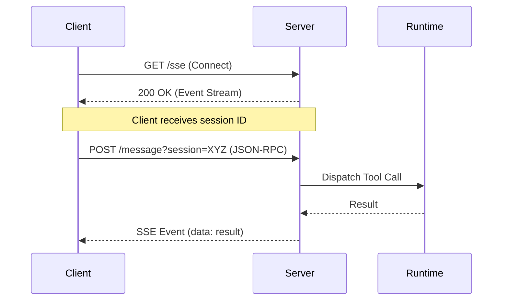

# Plan: MCP SSE Transport Implementation
# docs/plans/2026-02-21-mcp-sse-transport.md

## 1. Objective
Add support for Server-Sent Events (SSE) transport to the Circular MCP server. This allows clients to connect via HTTP, enabling remote usage and compatibility with tools that prefer HTTP over stdio.

## 2. Architecture
Circular's MCP implementation uses an `Adapter` interface for transports. We will add a new `SSE` adapter in `internal/mcp/transport` that implements this interface.

### Key Components:
- **SSE Adapter:** Manages HTTP connections, client session mapping, and event streaming.
- **HTTP Server:** Listens on a configured port (default 8080) for incoming SSE connections and JSON-RPC requests via POST.
- **Session Registry:** Tracks active SSE clients to route responses back to the correct stream.

## 3. Implementation Phases

### Phase 1: Implement SSE Adapter
| Task | Purpose | Files Involved |
|------|---------|----------------|
| Create `SSE` struct | Core transport logic for HTTP/SSE | `internal/mcp/transport/sse.go` |
| Implement `Start` method | Start HTTP server and manage connection loop | `internal/mcp/transport/sse.go` |
| Implement `Stop` method | Graceful shutdown of HTTP server | `internal/mcp/transport/sse.go` |
| Message Routing | Logic to link POST requests to active SSE streams | `internal/mcp/transport/sse.go` |

### Phase 2: Runtime Integration
| Task | Purpose | Files Involved |
|------|---------|----------------|
| Update `Build` factory | Support `transport=http` or `transport=sse` in config | `internal/mcp/runtime/bootstrap.go` |
| Configuration | Add `mcp.address` and `mcp.port` to config handling | `internal/core/config/config.go` |

### Phase 3: Documentation & Examples
| Task | Purpose | Files Involved |
|------|---------|----------------|
| Update MCP Docs | Document SSE endpoints and client config | `docs/documentation/mcp.md` |
| README Update | Highlight SSE support | `README.md` |
| CHANGELOG Entry | Log the addition of SSE transport | `CHANGELOG.md` |

## 4. Mermaid Data Flow: SSE Transport


## 5. DO's and DONT's

| DO | DONT |
|----|------|
| Use standard `net/http` package where possible. | Don't implement complex session logic; keep it simple for local/internal use. |
| Support both JSON-RPC 2.0 and the Circular-specific legacy envelope. | Don't forget to handle CORS if browsers will connect directly. |
| Use `context.Context` for request/stream lifecycle. | Don't block the main event loop with slow tool executions. |

## 6. Code Snippet: SSE Handler Example
```go
func (s *SSE) handleConnection(w http.ResponseWriter, r *http.Request) {
    w.Header().Set("Content-Type", "text/event-stream")
    w.Header().Set("Cache-Control", "no-cache")
    w.Header().Set("Connection", "keep-alive")

    flusher, _ := w.(http.Flusher)
    
    sessionID := generateSessionID()
    fmt.Fprintf(w, "event: endpoint
data: /message?session=%s

", sessionID)
    flusher.Flush()

    // Keep stream open and listen for responses to send back
    // ...
}
```
