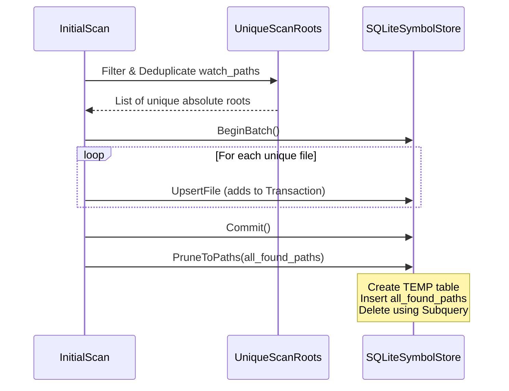

# Plan: SQLite Symbol Store & Scan Optimization
# Path: docs/plans/2026-02-21-sqlite-symbol-store-optimization.md

## 1. Executive Summary
This plan addresses critical performance bottlenecks in the Circular dependency tool, specifically targeting the SQLite symbol store's `PruneToPaths` operation and redundant file walking during the initial scan. The goal is to reduce scan time from minutes to seconds for medium-to-large repositories by optimizing database queries and deduplicating scan roots.

### Current Issues
| Issue | Location | Root Cause | Impact |
| --- | --- | --- | --- |
| **Pruning Bottleneck** | `internal/engine/graph/symbol_store.go` | `DELETE ... WHERE path NOT IN (?)` with 100+ parameters is slow in SQLite. | Long hangs at the end of initial scans. |
| **Scan Redundancy** | `internal/core/app/scanner.go` | `InitialScan` adds the module root even if sub-paths are already in `watch_paths`. | Files are walked and processed multiple times. |
| **Transaction Overhead** | `internal/core/app/scanner.go` | Each file is upserted in its own transaction during the initial scan. | Significant disk I/O wait times. |

---

## 2. Technical Standards & Best Practices
- **SQLite Performance:** Use temporary tables for bulk "NOT IN" comparisons. Avoid massive parameter lists in queries.
- **Transactional Integrity:** Wrap the entire initial scan processing loop in a single transaction or use a high-performance batching strategy.
- **Path Hygiene:** All paths must be absolute and cleaned before comparison to ensure deduplication works across different OS representations.
- **Observability:** Log the duration of database operations and the number of files processed to ensure the fix is measurable.

---

## 3. Dataflow Diagram
The following diagram shows the optimized flow for the initial scan and symbol pruning.



---

## 4. Implementation Phases

### Phase 1: Scan Deduplication
Correct the logic in `internal/core/app/scanner.go` to prevent redundant walking.

| Task | DO | DON'T |
| --- | --- | --- |
| Root Normalization | Use `filepath.Abs` and `filepath.Clean` on all input paths. | Don't assume `.` and `./` are different. |
| Containment Check | Skip roots that are subdirectories of other roots. | Don't walk `internal/` if `.` is already being walked. |

### Phase 2: Batch Processing
Refactor `InitialScan` to use the `Batch` interface.

```go
// Proposed change in scanner.go
func (a *App) InitialScan(ctx context.Context) error {
    // ... root collection ...
    batch, err := a.symbolStore.BeginBatch()
    if err != nil { return err }
    
    for _, filePath := range files {
        // Pass batch to ProcessFile or use batch.Upsert directly
        if err := a.processFileWithBatch(batch, filePath); err != nil {
            slog.Warn("failed", "path", filePath)
        }
    }
    return batch.Commit()
}
```

### Phase 3: Optimized Pruning
Replace the slow `NOT IN` query with a temporary table approach in `internal/engine/graph/symbol_store.go`.

| Task | Implementation |
| --- | --- |
| **Temp Table** | `CREATE TEMPORARY TABLE current_paths (path TEXT PRIMARY KEY);` |
| **Bulk Insert** | Insert all `paths` into the temporary table. |
| **Optimized Delete** | `DELETE FROM symbols WHERE file_path NOT IN (SELECT path FROM current_paths);` |

---

## 5. File Inventory & Specifications

### `internal/engine/graph/symbol_store.go`
- **Purpose:** Manages the SQLite persistence layer for symbols and file metadata.
- **Key Functions to Modify:**
  - `PruneToPaths(paths []string)`: Refactor to use temporary tables.
  - `UpsertFileRows`: Ensure it behaves correctly within a shared transaction.

### `internal/core/app/scanner.go`
- **Purpose:** Orchestrates the file system walking and parsing lifecycle.
- **Key Functions to Modify:**
  - `InitialScan`: Implement batching and root deduplication.
  - `ScanDirectories`: Ensure `filepath.SkipDir` is used aggressively for ignored patterns.

---

## 6. Verification Plan
1. **Performance Benchmark:**
   - Measure time taken for `InitialScan` on the `code-watch` repo with `db.enabled = true`.
   - Goal: `< 5 seconds`.
2. **Consistency Check:**
   - Run scan, then delete a file, then run scan again.
   - Verify `SELECT count(*) FROM symbols` correctly reflects the change after pruning.
3. **Redundancy Test:**
   - Set `watch_paths = [".", "internal"]` in `circular.toml`.
   - Verify each file is only logged as "processing" once in verbose mode.

---
*Plan authored by Gemini CLI.*
