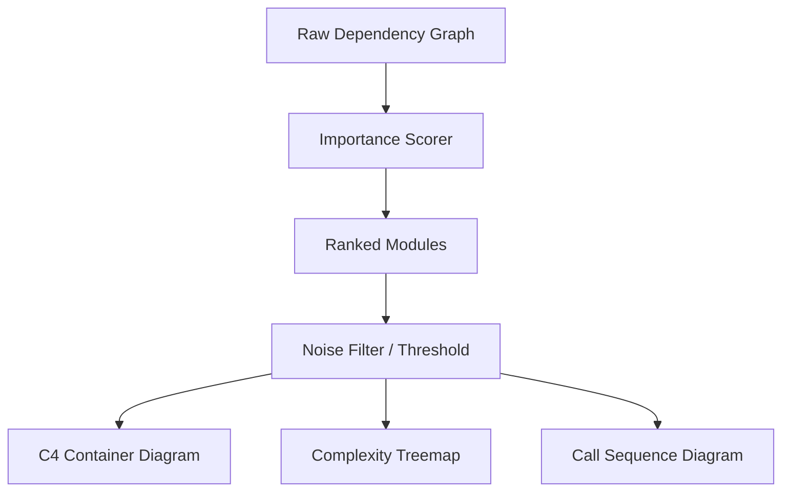

# Advanced Graph Visualization Plan
# docs/plans/advanced-graph-visualization.md

This plan describes enhancements to the graphical output of `circular` to provide more meaningful architectural insights and reduce visual noise.

## Implementation Status (2026-02-20)

| Phase | Status | Notes |
| :--- | :--- | :--- |
| **Phase 1: Importance Scoring** | ⚠️ Partial | `ModuleMetrics` has Fan-In/Fan-Out, missing `ImportanceScore` |
| **Phase 2: C4-style Diagrams** | ⚠️ Partial | Layer subgraphs exist in Mermaid, missing edge aggregation |
| **Phase 3: New Viz Types** | ❌ Not Implemented | No treemap, no sequence diagrams |

### What's Implemented
- Module metrics (Fan-In, Fan-Out, Depth) in `internal/engine/graph/metrics.go`
- Layer-based subgraphs in Mermaid output
- Cycle/violation highlighting
- Complexity hotspots

### What's Missing
- Importance scoring formula
- Edge aggregation for high-level views
- Treemap visualization
- Sequence diagram generation
- Interactive HTML reports

## Objective
Implement Importance/Complexity scoring, C4-style architecture diagrams, and new visualization types (Treemaps, Sequence Diagrams).

## Conceptual Flow


## Standards & Best Practices
- **Information Density:** Prioritize showing "Strategic" modules over "Tactical" ones.
- **Color Semantics:** Use red/hot colors for high complexity and blue/cool colors for leaf modules.
- **Clutter Reduction:** Use aggregation (thick lines for many imports) instead of individual arrows for high-level views.

## Detailed Phase Breakdown

### Phase 1: Importance & Complexity Scoring
Implement the heuristic to rank modules based on their architectural significance.

| Task | File | Description |
| :--- | :--- | :--- |
| Implement `calculateImportance` | `internal/engine/graph/metrics.go` | Calculate score based on Fan-In, Fan-Out, and Complexity. |
| Update `ModuleMetrics` struct | `internal/engine/graph/graph.go` | Add `ImportanceScore` field. |

#### Scoring Formula
```go
Score = (FanIn * 2) + (FanOut * 1) + (Complexity * 0.5) + (IsAPI ? 10 : 0)
```

### Phase 2: C4-style Architecture Diagrams
Refactor the architecture graph to use auto-clustering and aggregation.

| Task | File | Description |
| :--- | :--- | :--- |
| Implement Auto-Clustering | `internal/ui/report/formats/mermaid.go` | Group files into folders/layers automatically. |
| Edge Aggregation | `internal/ui/report/formats/mermaid.go` | Draw thick arrows between clusters. |
| Violation Highlighting | `internal/ui/report/formats/plantuml.go` | Color violation edges in red. |

### Phase 3: New Visualization Types
Add support for non-topology based views.

| Task | File | Description |
| :--- | :--- | :--- |
| Treemap Generator | `internal/ui/report/formats/html.go` | Generate interactive D3 treemaps for complexity. |
| Sequence Diagram Gen | `internal/ui/report/formats/mermaid.go` | Generate call sequences from function references. |

## Do's and Don'ts

| DO | DONT |
| :--- | :--- |
| Use size to represent complexity. | Show every single file in a 10,000 file repo. |
| Provide a "Focus Mode" for specific modules. | Mix different abstraction levels in one graph. |
| Support interactive tooltips in HTML reports. | Rely solely on static PNG/SVG images. |

## New Files Purpose

| File | Purpose | Known Functions |
| :--- | :--- | :--- |
| `internal/engine/graph/importance.go` | Heuristics for node ranking. | `CalculateImportanceScore` |
| `internal/ui/report/formats/html_interactive.go` | D3/Cytoscape based interactive reports. | `GenerateInteractiveReport` |
| `internal/ui/report/formats/sequence.go` | Logic for call path tracing. | `TraceCallSequence` |

## Verification Plan
1. **Visual Audit:** Manually inspect the new C4 diagrams for a medium-sized project.
2. **Performance:** Ensure scoring doesn't add more than 500ms to the report generation for 1000 modules.
3. **Usability:** Verify that "Focus Mode" correctly filters unrelated nodes.
