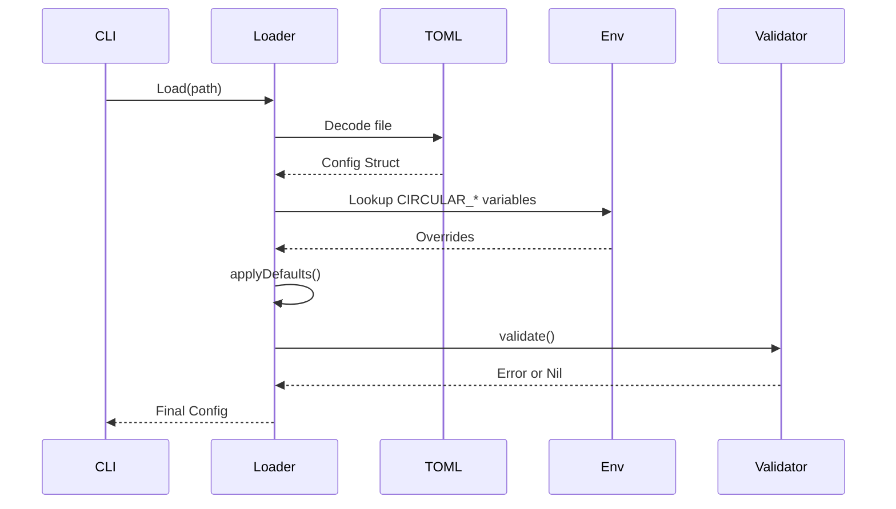
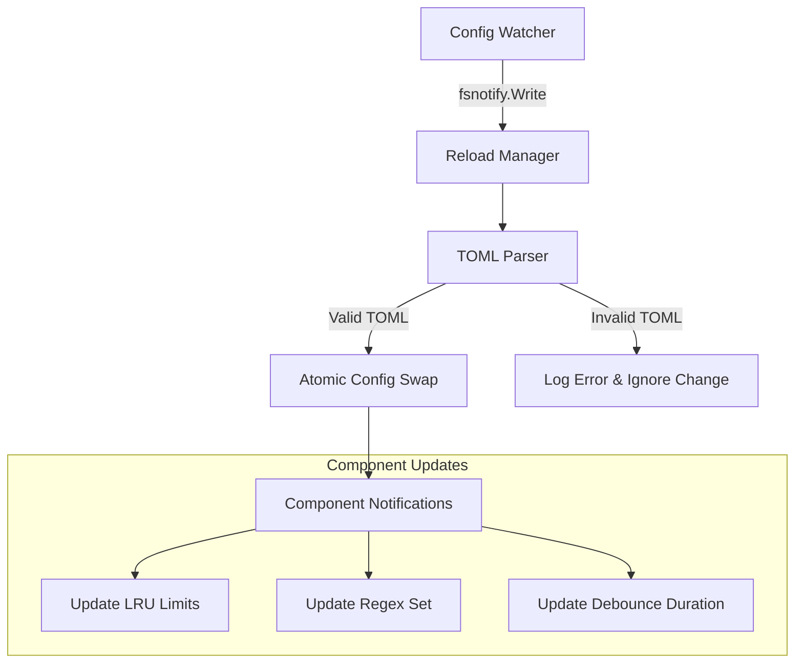
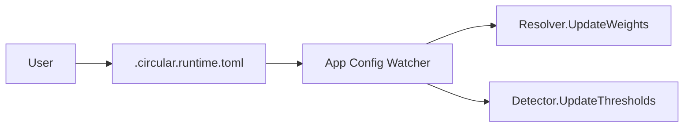

# Plan: Configuration Improvements & Runtime Tuning
# docs/plans/2026-02-21-configuration-improvements.md

## 1. Objective
Enhance Circular's configuration system to support modern operational requirements, including environment variable overrides, dynamic hot-reloading of settings, versioned schema migrations, and runtime parameter tuning via TOML.

## 2. Current Status & Gaps
- **Static Loading:** Configuration is loaded once at startup. Changes require a full application restart to take effect.
- **No Env Overrides:** All settings must be hardcoded in the TOML file; standard `CIRCULAR_PORT=9090` style overrides for containerized environments are missing.
- **Manual Migration:** Users must manually update their TOML files when the schema changes, leading to errors or missing features.
- **Fixed Runtime Tuning:** Performance-critical parameters like cache sizes or watcher debounce intervals are immutable after boot.

## 3. Proposed Features

### A. Environment Variable Support
Integrate a flexible environment variable mapping system.
- **Pattern:** `CIRCULAR_[SECTION]_[KEY]` (e.g., `CIRCULAR_OBSERVABILITY_PORT`).
- **Priority:** Environment variables always override TOML values, which in turn override defaults.
- **Implementation:** Use a mapping table in `internal/core/config/env.go` to link env keys to struct fields.

### B. Configuration Hot-Reload
Implement a file watcher specifically for the active configuration file.
- **Mechanism:** Use `fsnotify` to watch the path resolved during startup.
- **Graceful Updates:** Components like the `Watcher` or `Graph` should subscribe to configuration updates and apply changes without dropping state.

### C. Versioned Schema Migrations
Leverage the `version` field in `Config` to handle schema drift.
- **Automatic Upgrades:** Detect old versions (e.g., v1) and automatically map fields to the new structure (v2+).
- **Validation Warnings:** Warn users if they are using deprecated fields or missing new recommended sections (like `[observability]`).

### D. Runtime Tuning via `.circular.runtime.toml`
Support an optional, secondary configuration file for high-frequency tuning.
- **Purpose:** Change debounce intervals or secret entropy thresholds during long-lived watch sessions without touching the main deployment config.

---

## 4. Implementation Phases

### Phase 1: Environment & Migration (High Priority)
| Task | Purpose | Files Involved |
|------|---------|----------------|
| Env Variable Mapping | Link `CIRCULAR_*` to `Config` fields | `internal/core/config/env.go` (New) |
| Integration in Loader | Apply env overrides after TOML decode | `internal/core/config/loader.go` |
| Version Check Logic | Handle version 1 -> 2 transitions | `internal/core/config/loader.go` |
| Update Example Configs| Add comments explaining env overrides | `circular.example.toml`, `data/config/*.example.toml` |

### Phase 2: Hot-Reload Infrastructure (Medium Priority)
| Task | Purpose | Files Involved |
|------|---------|----------------|
| Config File Watcher | Detect changes to active config | `internal/core/config/watcher.go` (New) |
| Atomic Config Swap | Thread-safe replacement of the active config | `internal/core/app/app.go` |
| Notification Interface| Allow components to "Reload" from new config | `internal/core/ports/ports.go` |

### Phase 3: Component Instrumentation (Medium Priority)
| Task | Purpose | Files Involved |
|------|---------|----------------|
| Dynamic Cache Resizing| Update LRU capacity on the fly | `internal/engine/graph/lru.go`, `internal/core/app/app.go` |
| Watcher Debounce Update| Modify `fsnotify` debounce timer at runtime | `internal/core/watcher/watcher.go` |
| Secret Pattern Update | Reload regex patterns without rescan | `internal/engine/secrets/detector.go` |

---

## 5. Reloadable vs. Non-Reloadable Settings

| Category | Reloadable? | Notes |
|----------|------------|-------|
| **Caches** | ✅ Yes | Resize LRU maps; eviction happens on next put. |
| **Watch.Debounce** | ✅ Yes | Restarts the debounce timer in the watcher. |
| **Exclusion Rules** | ✅ Yes | Applied to next scan or file change. |
| **Observability** | ✅ Yes | Can toggle metrics/tracing or change port. |
| **Secrets.Patterns** | ✅ Yes | Update regex engine; applied to next change. |
| **Paths.Grammars** | ❌ No | Requires re-initializing Tree-sitter loaders. |
| **DB.Path** | ❌ No | Database connections are long-lived. |
| **Projects.Entries** | ❌ No | Core identity of the running session. |

---

## 6. Mermaid Diagrams

### Configuration Loading Sequence


### Hot-Reload Trigger Flow


---

## 7. DO's and DONT's

| DO | DONT |
|----|------|
| Use `sync.RWMutex` to protect all configuration access in the `App` struct. | Don't allow hot-reloading of settings that require deep re-initialization (like DB paths). |
| Log a clear message when an environment variable override is applied. | Don't silently discard an invalid configuration file; alert the user and stay on the old version. |
| Group environment variables logically (e.g., `CIRCULAR_DB_ENABLED`). | Don't block the main dependency analysis loop while reloading configuration. |
| Ensure `circular.example.toml` remains the single source of truth for documentation. | Don't forget to test that cache resizing doesn't cause data corruption. |

---

## 8. Data Flow: Runtime Tuning


## 9. Code Snippets

### Env Override Helper (Planned)
```go
func applyEnvOverrides(cfg *Config) {
    if val, ok := os.LookupEnv("CIRCULAR_OBSERVABILITY_PORT"); ok {
        if p, err := strconv.Atoi(val); err == nil {
            cfg.Observability.Port = p
        }
    }
    // ... repeat for other critical keys
}
```

### Thread-Safe Config Access
```go
func (a *App) GetConfig() config.Config {
    a.configMu.RLock()
    defer a.configMu.RUnlock()
    return *a.Config // Return a copy to prevent mutation
}
```
