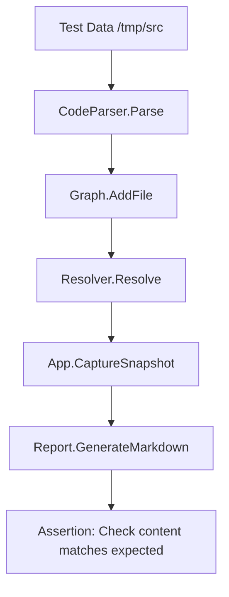

# Plan: Improve Test Coverage (High Priority #3)
# docs/plans/2026-02-21-improve-test-coverage.md

## 1. Objective
To systematically increase the reliability and robustness of the Circular codebase by addressing gaps in integration testing, performance benchmarking, parser fuzzing, and end-to-end MCP validation.

## 2. Current Status & Gaps
Based on the internal codebase analysis, the following gaps exist:
- **Integration Tests:** Limited coverage for cross-component interactions (e.g., App -> Parser -> Graph -> Resolver).
- **Performance Benchmarks:** Only the History store has benchmarks; core graph and parser operations lack them.
- **Fuzz Testing:** Tree-sitter parsers and extractors are not fuzzed for edge cases or malicious inputs.
- **MCP E2E Tests:** No automated end-to-end tests for the Model Context Protocol tools and transport layer.

## 3. Standards & Best Practices
- **Standard:** Go 1.24+ `testing` package for unit and benchmark tests.
- **Library:** `testify` for assertions (check if used in project, otherwise use standard `reflect.DeepEqual` and manual checks to match project style).
- **Best Practice:** Table-driven tests for all core logic.
- **Best Practice:** Mocking via interfaces defined in `internal/core/ports/`.

## 4. Implementation Phases

### Phase 1: Integration Testing Infrastructure
| Task | Purpose | Files Involved |
|------|---------|----------------|
| Scaffold `internal/test/integration` | Dedicated space for multi-package tests | New directory |
| Create `IntegrationTestSuite` | Setup/Teardown for full app stack | `internal/core/app/app_test.go` (expand) |
| Test "Scan to Report" flow | Verify full pipeline from source to markdown | New test file |

### Phase 2: Parser Fuzzing
| Task | Purpose | Files Involved |
|------|---------|----------------|
| Add `FuzzParse` to Go extractor | Detect crashes in Go parser | `internal/engine/parser/go_fuzz_test.go` |
| Add `FuzzParse` to Python extractor | Detect crashes in Python parser | `internal/engine/parser/python_fuzz_test.go` |

### Phase 3: Performance Benchmarking
| Task | Purpose | Files Involved |
|------|---------|----------------|
| Benchmark `AddFile` | Measure graph insertion performance | `internal/engine/graph/graph_bench_test.go` |
| Benchmark `DetectCycles` | Measure Tarjan algorithm efficiency | `internal/engine/graph/graph_bench_test.go` |

### Phase 4: MCP End-to-End Tests
| Task | Purpose | Files Involved |
|------|---------|----------------|
| Mock STDIO transport | Simulate MCP client/server interaction | `internal/mcp/transport/mock_transport.go` |
| E2E tool execution | Test tool dispatch through the full MCP adapter | `internal/mcp/adapters/adapter_e2e_test.go` |

## 5. Mermaid Data Flow: Integration Test Pipeline


## 6. DO's and DONT's

| DO | DONT |
|----|------|
| Use `t.Parallel()` for independent unit tests. | Don't use global state in integration tests. |
| Use `t.TempDir()` for all filesystem-dependent tests. | Don't mock the `Graph` in integration tests; test the real one. |
| Write benchmarks that use realistic codebase sizes. | Don't forget to cleanup temporary SQLite databases. |
| Use `go test -fuzz` for complex string/code processing. | Don't rely on `time.Sleep` for concurrency tests. |

## 7. Code Snippet: Example Integration Test Structure
```go
func TestFullPipelineIntegration(t *testing.T) {
    // 1. Setup temp environment
    tmpDir := t.TempDir()
    createTestFiles(tmpDir)

    // 2. Initialize App with real dependencies
    cfg := config.DefaultConfig()
    cfg.Paths.ProjectRoot = tmpDir
    
    app := app.New(cfg)
    
    // 3. Execute Scan
    ctx := context.Background()
    err := app.InitialScan(ctx)
    require.NoError(t, err)

    // 4. Verify Graph State
    modules := app.Graph.ListModules()
    assert.Contains(t, modules, "my-test-module")
    
    // 5. Verify Resolver
    unresolved := app.AnalyzeHallucinations(ctx)
    assert.Empty(t, unresolved)
}
```
