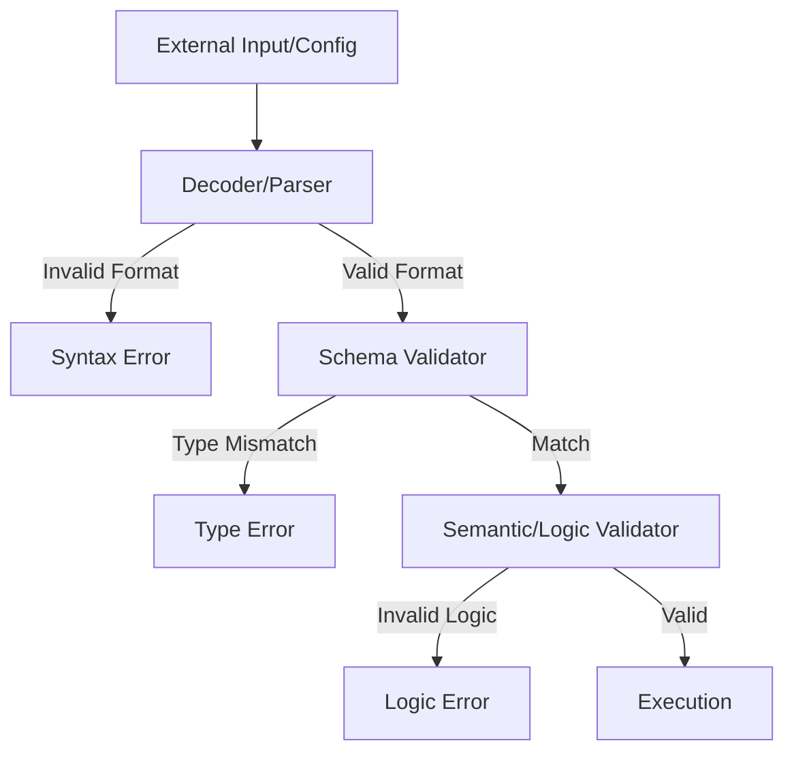
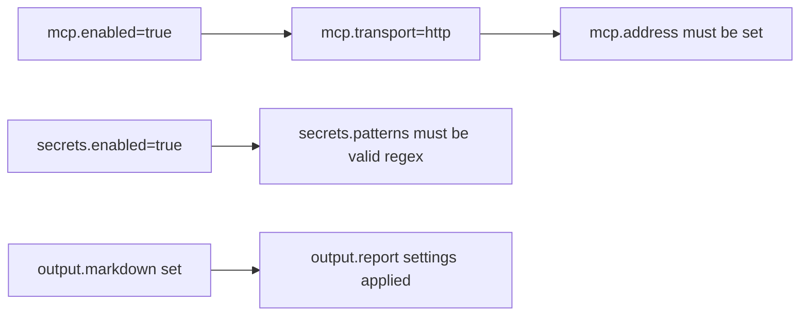

# Plan: Robust Input & Configuration Validation
# docs/plans/2026-02-21-input-config-validation.md

## 1. Objective
Strengthen Circular's defenses by implementing exhaustive validation for both runtime configuration (TOML) and external inputs (MCP tool arguments). This ensures the system "fails fast" with descriptive errors rather than crashing or exhibiting undefined behavior.

## 2. Validation Layers

### A. Configuration Validation (TOML)
- **Schema Validation:** Ensure all required fields exist and match expected types.
- **Semantic Validation:** Check for logical consistency (e.g., `mcp.transport=http` requires `mcp.address`).
- **Path Verification:** Verify that crucial paths (grammars, database) are accessible.
- **Dependency Checks:** Cross-field validation (e.g., if secrets are enabled, patterns must be valid).

### B. Input Validation (MCP)
- **Type Safety:** Use structured decoding (already partially implemented).
- **Bounds Checking:** Enforce limits on array lengths, string sizes, and numeric values.
- **Path Sanitization:** Prevent directory traversal in `scan.run` paths.
- **Allowlist Enforcement:** Ensure only authorized operations are executed.

## 3. Implementation Phases

### Phase 1: Advanced Config Validator
| Task | Purpose | Files Involved |
|------|---------|----------------|
| Cross-Field Rules | Validate relationships between config sections | `internal/core/config/validator.go` |
| File System Pre-checks| Verify permissions/existence of paths | `internal/core/config/validator.go` |
| `--check` CLI Flag | Dry-run config validation and exit | `internal/ui/cli/cli.go` |

### Phase 2: Enhanced MCP Input Guard
| Task | Purpose | Files Involved |
|------|---------|----------------|
| Path Sanitizer | Prevent `../../` style escapes in tool args | `internal/mcp/validate/args.go` |
| Comprehensive Error Details | Return specific field errors to MCP client | `internal/mcp/validate/args.go` |
| JSON Schema Integration | Use JSON schema for tool argument validation | `internal/mcp/schema/schema.go` |

### Phase 3: Developer Experience (DX)
| Task | Purpose | Files Involved |
|------|---------|----------------|
| Error Colorization | Use `lipgloss` for pretty terminal errors | `internal/ui/cli/runtime.go` |
| Config Migration Guide| Suggest fixes when old keys are detected | `internal/core/config/loader.go` |

---

## 4. Mermaid Diagrams

### Validation Data Flow


### Config Dependency Tree (Partial)


---

## 5. DO's and DONT's

| DO | DONT |
|----|------|
| Return all validation errors at once, not just the first one found. | Don't allow raw strings to be used directly in file system calls without sanitization. |
| Use clear, human-readable error messages (e.g., "Field 'mcp.port' must be between 1 and 65535"). | Don't perform heavy I/O during every validation cycle; cache results where appropriate. |
| Group related validation rules into logical functions. | Don't trust that the configuration file hasn't been tampered with; re-validate on hot-reload. |

---

## 6. Code Snippet: Semantic Validator Example

```go
func validateConfigDependencies(cfg *Config) []error {
    var errs []error
    
    // MCP Dependencies
    if cfg.MCP.Enabled && cfg.MCP.Transport == "http" {
        if cfg.MCP.Address == "" {
            errs = append(errs, fmt.Errorf("mcp.address is required when mcp.transport is 'http'"))
        }
    }
    
    // Secrets Dependencies
    if cfg.Secrets.Enabled && len(cfg.Secrets.Patterns) == 0 && cfg.Secrets.EntropyThreshold == 0 {
        errs = append(errs, fmt.Errorf("secrets scanning enabled but no patterns or entropy threshold defined"))
    }
    
    return errs
}
```

## 7. Path Sanitization Rules
Paths provided via MCP (e.g., in `scan.run`) MUST:
1. Be converted to absolute paths relative to the project root.
2. Be checked using `strings.HasPrefix` to ensure they stay within the intended project boundary.
3. Be cleaned using `filepath.Clean`.
