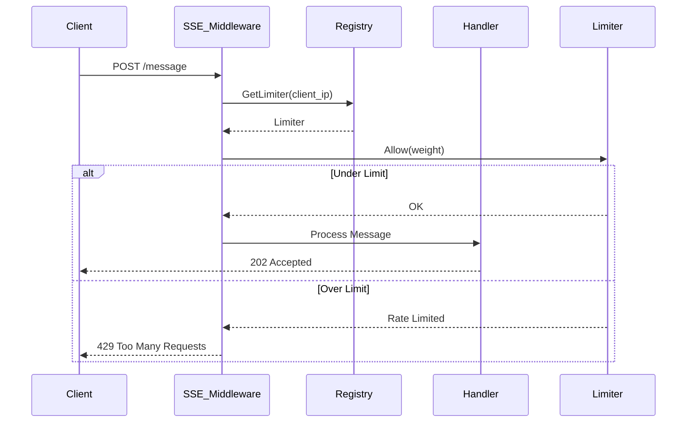
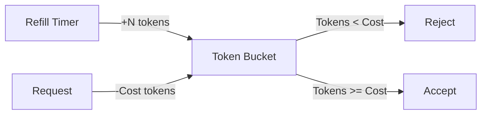

# Plan: Rate Limiting for MCP & SSE Transport
# docs/plans/2026-02-21-rate-limiting.md

## 1. Objective
Protect the Circular MCP server from resource exhaustion and denial-of-service (DoS) attacks by implementing rate limiting. This is especially critical for the new SSE (HTTP) transport, which is exposed to network-based clients.

## 2. Target Scope
- **SSE Transport:** Limit connections and requests per IP address.
- **Stdio Transport:** Implement a global "burst" protection to prevent local agent loops from overwhelming the system.
- **Operation Level:** Support different limits for "heavy" operations (e.g., `scan.run`) vs. "light" operations (e.g., `graph.cycles`).

## 3. Architecture

### Rate Limiter Core
We will use a **Token Bucket** algorithm for smooth rate limiting with burst support.

### Middleware Pattern
- For SSE, rate limiting will be implemented as standard HTTP middleware.
- For Stdio, it will be integrated into the `serve` loop.

### Key Components:
- `Limiter`: Core logic tracking tokens and timestamps.
- `Registry`: Maps client identifiers (IP for SSE, "local" for stdio) to `Limiter` instances.
- `Config`: New TOML section to define limits.

## 4. Implementation Phases

### Phase 1: Core Rate Limiter Logic
| Task | Purpose | Files Involved |
|------|---------|----------------|
| `Limiter` implementation | Token bucket logic (Wait/Allow) | `internal/shared/util/limiter.go` (New) |
| Registry for Limiters | Manage lifecycle of limiters per client | `internal/shared/util/limiter_registry.go` (New) |
| Unit Tests | Verify burst and refill logic | `internal/shared/util/limiter_test.go` (New) |

### Phase 2: SSE Integration
| Task | Purpose | Files Involved |
|------|---------|----------------|
| HTTP Middleware | Intercept requests and check limits | `internal/mcp/transport/sse.go` |
| IP Detection Helper | Extract client IP from headers/remote addr | `internal/shared/util/net.go` (New) |
| Error Handling | Return `429 Too Many Requests` | `internal/mcp/transport/sse.go` |

### Phase 3: Stdio & Operation Throttling
| Task | Purpose | Files Involved |
|------|---------|----------------|
| Stdio Limiter | Protect against local process spam | `internal/mcp/transport/stdio.go` |
| Weighted Operations | Assign costs to different operations | `internal/mcp/validate/args.go` |

### Phase 4: Configuration & Tuning
| Task | Purpose | Files Involved |
|------|---------|----------------|
| Config Schema | Add `[mcp.rate_limit]` section | `internal/core/config/config.go` |
| Defaults & Validation | Sanity checks for rate limit parameters | `internal/core/config/loader.go` |

---

## 5. Rate Limit Configuration (Proposed)

```toml
[mcp.rate_limit]
enabled = true

# Global defaults
requests_per_minute = 60
burst = 10

# SSE specific (per IP)
sse_requests_per_minute = 30
sse_connections_per_minute = 5

# Operation weights (optional overrides)
[mcp.rate_limit.weights]
"scan.run" = 5
"secrets.scan" = 3
"graph.cycles" = 1
```

---

## 6. Mermaid Diagrams

### Rate Limiting Data Flow (SSE)


### Token Bucket Logic


---

## 7. DO's and DONT's

| DO | DONT |
|----|------|
| Use `golang.org/x/time/rate` if possible to avoid reinventing the wheel. | Don't use a single global lock for all client limiters; use a map with fine-grained locking or `sync.Map`. |
| Include `Retry-After` header in 429 responses. | Don't leak memory by keeping limiters for disconnected SSE clients indefinitely (use a TTL/cleanup). |
| Log rate-limited events for auditability. | Don't block stdio reading while waiting for a rate limit; reject immediately if burst is exhausted. |

---

## 8. Code Snippet: Limiter Middleware (Example)

```go
func (s *SSE) rateLimitMiddleware(next http.Handler) http.Handler {
    return http.HandlerFunc(func(w http.ResponseWriter, r *http.Request) {
        ip := s.getClientIP(r)
        limiter := s.registry.Get(ip)
        
        if !limiter.Allow() {
            w.Header().Set("Retry-After", "60")
            http.Error(w, "Rate limit exceeded", http.StatusTooManyRequests)
            return
        }
        next.ServeHTTP(w, r)
    })
}
```
