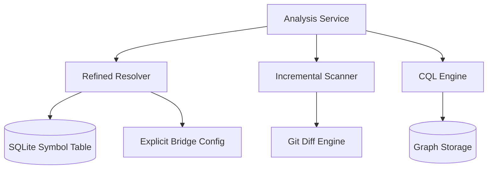

# Advanced Architecture Refinements Plan
# docs/plans/advanced-architecture-refinements.md

This plan covers high-impact architectural refinements to optimize performance for large-scale repositories and improve the precision of cross-language analysis.

## Objective
Implement persistent symbol tables, incremental secret scanning, explicit cross-language bridges, and a specialized query language (CQL) for advanced architectural analysis.

## Implementation Status
- Last updated: 2026-02-14
- Overall status: complete
- Phase 1: complete
  - complete: `internal/data/history/schema.go` `symbols` table migration added (schema version `3`)
  - complete: `internal/engine/graph/symbol_store.go` SQLite-backed symbol store added (sync + lookup)
  - complete: `internal/engine/resolver/resolver.go` can query SQLite symbol store with in-memory fallback
  - complete: `internal/core/app/app.go` analysis flows prefer SQLite symbol lookup when DB is enabled
  - complete: refined symbol writes to true incremental file-level upsert/delete/prune (`UpsertFile`, `DeleteFile`, `PruneToPaths`) with app-driven updates during watch and initial scan
- Phase 2: complete
  - complete: `internal/engine/secrets/detector.go` supports line-range incremental detection (`DetectInRanges`) for changed hunks
  - complete: `internal/core/app/app.go` computes changed line ranges and performs incremental secret scans with full-scan fallback for line-shift edits
  - complete: entropy checks are gated to high-risk file extensions to reduce false positives/cost on general source files
- Phase 3: complete
  - complete: `internal/engine/resolver/bridge.go` bridge config loader + explicit resolver pass added
  - complete: `internal/core/app/app.go` loads `.circular-bridge.toml` from watch roots and applies bridge mappings to resolver instances
- Phase 4: complete
  - complete: `internal/data/query/cql.go` read-only CQL parser added for `SELECT modules WHERE ...`
  - complete: `internal/data/query/service.go` CQL execution path added over graph/query data (`Service.ExecuteCQL`)

## Status by Task

| Phase | Task | Status | Notes |
| :--- | :--- | :--- | :--- |
| Phase 1 | Schema for Symbols (`internal/data/history/schema.go`) | complete | Added `symbols` table and indexes in schema migration version `3`. |
| Phase 1 | Symbol Repository (`internal/engine/graph/symbol_store.go`) | complete | Added incremental mutation API (`UpsertFile`, `DeleteFile`, `PruneToPaths`) and file-granular sync. |
| Phase 1 | Resolver Integration (`internal/engine/resolver/resolver.go`) | complete | Resolver can use SQLite symbol lookup with fallback to in-memory table. |
| Phase 2 | Diff-based Detection (`internal/engine/secrets/detector.go`) | complete | Added line-range scan entrypoint (`DetectInRanges`) and changed-line range selection. |
| Phase 2 | High-Risk Filtering (`internal/engine/secrets/adapter.go`) | complete | Entropy checks now run only for high-risk extension set; context/pattern checks remain enabled. |
| Phase 3 | Bridge Config Loader (`internal/engine/resolver/bridge.go`) | complete | Added TOML loader (`LoadBridgeConfig`) and config path discovery (`DiscoverBridgeConfigPaths`). |
| Phase 3 | Bridge Resolver Pass (`internal/engine/resolver/resolver.go`) | complete | Added explicit bridge resolution pass before stdlib/import/probabilistic checks. |
| Phase 4 | CQL Parser (`internal/data/query/cql.go`) | complete | Added parser for read-only `SELECT modules WHERE ...` syntax with `AND` conditions. |
| Phase 4 | Query Executor (`internal/data/query/service.go`) | complete | Added `Service.ExecuteCQL(...)` execution path against module summaries + graph metrics. |

## Conceptual Architecture


## Standards & Best Practices
- **Incrementalism:** Never rebuild what hasn't changed.
- **Explicit over Implicit:** Prefer user-defined mapping for ambiguous cross-language calls.
- **Safety:** Ensure CQL queries are read-only and have execution timeouts.

## Detailed Phase Breakdown

### Phase 1: Persistent Symbol Table
Move the `UniversalSymbolTable` from an in-memory map to a SQLite-backed index.

| Task | File | Description |
| :--- | :--- | :--- |
| Schema for Symbols | `internal/data/history/schema.go` | Add `symbols` table with columns for name, module, type, and exported flag. |
| Symbol Repository | `internal/engine/graph/symbol_store.go` | Implement incremental upsert/delete for symbols. |
| Resolver Integration | `internal/engine/resolver/resolver.go` | Update `Resolver` to query the database instead of rebuilding the table. |

#### Code Snippet: Symbol Query
```sql
SELECT module_name, is_exported 
FROM symbols 
WHERE symbol_name = ? AND language = ?
```

### Phase 2: Tainted Secret Scanning
Optimize the `SecretScanner` to avoid full-file scans on every save.

| Task | File | Description |
| :--- | :--- | :--- |
| Diff-based Detection | `internal/engine/secrets/detector.go` | Implement logic to scan only changed lines (hunks) provided by the watcher. |
| High-Risk Filtering | `internal/engine/secrets/adapter.go` | Only trigger entropy analysis for files matching specific extensions (e.g., .env, .json, .key). |

### Phase 3: Explicit Cross-Language Bridges
Allow manual mapping of dependencies that static analysis cannot resolve with 100% confidence.

| Task | File | Description |
| :--- | :--- | :--- |
| Bridge Config Loader | `internal/engine/resolver/bridge.go` | Parse `.circular-bridge.toml` files. |
| Bridge Resolver Pass | `internal/engine/resolver/resolver.go` | Add a high-priority resolution pass using explicit mappings. |

#### Example `.circular-bridge.toml`
```toml
[[bridges]]
from = "go:internal/mcp/runtime"
to = "python:circular_mcp.server"
reason = "JSON-RPC over Stdio"
```

### Phase 4: Circular Query Language (CQL)
Provide a powerful way for agents and power users to query the graph.

| Task | File | Description |
| :--- | :--- | :--- |
| CQL Parser | `internal/data/query/cql.go` | Implement a simple recursive descent parser for CQL. |
| Query Executor | `internal/data/query/service.go` | Translate CQL AST into optimized SQL queries or graph traversals. |

#### CQL Example
`SELECT modules WHERE fan_in > 10 AND complexity > 50`

## Do's and Don'ts

| DO | DONT |
| :--- | :--- |
| Index the `symbol_name` column in SQLite. | Perform full secret scans on every save for files > 1MB. |
| Use the `Bridge` config to break "probabilistic" false positives. | Allow CQL to execute `DELETE` or `UPDATE` statements. |
| Implement caching for frequent CQL queries. | Keep the symbol table in a separate DB from history (keep it unified). |

## New Files Purpose

| File | Purpose | Known Functions |
| :--- | :--- | :--- |
| `internal/engine/resolver/bridge.go` | Explicit mapping logic. | `LoadBridgeConfig`, `ResolveExplicit` |
| `internal/data/query/cql.go` | CQL parser and executor. | `ParseCQL`, `ExecuteCQL` |

## Verification Plan
1. **Performance:** Measure time-to-resolve for a 50k file repo. Target: < 100ms per query.
2. **Precision:** Verify that `circular-bridge` resolves 100% of defined links.
3. **Efficiency:** Confirm that secret scanning only touches modified lines during "watch" mode.
