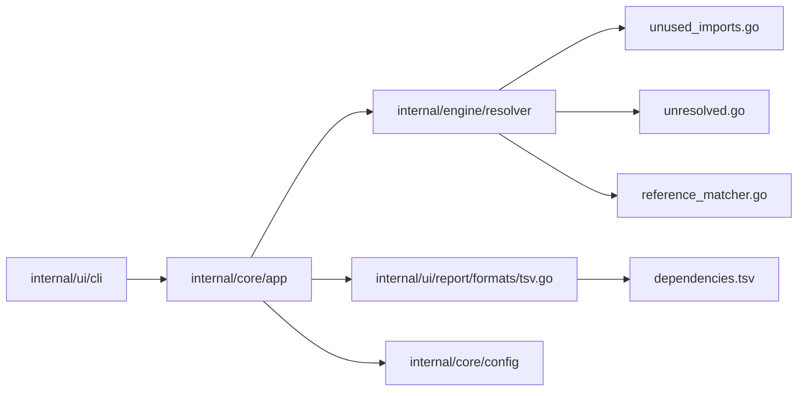
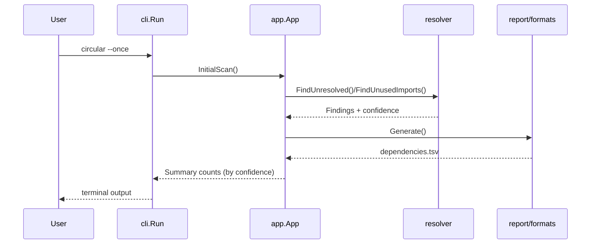
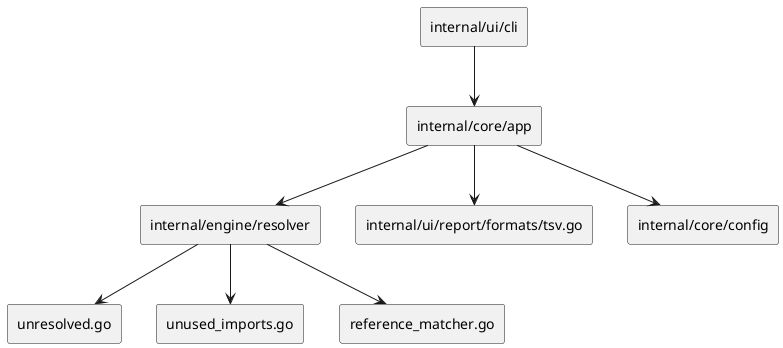

# Analyzer Signal Stabilization Plan (Post-Refactor)

## Scope, Assumptions, Constraints

This plan targets analyzer signal quality after the internal package refactor, with the goal of reducing false positives while preserving real defect detection.

- Baseline from `2026-02-13` on this repository:
  - `0` circular imports
  - `13` unresolved references (after re-adding `tree_sitter*` exclusions)
  - `67` unused imports
  - unused-import split: `38` non-test files, `29` test files
- Build/test currently pass (`go test ./...`, `go build ./cmd/circular`), so many findings are likely heuristic false positives.
- Backward compatibility must be preserved for:
  - CLI output contracts
  - TSV output schema
  - current config schema (avoid breaking changes)
- Sequencing constraint:
  - Do not run `go mod tidy` as a cleanup step until non-test unused imports are addressed (`38 -> 0` target for this phase).

## Plan Overview

| Task ID | Goal | Primary Owner Package | Dependencies | Risk |
| --- | --- | --- | --- | --- |
| T1 | Establish deterministic analyzer baseline and triage buckets | `internal/engine/resolver` | none | low |
| T2 | Reduce unresolved-reference false positives | `internal/engine/resolver` | T1 | medium |
| T3 | Reduce unused-import false positives | `internal/engine/resolver` | T1 | medium |
| T4 | Eliminate non-test unused imports (code cleanup gate) | `internal/*` | T3 | medium |
| T5 | Add confidence classification + output gating | `internal/ui/report`, `internal/core/app` | T2, T4 | medium |
| T6 | Final verification and documentation updates | `docs/documentation`, `README.md` | T1-T5 | low |

## Task Details

### T1 Build baseline harness and finding taxonomy [ ]

Summary:
- Create a reproducible baseline for unresolved/unused findings and classify each finding type as `real`, `likely-real`, `likely-false-positive`, `false-positive`.

Inputs/outputs:
- Input: `go run ./cmd/circular --once --config data/config/circular.toml`.
- Output: baseline artifact in `docs/reviews/` with grouped finding categories and counts.

File changes (planned):
- `docs/reviews/analyzer-baseline-2026-02-13.md` (new)
- `internal/engine/resolver/resolver_test.go` (update; table-driven regression expectations)

Best practices and standards:
- Keep baseline command and config fixed for comparability.
- Separate analyzer quality metrics from product behavior metrics.
- Track counts by category, not only total counts.
- Keep deterministic ordering in test assertions.

Acceptance checks:
- Baseline document committed with categorized findings.
- Test cases encode at least 5 known false-positive patterns.
- `go test ./internal/engine/resolver` passes.

### T2 Resolve unresolved-reference false positives [ ]

Summary:
- Improve unresolved-reference logic for qualified calls and external package aliases (`glob.Compile`, `tree_sitter_go.Language`, style renderers, chained resolver constructors).

Inputs/outputs:
- Input: categorized unresolved findings from T1.
- Output: reduced unresolved false positives with preserved true positives.

File changes (planned):
- `internal/engine/resolver/unresolved.go` (new; extracted unresolved pipeline)
- `internal/engine/resolver/reference_matcher.go` (new; qualified symbol matcher)
- `internal/engine/resolver/resolver.go` (update; call extracted logic)
- `internal/engine/resolver/resolver_test.go` (update; edge-case fixtures)

Classes/functions (planned):
- `func (r *Resolver) FindUnresolved() []UnresolvedReference`
- `func (r *Resolver) FindUnresolvedForPaths(paths []string) []UnresolvedReference`
- `func (r *Resolver) resolveQualifiedReference(file *parser.File, ref parser.Reference) bool`
- `func moduleReferenceBase(language, module string) string`

Best practices and standards:
- Keep language-specific logic isolated from generic matching.
- Do not suppress findings globally; suppress only pattern-specific false positives.
- Prefer additive matching rules with explicit tests.
- Preserve deterministic output order for stable snapshots.

Acceptance checks:
- All existing resolver tests pass.
- New tests cover:
  - imported package function calls
  - aliased import member calls
  - constructor-chain method calls
- Unresolved count decreases for known false-positive categories.

### T3 Resolve unused-import false positives [ ]

Summary:
- Improve unused-import detection by strengthening usage mapping between references and imports for Go/Python/JS-like patterns.

Inputs/outputs:
- Input: categorized unused-import findings from T1.
- Output: reduced noisy unused-import rows while preserving real unused-import detections.

File changes (planned):
- `internal/engine/resolver/unused_imports.go` (new; extracted unused-import pipeline)
- `internal/engine/resolver/resolver.go` (update; delegate to new pipeline)
- `internal/engine/resolver/resolver_test.go` (update; expanded cases)

Classes/functions (planned):
- `func (r *Resolver) FindUnusedImports(paths []string) []UnusedImport`
- `func (r *Resolver) findUnusedInFile(file *parser.File) []UnusedImport`
- `func hasSymbolUse(refHits map[string]int, symbol string) bool`
- `func isLikelySideEffectOnlyImport(language string, imp parser.Import) bool`

Best practices and standards:
- Keep confidence scoring explicit and testable.
- Preserve current TSV field compatibility.
- Avoid language-agnostic shortcuts that inflate false negatives.
- Document language-specific caveats in code comments only where needed.

Acceptance checks:
- New table-driven tests for:
  - selector-based references (`pkg.Func`)
  - alias and from-import usage
  - side-effect-only imports
- Unused-import count decreases for known false-positive categories.

### T4 Eliminate non-test unused imports (code cleanup gate) [ ]

Summary:
- Remove unused imports in non-test files first; defer test-file cleanup if needed until after production code is clean.

Inputs/outputs:
- Input: current split (`38` non-test, `29` test).
- Output: non-test unused imports reduced to `0` before further hygiene steps.

File changes (planned):
- `internal/core/app/*.go` (update imports)
- `internal/core/config/*.go` (update imports)
- `internal/engine/*/*.go` (update imports)
- `internal/ui/*/*.go` (update imports)

Best practices and standards:
- Prioritize production code paths over tests for cleanup sequencing.
- Remove only truly unused imports; do not hide with blank identifiers.
- Keep edits minimal and mechanical.
- Re-run analyzer after each package batch.

Acceptance checks:
- Analyzer reports `0` non-test unused imports.
- `go test ./...` and `go build ./cmd/circular` remain green.
- `go mod tidy` remains deferred until this gate is met.

### T5 Add confidence-aware reporting and optional strict mode [ ]

Summary:
- Introduce confidence labels to unresolved findings and allow reporting gates so users can hide low-confidence noise in default runs.

Inputs/outputs:
- Input: improved finding confidence from T2/T3.
- Output: cleaner default summary and additive strict mode.

File changes (planned):
- `internal/engine/resolver/resolver.go` (update; add confidence field for unresolved)
- `internal/core/app/app.go` (update; pass confidence-filtered findings to summary/output)
- `internal/ui/report/formats/tsv.go` (update; optional confidence column for unresolved rows, additive)
- `internal/core/config/config.go` (update; additive analysis/reporting options)
- `docs/documentation/configuration.md` (update)
- `docs/documentation/output.md` (update)

Classes/functions (planned):
- `type UnresolvedReference struct { ... Confidence string }`
- `func (a *App) AnalyzeHallucinations() []resolver.UnresolvedReference`
- `func (t *TSVGenerator) Generate() (string, error)` (additive unresolved confidence support)

Best practices and standards:
- Keep default behavior backward compatible (no breaking schema changes).
- Add only additive config fields.
- Ensure strict mode is opt-in.
- Keep CLI summary concise with explicit counts by confidence.

Acceptance checks:
- Default CLI still works with existing config files.
- New config options are optional and validated.
- TSV output remains parse-compatible for existing consumers.

### T6 Verification, rollout, and documentation closure [ ]

Summary:
- Verify analyzer quality gains, prevent regressions, and update documentation/changelog.

Inputs/outputs:
- Input: implementation from T1-T5.
- Output: updated docs, changelog, and measurable finding reduction report.

File changes (planned):
- `README.md` (update; analysis caveats + strict mode usage)
- `docs/documentation/limitations.md` (update; remaining known limitations)
- `docs/documentation/cli.md` (update; strict/noise-control flags)
- `CHANGELOG.md` (update; user-facing changes)
- `docs/reviews/analyzer-baseline-2026-02-13.md` (update with after-metrics)

Best practices and standards:
- Report before/after counts with fixed baseline command.
- Highlight residual risks explicitly.
- Keep changelog user-focused, not implementation-focused.
- Verify docs align with actual runtime behavior.

Acceptance checks:
- `go test ./...` passes.
- `go build ./cmd/circular` passes.
- Before/after analyzer counts are documented and reproducible.
- Non-test unused imports were cleared before any final `go mod tidy`.

## File Inventory

| File | Type | Classes (name + main methods) | Main functions (name + signature) | Purpose |
| --- | --- | --- | --- | --- |
| `internal/engine/resolver/unresolved.go` | new | `Resolver` (`FindUnresolved`, `FindUnresolvedForPaths`) | `resolveQualifiedReference(file *parser.File, ref parser.Reference) bool` | Isolate unresolved detection pipeline |
| `internal/engine/resolver/reference_matcher.go` | new | none | `moduleReferenceBase(language, module string) string` | Centralized qualified-symbol matching |
| `internal/engine/resolver/unused_imports.go` | new | `Resolver` (`FindUnusedImports`) | `hasSymbolUse(refHits map[string]int, symbol string) bool` | Isolate unused-import pipeline |
| `internal/engine/resolver/resolver.go` | update | `Resolver` | existing exported APIs preserved | Keep orchestration and public API stable |
| `internal/engine/resolver/resolver_test.go` | update | none | table-driven tests | Regression and false-positive prevention |
| `internal/ui/report/formats/tsv.go` | update | `TSVGenerator` | `Generate() (string, error)` | Additive confidence-aware reporting |
| `internal/core/config/config.go` | update | `Config` schema structs | validation helpers | Additive strict/noise config fields |
| `internal/core/app/app.go` | update | `App` | analysis wiring functions | Confidence filtering integration |
| `docs/reviews/analyzer-baseline-2026-02-13.md` | new | none | none | Baseline and after-metrics evidence |
| `docs/documentation/configuration.md` | update | none | none | Config documentation |
| `docs/documentation/output.md` | update | none | none | TSV/reporting contract updates |
| `docs/documentation/limitations.md` | update | none | none | Remaining analyzer caveats |
| `docs/documentation/cli.md` | update | none | none | CLI strict/noise controls |
| `README.md` | update | none | none | Quick guidance for analyzer signal tuning |
| `CHANGELOG.md` | update | none | none | User-facing release notes |

## Mermaid Component Diagram

## Mermaid Sequence Diagram

## PlantUML Component Diagram

## Risks and Mitigations

| Risk | Impact | Mitigation |
| --- | --- | --- |
| Over-suppression hides real issues | high | Require test fixtures for each suppression pattern and keep strict mode |
| Output schema drift breaks consumers | medium | Keep TSV changes additive and documented |
| Refactor causes package coupling regression | medium | Keep logic package-local and preserve API bridges |

## Testing and Verification Plan

- Baseline command:
  - `go run ./cmd/circular --once --config data/config/circular.toml`
- Unit/regression:
  - `go test ./internal/engine/resolver`
  - `go test ./...`
- Build:
  - `go build ./cmd/circular`
- Sequencing gate:
  - `go mod tidy` only after analyzer reports `0` non-test unused imports.
- Optional compatibility:
  - `GOTOOLCHAIN=go1.24.9 go test ./...`

## Folder List (Planned End State)

- `internal/engine/resolver/`
- `internal/engine/resolver/unresolved.go`
- `internal/engine/resolver/unused_imports.go`
- `internal/engine/resolver/reference_matcher.go`
- `internal/ui/report/formats/`
- `docs/reviews/`
- `docs/plans/`
