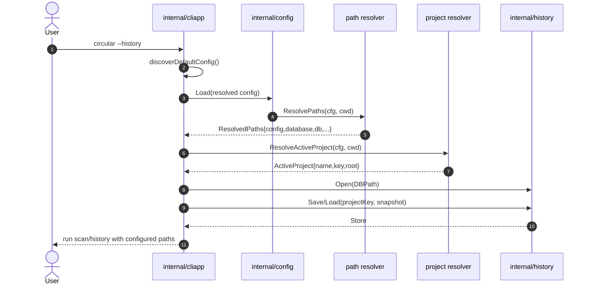
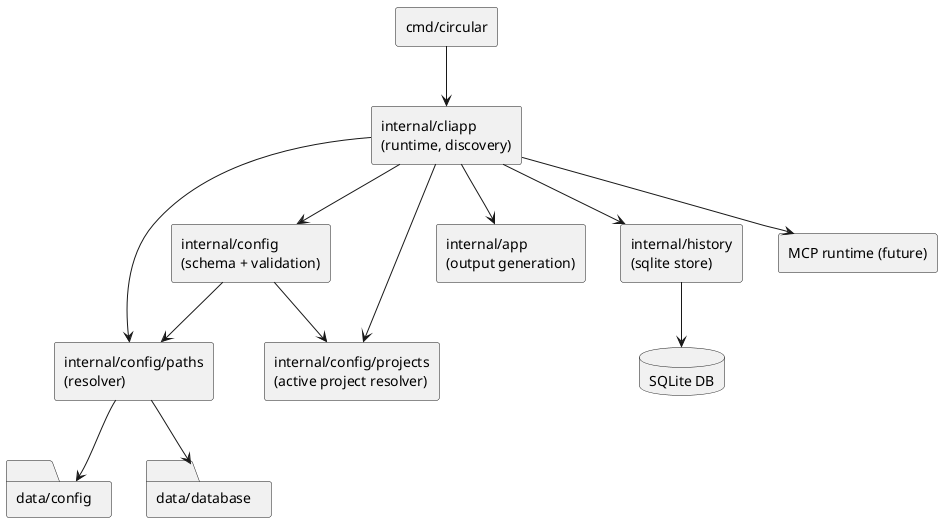

# Config Expansion and Pathing Plan (data/config + data/database + Projects + MCP)

## Scope, Assumptions, Constraints

Scope:
- Expand TOML configuration capabilities with explicit pathing for config files, project-scoped SQLite DB, and upcoming MCP mode.
- Migrate default config location from repository root (`./circular.toml`) to `data/config/`.
- Migrate default history DB location from `.circular/history.db` to `data/database/history.db`.
- Introduce first-class multi-project management so one workspace can manage multiple project entries safely.
- Keep current behavior working during migration to avoid breaking existing users.

Assumptions:
- MCP mode is planned but not fully implemented yet; this plan defines config contracts and runtime hooks only.
- Existing users may have automation depending on `--config ./circular.toml` and `.circular/history.db` defaults.
- Project identity can be derived from project root path, but explicit project naming must also be supported.
- Current code boundaries (`internal/config`, `internal/cliapp`, `internal/app`, `internal/history`) remain intact.

Constraints:
- Maintain Go 1.24.x compatibility.
- Prefer additive config fields and staged deprecation.
- Avoid breaking CLI UX in one release.

## Current-State Summary

| Area | Current behavior | Gap addressed by this plan |
| --- | --- | --- |
| Config default path | `--config` defaults to `./circular.toml`; fallback to `./circular.example.toml` | No `data/config` convention, no layered config discovery |
| History DB path | hard-coded to `<cwd>/.circular/history.db` | Not configurable in TOML, pathing fragmented |
| Project scope | implicit single-project behavior from current cwd | No registry for named projects or active-project selection |
| DB schema | snapshots stored without explicit project identity | Cannot safely store/query multiple projects in one DB |
| Output root detection | inferred from watch paths/cwd and repo markers | Independent logic from other path types |
| MCP mode config | no schema present | Need explicit section before MCP server wiring |
| Path normalization | grammars path normalized in runtime only | Path policy not centralized across config/DB/output/MCP |

## Target Configuration Model

```toml
version = 2

[paths]
project_root = ""                    # optional override
config_dir = "data/config"           # default
state_dir = "data/state"             # default
cache_dir = "data/cache"             # default
database_dir = "data/database"       # default

[config]
active_file = "circular.toml"        # resolved under paths.config_dir unless absolute
includes = ["profiles/dev.toml"]     # optional additive overlays

[db]
enabled = true
driver = "sqlite"
path = "history.db"                  # resolved under paths.database_dir unless absolute
busy_timeout = "5s"
project_mode = "multi"               # single|multi

[projects]
active = "default"
registry_file = "projects.toml"      # resolved under paths.config_dir unless absolute

[[projects.entries]]
name = "default"
root = "."
db_namespace = "default"

[mcp]
enabled = false
mode = "embedded"                    # embedded|server
transport = "stdio"                  # stdio|http (future)
address = "127.0.0.1:8765"           # used when transport supports it

[watch]
debounce = "500ms"

[output.paths]
root = ""
diagrams_dir = "docs/diagrams"
```

Notes:
- Existing fields (`grammars_path`, `watch_paths`, `exclude`, `output`, `alerts`, `architecture`) stay supported.
- Path blocks are additive in v1 and become preferred defaults in v2 migration mode.
- Project registry supports explicit naming while retaining cwd-based fallback for compatibility.

## Plan Overview

| Task ID | Goal | Owner | Depends On | Risk |
| --- | --- | --- | --- | --- |
| T1 | Define versioned config schema and migration policy | Core | - | Medium |
| T2 | Add centralized path resolver for config/state/db/output/MCP | Core | T1 | Medium |
| T3 | Implement `data/config` discovery + fallback chain | Core | T1,T2 | Medium |
| T4 | Move DB defaults to `data/database` and wire runtime pathing | Core | T2,T3 | Medium |
| T5 | Add multi-project model (config + registry + runtime selection) | Core | T1,T2,T4 | High |
| T6 | Update DB logic/schema for project-aware storage and querying | Core | T4,T5 | High |
| T7 | Add MCP config block + runtime validation hooks | Core | T1,T2 | Medium |
| T8 | Tests, docs, and rollout/deprecation guidance | Core | T1,T2,T3,T4,T5,T6,T7 | Low |

## Task Details

- T1 Define versioned config schema and migration policy [x]
Summary: introduce explicit schema versioning and compatibility guarantees before path migration.
Inputs/outputs: existing TOML schema in; additive `version`, `paths`, `config`, `db`, `projects`, `mcp` model + migration rules out.
File changes (with classes/functions):
- `internal/config/config.go` (update):
  - Classes/structs: `Config`, `Paths`, `ConfigFiles`, `Database`, `Projects`, `ProjectEntry`, `MCP`.
  - Main functions: `func Load(path string) (*Config, error)`, `func applyDefaults(cfg *Config)`, `func validateVersion(cfg *Config) error`, `func validateProjects(cfg *Config) error`.
- `internal/config/config_test.go` (update):
  - Main functions: `func TestLoad_VersionedConfig(t *testing.T)`, `func TestLoad_BackwardCompatibilityV1(t *testing.T)`.
- `circular.example.toml` (update): add new additive sections with comments for migration.
Best practices and standards:
- Keep v1 schema accepted without requiring immediate user edits.
- Fail fast on unsupported future versions with actionable messages.
- Keep defaults deterministic and OS-agnostic for relative paths.
- Document every new key in one place.
Acceptance checks:
- v1 config loads unchanged.
- v2-style config loads and validates.
- invalid/unknown version paths fail with clear errors.

- T2 Add centralized path resolver for config/state/db/output/MCP [x]
Summary: create a single path policy layer to eliminate duplicated resolution rules.
Inputs/outputs: config path fields + cwd in; canonical absolute runtime paths out.
File changes (with classes/functions):
- `internal/config/paths.go` (new):
  - Classes/structs: `ResolvedPaths` (`ProjectRoot`, `ConfigDir`, `StateDir`, `CacheDir`, `DatabaseDir`, `DBPath`, `MCPConfigPath`).
  - Main functions: `func ResolvePaths(cfg *Config, cwd string) (ResolvedPaths, error)`, `func ResolveRelative(base, value string) string`, `func DetectProjectRoot(candidates []string) (string, error)`.
- `internal/config/paths_test.go` (new):
  - Main functions: `func TestResolvePaths_DefaultLayout(t *testing.T)`, `func TestResolvePaths_AbsoluteOverrides(t *testing.T)`, `func TestDetectProjectRoot_FallbackOrder(t *testing.T)`.
- `internal/app/app.go` (update): replace local output-root detection helpers with config path resolver usage.
Best practices and standards:
- Centralize filesystem policy in `internal/config` only.
- Preserve absolute-path passthrough semantics.
- Keep helper functions pure for table-driven tests.
- Normalize paths with `filepath.Clean` and explicit cwd injection for testability.
Acceptance checks:
- output path resolution behavior remains unchanged for legacy configs.
- new resolver returns stable paths on Linux/macOS path separators.

- T3 Implement `data/config` discovery + fallback chain [x]
Summary: migrate default config lookup to `data/config` while preserving legacy fallback.
Inputs/outputs: CLI `--config` + cwd in; chosen config file path and source metadata out.
File changes (with classes/functions):
- `internal/cliapp/cli.go` (update):
  - Main constants/functions: `defaultConfigPath` moved to `./data/config/circular.toml`.
- `internal/cliapp/runtime.go` (update):
  - Main functions: `func loadConfig(path string) (*config.Config, error)`, `func discoverDefaultConfig(cwd string) ([]string, error)`.
- `internal/cliapp/runtime_test.go` (update):
  - Main functions: `func TestLoadConfig_DefaultDiscoveryOrder(t *testing.T)`, `func TestLoadConfig_CustomPathNoFallback(t *testing.T)`.
- `data/config/circular.example.toml` (new): repository-default config template location.
- `circular.example.toml` (update): compatibility shim copy or short deprecation header.
Best practices and standards:
- Discovery order should be explicit and documented.
- Keep custom `--config` behavior strict (no surprise fallback chain).
- Emit one clear warning when using deprecated root config location.
- Avoid silent path mutation in CLI layer.
Acceptance checks:
- default launch resolves `data/config/circular.toml` first.
- missing new default falls back to legacy path in transition phase.
- `--config` explicit path stays authoritative.

- T4 Move DB defaults to `data/database` and wire runtime pathing [x]
Summary: remove hard-coded `.circular/history.db` dependency, default to `data/database/history.db`, and drive DB path from TOML.
Inputs/outputs: `db.*` config + resolved paths in; `history.Open(resolvedDBPath)` and exports out.
File changes (with classes/functions):
- `internal/cliapp/runtime.go` (update):
  - Main functions: `func openHistoryStoreIfEnabled(enabled bool, cfg *config.Config, paths config.ResolvedPaths) (*history.Store, error)`.
  - Remove/replace: `resolveHistoryPath()` hard-coded behavior.
- `internal/history/store.go` (update):
  - Classes/structs: `Store` (no API break expected).
  - Main functions: `func Open(path string) (*Store, error)` (retain), optional timeout setup helper if needed.
- `internal/cliapp/runtime_test.go` (update):
  - Main functions: `func TestOpenHistoryStore_UsesConfiguredDBPath(t *testing.T)`, `func TestOpenHistoryStore_DBDisabled(t *testing.T)`.
- `docs/documentation/cli.md` (update): history storage path behavior.
Best practices and standards:
- Keep history feature toggled by CLI mode and/or db.enabled rules documented clearly.
- Ensure parent directories are created with least-privilege permissions.
- Keep migration behavior deterministic if both old and new DB files exist.
- Avoid changing snapshot schema or trend contracts in this task.
Acceptance checks:
- `--history` writes to configured DB path.
- default DB path resolves to `data/database/history.db`.
- legacy behavior preserved when `db.path` omitted during transition.

- T5 Add multi-project model (config + registry + runtime selection) [x]
Summary: define a stable project identity model so CLI/history/query flows can select and run against a named project.
Inputs/outputs: `[projects]` config + runtime context in; resolved `ActiveProject` metadata out.
File changes (with classes/functions):
- `internal/config/config.go` (update):
  - Classes/structs: `Projects`, `ProjectEntry`.
  - Main functions: `func validateProjects(cfg *Config) error`.
- `internal/config/projects.go` (new):
  - Classes/structs: `ActiveProject`.
  - Main functions: `func ResolveActiveProject(cfg *Config, cwd string) (ActiveProject, error)`, `func LoadProjectRegistry(path string) ([]ProjectEntry, error)`.
- `internal/cliapp/runtime.go` (update):
  - Main functions: `func resolveRuntimeProject(cfg *config.Config, paths config.ResolvedPaths, cwd string) (config.ActiveProject, error)`.
- `internal/config/config_test.go` (update):
  - Main functions: `func TestLoad_ProjectsValidation(t *testing.T)`.
- `data/config/projects.example.toml` (new): sample project registry.
Best practices and standards:
- Require unique project names and normalized roots.
- Keep active-project resolution deterministic with explicit precedence.
- Avoid hidden fallback between unrelated projects.
- Ensure config errors identify invalid project entry by name.
Acceptance checks:
- active project can be selected by name.
- project root auto-match works when `projects.active` is unset.
- invalid duplicate project names fail config load with clear errors.

- T6 Update DB logic/schema for project-aware storage and querying [x]
Summary: make history persistence/querying project-aware so one DB can safely store multiple projects.
Inputs/outputs: active project metadata + snapshot payload in; project-scoped snapshots/trends out.
File changes (with classes/functions):
- `internal/history/schema.go` (update):
  - Main functions: `func EnsureSchema(db *sql.DB) error` (add project tables/indexes/migration).
- `internal/history/models.go` (update):
  - Classes/structs: add `ProjectID` / `ProjectKey` fields to snapshot models.
- `internal/history/store.go` (update):
  - Main functions: `func Open(path string) (*Store, error)` (retain), `func SaveSnapshot(projectKey string, snapshot Snapshot) error`, `func LoadSnapshots(projectKey string, since time.Time) ([]Snapshot, error)`.
- `internal/history/trends.go` (update):
  - Main functions: `func BuildTrendReport(projectKey string, points []TrendPoint, window time.Duration) (TrendReport, error)`.
- `internal/history/history_test.go` (update):
  - Main functions: `func TestStore_SaveLoadSnapshots_ProjectIsolation(t *testing.T)`.
Best practices and standards:
- Use composite unique indexes including project identity.
- Keep old rows migratable with deterministic default project assignment.
- Ensure cross-project reads are impossible unless explicitly requested.
- Keep migration idempotent and rollback-safe.
Acceptance checks:
- snapshots from two projects do not collide.
- trend/query outputs are scoped to active project.
- legacy single-project DB migrates without data loss.

- T7 Add MCP config block + runtime validation hooks [x]
Summary: define MCP-related config and validate combinations without enabling full MCP runtime yet.
Inputs/outputs: `[mcp]` block in; validated runtime options and no-op integration hooks out.
File changes (with classes/functions):
- `internal/config/config.go` (update):
  - Classes/structs: `MCP` (`Enabled`, `Mode`, `Transport`, `Address`, `ConfigPath`).
  - Main functions: `func validateMCP(cfg *Config) error`.
- `internal/cliapp/runtime.go` (update):
  - Main functions: `func validateModeCompatibility(opts cliOptions, cfg *config.Config) error` (extended for MCP constraints).
- `internal/config/config_test.go` (update):
  - Main functions: `func TestLoad_MCPValidation(t *testing.T)`.
- `docs/documentation/configuration.md` (update): MCP config schema and examples.
Best practices and standards:
- Keep MCP schema additive and disabled by default.
- Validate enums (`mode`, `transport`) strictly.
- Reserve unsupported transport modes with clear error text.
- Separate config validation from MCP runtime startup logic.
Acceptance checks:
- invalid MCP combinations fail during config load.
- default non-MCP workflows are unchanged.

- T8 Tests, docs, rollout, and deprecation timeline [x]
Summary: complete migration documentation, release notes, and phased deprecation policy.
Inputs/outputs: implemented pathing/config changes in; verified tests/docs and release plan out.
File changes (with classes/functions):
- `README.md` (update): quickstart now references `data/config/circular.toml`.
- `docs/documentation/configuration.md` (update): full schema + migration matrix.
- `docs/documentation/cli.md` (update): config discovery order, project selection flow, and DB path notes.
- `docs/documentation/advanced.md` (update): history DB relocation and troubleshooting.
- `CHANGELOG.md` (update): migration notes and deprecation dates.
- `docs/plans/config-expansion-pathing-plan.md` (update/finalize): implementation tracking.
Best practices and standards:
- Version migration notes must include concrete examples.
- Keep docs and runtime behavior synchronized in the same PR.
- Include one upgrade checklist for CI users, one for local users, and one for multi-project adopters.
- Use semantic version guidance explicitly (likely MINOR with deprecation, MAJOR when legacy removed).
Acceptance checks:
- `go test ./...` passes including new config/path tests.
- docs reference correct default config and DB paths consistently (`data/database/history.db`).
- changelog records transition and removal milestones.

## File Inventory

| File | Type | Classes (name + main methods) | Main functions (name + signature) | Purpose |
| --- | --- | --- | --- | --- |
| `internal/config/config.go` | update | `Config`, `Paths`, `ConfigFiles`, `Database`, `Projects`, `ProjectEntry`, `MCP` | `Load(path string) (*Config, error)`; `validateVersion(cfg *Config) error`; `validateProjects(cfg *Config) error`; `validateMCP(cfg *Config) error` | Expand schema and validation |
| `internal/config/paths.go` | new | `ResolvedPaths` | `ResolvePaths(cfg *Config, cwd string) (ResolvedPaths, error)`; `DetectProjectRoot(candidates []string) (string, error)` | Central path resolver |
| `internal/config/projects.go` | new | `ActiveProject` | `ResolveActiveProject(cfg *Config, cwd string) (ActiveProject, error)`; `LoadProjectRegistry(path string) ([]ProjectEntry, error)` | Multi-project selection and registry loading |
| `internal/config/config_test.go` | update | n/a | `TestLoad_VersionedConfig(t *testing.T)`; `TestLoad_ProjectsValidation(t *testing.T)`; `TestLoad_MCPValidation(t *testing.T)` | Config + compatibility tests |
| `internal/config/paths_test.go` | new | n/a | `TestResolvePaths_DefaultLayout(t *testing.T)` | Pathing tests |
| `internal/cliapp/cli.go` | update | n/a | `parseOptions(args []string) (cliOptions, error)` | New default config path |
| `internal/cliapp/runtime.go` | update | n/a | `loadConfig(path string) (*config.Config, error)`; `discoverDefaultConfig(cwd string) ([]string, error)`; `resolveRuntimeProject(cfg *config.Config, paths config.ResolvedPaths, cwd string) (config.ActiveProject, error)`; `openHistoryStoreIfEnabled(enabled bool, cfg *config.Config, paths config.ResolvedPaths) (*history.Store, error)` | Discovery and runtime wiring |
| `internal/cliapp/runtime_test.go` | update | n/a | `TestLoadConfig_DefaultDiscoveryOrder(t *testing.T)`; `TestOpenHistoryStore_UsesConfiguredDBPath(t *testing.T)` | Runtime behavior regression coverage |
| `internal/app/app.go` | update | `App` | `resolveOutputTargets() (outputTargets, error)` (updated to use resolver) | Unify output path resolution |
| `internal/history/store.go` | update | `Store` (`Close`, `SaveSnapshot`, `LoadSnapshots`) | `Open(path string) (*Store, error)`; `SaveSnapshot(projectKey string, snapshot Snapshot) error`; `LoadSnapshots(projectKey string, since time.Time) ([]Snapshot, error)` | Project-aware DB storage semantics |
| `internal/history/schema.go` | update | n/a | `EnsureSchema(db *sql.DB) error` | Add project-aware schema migration/indexing |
| `internal/history/models.go` | update | `Snapshot`, `SnapshotMetric` | n/a | Add project identity fields |
| `internal/history/history_test.go` | update | n/a | `TestStore_SaveLoadSnapshots_ProjectIsolation(t *testing.T)` | Project isolation regression coverage |
| `data/config/circular.example.toml` | new | n/a | n/a | Canonical config template in new location |
| `data/config/projects.example.toml` | new | n/a | n/a | Multi-project registry example |
| `circular.example.toml` | update | n/a | n/a | Transitional compatibility entrypoint |
| `README.md` | update | n/a | n/a | New quickstart and default paths |
| `docs/documentation/configuration.md` | update | n/a | n/a | Schema and migration documentation |
| `docs/documentation/cli.md` | update | n/a | n/a | CLI default/fallback behavior |
| `docs/documentation/advanced.md` | update | n/a | n/a | DB pathing and operations guidance |
| `CHANGELOG.md` | update | n/a | n/a | Versioned release notes |

## Diagrams





## Risks and Mitigations

| Risk | Impact | Mitigation |
| --- | --- | --- |
| Default config path migration breaks automation | High | two-stage fallback chain + deprecation warning cycle |
| Multiple path roots (watch/output/db) drift | Medium | single resolver and shared tests |
| Multi-project selection causes accidental cross-project writes | High | explicit active project resolution and project-scoped DB keys/indexes |
| DB migration for project-aware schema corrupts legacy history | High | additive migrations, backup recommendation, and migration tests with fixtures |
| MCP config lands before runtime support | Medium | strict validation + disabled-by-default no-op hooks |
| Hidden behavior changes in history mode | Medium | explicit regression tests for old/new DB path behavior |

## Testing and Verification Plan

| Layer | Verification |
| --- | --- |
| Config parsing | table-driven tests for v1 and v2 schemas |
| Path resolution | deterministic tests for relative/absolute/cwd variants |
| Runtime wiring | CLI tests covering discovery order, active-project selection, and DB open path |
| DB project isolation | history tests for project-keyed writes/reads and trend scoping |
| Backward compatibility | fixtures for legacy `./circular.toml` and `.circular/history.db` behavior + migration into `data/database/history.db` |
| End-to-end | `go test ./...` and manual smoke run: `go run ./cmd/circular --once` |

## Release and Migration Strategy

| Phase | Version target | Behavior |
| --- | --- | --- |
| Phase 1 | MINOR | add new schema + resolver + `data/config` and `data/database` preferred defaults, keep legacy fallback |
| Phase 2 | MINOR+1 | add multi-project registry and project-aware DB schema migration, warn when legacy root config/DB paths are used |
| Phase 3 | MAJOR | remove legacy fallback and finalize `data/config` + `data/database` + project-scoped history contract |

## Folder List

- `docs/plans/config-expansion-pathing-plan.md`
- `data/config/`
- `data/database/`
- `internal/config/`
- `internal/cliapp/`
- `internal/app/`
- `internal/history/`
- `docs/documentation/`
- `README.md`
- `CHANGELOG.md`
