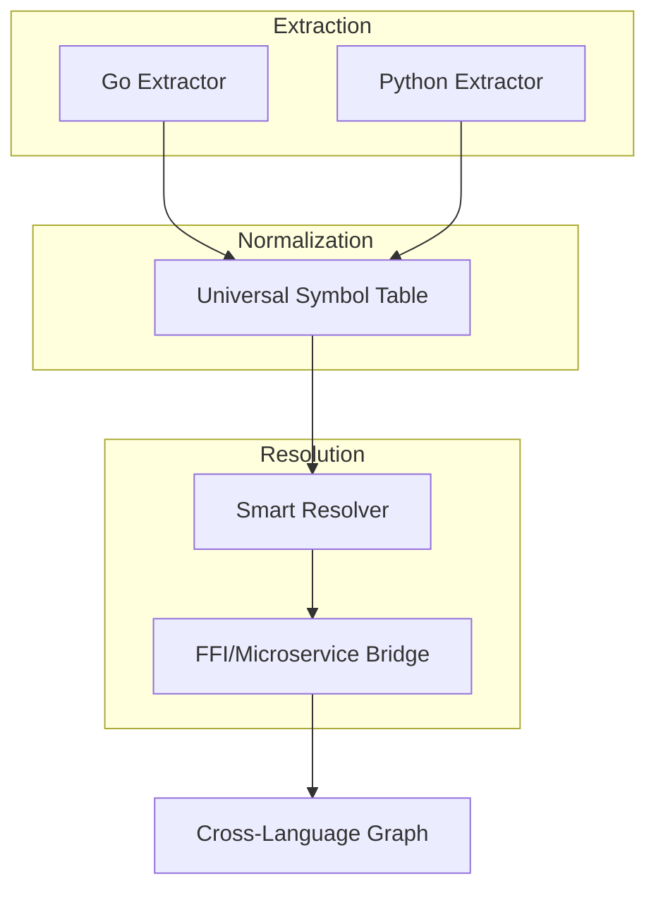

# Plan: Cross-Language Analysis Optimization

## Implementation Status (Session: 2026-02-14)

- Overall completion: **fully implemented (heuristic baseline)**
- Current status by phase:
  - Phase 1 (Metadata): **completed**
  - Phase 2 (Queries): **completed**
  - Phase 3 (FFI): **completed**
  - Phase 4 (Resolving): **completed**

### Completed This Session

- Added graph-level universal symbol table abstraction in `internal/engine/graph/symbol_table.go`.
- Extended profile extractors (`javascript`/`typescript`/`java`/`rust`) to populate definition metadata parity fields:
  - `Visibility`
  - `Scope`
  - `Signature`
  - `TypeHint`
- Added multi-pass probabilistic resolution using symbol-table candidates in `internal/engine/resolver/probabilistic.go`.
- Added framework-aware service contract linking heuristics (for example `GreeterClient` -> `GreeterServicer`) via service-key indexing.
- Expanded bridge-context tagging and recognition across non-Go/Python profiles.
- Added/updated graph, parser, and resolver tests for symbol-table indexing, metadata parity, and probabilistic/service resolution.

### Remaining To Reach Full Plan Completion

- None for the current plan scope. Remaining opportunities are quality/perf follow-ups rather than unmet plan tasks.

## Overview
Improve the depth and accuracy of symbol resolution across different programming languages. This plan focuses on making the resolver smarter at identifying relationships between Go, Python, and other supported languages, especially in polyglot repositories.

## Key Strategies

### 1. Enhanced Symbol Resolution
- **Contextual Heuristics** - `completed`: Bridge-aware cross-language patterns now cover Go/Python/JS/TS/Java/Rust reference contexts.
- **Universal Symbol Table** - `completed`: Graph-backed symbol table now normalizes and indexes definitions across enabled languages.
- **FFI Detection** - `completed`: FFI/process/service bridge contexts are extracted and consumed during multi-pass resolution.

### 2. Improved Language Extraction
- **Deep Tree-Sitter Queries** - `completed`: Metadata parity is now captured across Go/Python/JS/TS/Java/Rust extractor profiles.
- **Reference Tracking** - `completed`: Bridge-context tagging plus symbol-table lookups now support inter-file cross-language linkage.
- **Scope Awareness** - `completed`: Scope metadata is captured in core profiles with method/global distinctions.

### 3. Smarter Resolver Logic
- **Probabilistic Matching** - `completed`: Resolver now performs a scored second-pass over universal symbol candidates.
- **Inter-file Dependency Tracking** - `completed`: Universal symbol indexing provides cross-file symbol-flow matching beyond call-context-only handling.
- **Framework Support** - `completed`: Service bridge references now link to likely service definitions via normalized service keys.

## Implementation Steps

| Phase | Task | Description | Status |
| :--- | :--- | :--- | :--- |
| **Phase 1: Metadata** | Enrich `parser.Definition` | Add more fields for type info, decorators, and visibility. | `completed` |
| **Phase 2: Queries** | Optimize Tree-Sitter Queries | Update extractors to use more precise queries for each language. | `completed` |
| **Phase 3: FFI** | FFI Recognition | Implement basic detection for common cross-language call patterns. | `completed` |
| **Phase 4: Resolving** | Advanced Resolver Logic | Implement multi-pass resolution for ambiguous symbols. | `completed` |

### Task Checklist

- [x] Enrich `parser.Definition` with metadata fields (initial implementation)
- [x] Tag cross-language bridge reference contexts (`ffi_bridge`, `process_bridge`, `service_bridge`)
- [x] Build universal symbol table across languages
- [x] Implement multi-pass/probabilistic resolution for ambiguous symbols
- [x] Add framework-level contract linking (gRPC/Thrift service definitions)

## Do's and Don'ts

### DO
- Prioritize accuracy over speed; a wrong resolution is worse than no resolution.
- Cache resolution results to avoid redundant tree-walking.
- Use language-specific "bridges" for common inter-op scenarios.

### DON'T
- Over-engineer for rare edge cases; focus on the most common 80% of cross-language usage.
- Hardcode language-specific assumptions into the core `Graph` structure.
- Ignore build artifacts (like `.pyi` stubs or Go headers) that provide better type info.

## Analysis Dataflow

