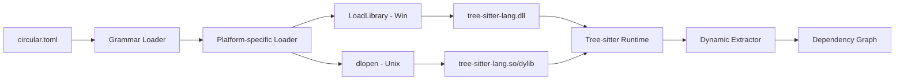

# Dynamic Tree-sitter Grammar Support Plan
# docs/plans/archived/dynamic-grammar-support.md

This document outlines the implementation of dynamic grammar loading for `circular`. This allows adding support for new programming languages without recompiling the main binary, using shared object files (`.so` or `.dll`).

## Objective
Enable `circular` to load and use Tree-sitter grammars at runtime via the `dlopen` (or equivalent) mechanism across Linux, macOS, and Windows.

**Status: Fully Implemented** (2026-02-14)
**Archived:** 2026-02-20 - All phases complete, verified in codebase.

## Platform Support (Grammar Extensions)
| OS | Extension | Loading Mechanism |
| :--- | :--- | :--- |
| **Linux** | `.so` | `dlopen` |
| **macOS** | `.dylib` | `dlopen` |
| **Windows** | `.dll` | `LoadLibrary` |

## Data Flow


## Standards & Best Practices
- **CGO Safety:** Use a dedicated C file or bridge for `dlopen` calls to keep Go code clean.
- **Symbol Convention:** Follow the standard Tree-sitter symbol naming convention: `tree_sitter_<langname>`.
- **Validation:** Verify grammar compatibility (ABI version) before loading.
- **Fallback:** Always allow falling back to statically linked grammars if dynamic loading fails.

## Detailed Phase Breakdown

### Phase 1: Dynamic Loader implementation
Implement the low-level mechanism to load symbols from shared libraries.

| Task | File | Status | Description |
| :--- | :--- | :--- | :--- |
| Create `dlopen` bridge | `internal/engine/parser/grammar/dynamic_loader.go` | [x] | Implement `C` wrapper for `dlopen` and `dlsym`. |
| Implement `LanguageLoader` | `internal/engine/parser/loader.go` | [x] | Logic to map config path to loaded language pointer. |

#### Code Snippet: Dynamic Loader (CGO)
```go
package grammar

/*
#include <dlfcn.h>
#include <stdlib.h>

void* load_ts_lang(const char* path, const char* name) {
    void* handle = dlopen(path, RTLD_LAZY);
    if (!handle) return NULL;
    return dlsym(handle, name);
}
*/
import "C"
import (
    "fmt"
    "unsafe"
    sitter "github.com/tree-sitter/go-tree-sitter"
)

func LoadDynamic(path, langName string) (*sitter.Language, error) {
    symbol := "tree_sitter_" + langName
    cPath := C.CString(path)
    cSymbol := C.CString(symbol)
    defer C.free(unsafe.Pointer(cPath))
    defer C.free(unsafe.Pointer(cSymbol))

    ptr := C.load_ts_lang(cPath, cSymbol)
    if ptr == nil {
        return nil, fmt.Errorf("failed to load %s from %s", symbol, path)
    }
    return sitter.NewLanguage(ptr), nil
}
```

### Phase 2: Configuration Mapping
Extend `circular.toml` to support dynamic grammar definitions.

| Task | File | Status | Description |
| :--- | :--- | :--- | :--- |
| Update Config struct | `internal/core/config/config.go` | [x] | Add `DynamicGrammars` section. |
| Add Path validation | `internal/core/config/paths.go` | [x] | Ensure `.so` files exist and are reachable. |

#### Example Config
```toml
[[dynamic_grammars]]
name = "kotlin"
library = "./grammars/kotlin/kotlin.so"
extensions = [".kt"]
# Mapping AST nodes to concepts
namespace_node = "package_header"
import_node = "import_header"
definition_nodes = ["class_declaration", "function_declaration"]
```

### Phase 3: Generic Dynamic Extractor
Create an extractor that uses the configuration mapping to navigate the AST.

| Task | File | Status | Description |
| :--- | :--- | :--- | :--- |
| Implement `DynamicExtractor` | `internal/engine/parser/dynamic_extractor.go` | [x] | Uses TOML mapping to extract symbols. |
| Register Dynamic Extractor | `internal/engine/parser/parser.go` | [x] | Auto-register for dynamic languages. |

## Do's and Don'ts

| DO | DONT |
| :--- | :--- |
| Cache loaded `.so` handles. | `dlopen` the same file multiple times. |
| Provide clear error messages for missing symbols. | Silently fail when a grammar is misconfigured. |
| Use `RTLD_LAZY` for performance. | Use `RTLD_GLOBAL` unless absolutely necessary. |

## New Files Purpose

| File | Purpose | Known Functions |
| :--- | :--- | :--- |
| `internal/engine/parser/grammar/dynamic_loader.go` | CGO bridge for library loading. | `LoadDynamic` |
| `internal/engine/parser/dynamic_extractor.go` | Config-driven AST extractor. | `Extract`, `extractNamespace`, `extractImport`, `extractDefinition` |

## Verification Plan
1. **Toolchain Test:** Compile a simple grammar (e.g., JSON) to `.so` and load it.
2. **Integration Test:** Verify `circular` can parse Kotlin files using the dynamic loader.
3. **Error Handling:** Verify behavior when `.so` is missing or corrupted.
