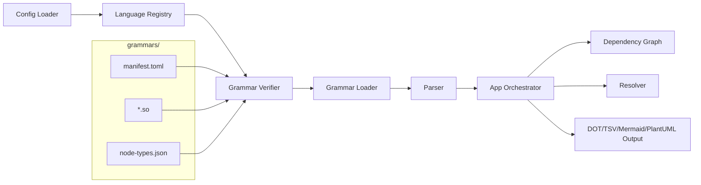
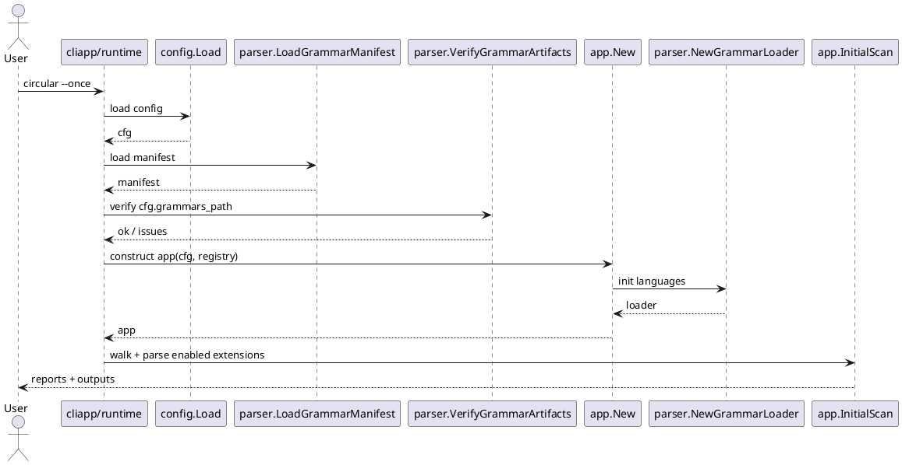

# Plan: Multi-Language Grammar Integration with AIB14/AIB15 Verification

## Overview

Scope: implement new grammar support under `grammars/` with strict grammar provenance/version verification, and migrate parsing to a profile-driven extractor architecture (inspired by the Python `ASTParser` + mapping pattern) to replace per-language extractor files.

Current status (2026-02-13):
- Runtime defaults to `.go` and `.py`, with registry-driven extension/file routing now implemented.
- `GrammarLoader` now supports manifest verification gates for enabled languages and fails fast on checksum/AIB issues.
- New grammar artifacts are present for: `css`, `html`, `java`, `javascript`, `typescript`, `tsx`, `rust`, `gomod`, and `gosum`.

Date/provenance constraint:
- `node-types.json` for major new languages are timestamped **2026-01-12**.
- Most corresponding `.so` files are timestamped **2026-01-22**.
- Because this differs from a single-date assumption, implementation must include an explicit provenance manifest and checksum/version gate before enabling production parsing.

Assumptions:
- AIB14 and AIB15 are both intentionally present and both must remain supported for this rollout.
- Language support should be additive and feature-flagged per language until extractor quality is validated.
- Compatibility target remains Go 1.24.x behavior, even if development occurs on newer Go versions.
- The Python parser architecture in `ecosystem/syntx` is a design reference, but this project will use a lighter configuration model (no AST storage tiers/pruning complexity).

Python reference paths (absolute, for direct reuse without search):
- `/home/michael/projects/ecosystem/syntx/backend/database/src/database/parser/parser/ast_parser.py`
- `/home/michael/projects/ecosystem/syntx/backend/database/src/database/parser/parser/mapping_generator.py`
- `/home/michael/projects/ecosystem/syntx/backend/database/src/database/parser/parser/treesitter_schema.py`
- `/home/michael/projects/ecosystem/syntx/backend/database/src/database/parser/parser.py`
- `/home/michael/projects/ecosystem/syntx/backend/database/src/database/parser/grammars/`
- `/home/michael/projects/ecosystem/syntx/backend/database/src/database/parser/grammars/python/`
- `/home/michael/projects/ecosystem/syntx/backend/database/src/database/parser/grammars/javascript/`
- `/home/michael/projects/ecosystem/syntx/backend/database/src/database/parser/grammars/typescript/`
- `/home/michael/projects/ecosystem/syntx/backend/database/src/database/parser/grammars/tsx/`
- `/home/michael/projects/ecosystem/syntx/backend/database/src/database/parser/grammars/java/`
- `/home/michael/projects/ecosystem/syntx/backend/database/src/database/parser/grammars/rust/`
- `/home/michael/projects/ecosystem/syntx/backend/database/src/database/parser/grammars/html/`
- `/home/michael/projects/ecosystem/syntx/backend/database/src/database/parser/grammars/css/`

Constraints:
- Keep existing Go/Python behavior unchanged.
- Avoid silently accepting unverified grammar binaries.
- Preserve deterministic output/test behavior.

## Current Implementation Status (2026-02-13)

### Implemented

- Shared extraction engine added in `internal/parser/engine.go` with:
- generic node-kind dispatch (`NodeHandler`)
- shared extraction context (`ExtractionContext`)
- reusable traversal/helpers (text, location, child lookup, identifier collection)
- Go extractor migrated to engine-driven handler dispatch in `internal/parser/golang.go`.
- Python extractor migrated to engine-driven handler dispatch in `internal/parser/python.go`.
- Validation complete for this step:
- `go test ./internal/parser` passed.
- `go test ./...` passed.

### Completed

- T5 completed with a simplified profile-driven implementation in `internal/parser/profile_extractors.go` (code-defined profiles instead of TOML profile files).
- T6 completed with conservative JS/TS/TSX, Java, and Rust policies plus language-scoped stdlib lists.
- T7 completed with parser/loader cross-language matrix tests, including `gomod`/`gosum` raw extraction coverage.
- T8 completed with documentation and changelog updates.
- T9 completed by removing one-off language extractor files and routing through shared profile extractors.

## Inputs and Outputs

| Input | Source | Format | Validation |
| --- | --- | --- | --- |
| Grammar binaries | `grammars/*/*.so` | shared objects | SHA256 + manifest match |
| Grammar node specs | `grammars/*/node-types.json` | JSON | parseable JSON + manifest match |
| Version metadata | new manifest file | TOML/JSON | required fields + supported AIB version |
| Source files | scanned repos | language-specific extensions | extension map + exclusions |

| Output | Consumer | Format | Backward Compatibility |
| --- | --- | --- | --- |
| Language registry | parser/app | typed Go structs | additive only |
| Verified grammar report | CI/dev scripts | terminal/JSON summary | new optional check |
| Extended parse graph data | graph/resolver/output | existing structs | additive language coverage |
| Updated docs/config guidance | users/integrators | markdown | non-breaking docs update |

## Plan Overview

| Task ID | Goal | Owner | Depends On | Risk | Status |
| --- | --- | --- | --- | --- | --- |
| T1 | Create grammar provenance manifest and verifier | Core | - | High | [x] |
| T2 | Add language registry model and config controls | Core | T1 | Medium | [x] |
| T3 | Refactor loader to manifest-driven initialization | Core | T1,T2 | High | [x] |
| T4 | Expand parser/app/watcher language routing | Core | T2,T3 | Medium | [x] |
| T5 | Implement profile-driven extractor architecture (phase gates) | Core | T3,T4 | High | [x] |
| T6 | Add resolver/stdlib policy for newly supported languages | Core | T5 | Medium | [x] |
| T7 | Add test matrix and fixture suite | Core | T1,T3,T4,T5,T6 | Medium | [x] |
| T8 | Docs/changelog/release readiness and rollout flags | Core | T1-T7 | Low | [x] |
| T9 | Remove language-specific parser files after profile parity | Core | T5,T7,T8 | Medium | [x] |

## Tasks

- T1 Create grammar provenance manifest and verifier [x]
Summary: introduce a manifest that records each grammar artifact's AIB major version, expected SHA256, source reference, and approved date window.
Inputs/outputs: grammar files + expected metadata in; pass/fail verification report out.
File changes (with classes/functions):
- `grammars/manifest.toml` (new): language metadata, AIB14/AIB15 mapping, artifact hashes.
- `internal/parser/grammar_manifest.go` (new): `type GrammarManifest`, `type GrammarArtifact`.
- `internal/parser/grammar_verify.go` (new): `func VerifyGrammarArtifacts(baseDir string, manifest GrammarManifest) ([]VerificationIssue, error)`.
- `internal/cliapp/runtime.go` (update): optional `--verify-grammars` command path.
Best practices and standards:
- Treat missing hash/version metadata as hard failure.
- Separate “unsupported AIB version” from “checksum mismatch” in errors.
- Keep verifier deterministic and CI-friendly.
Acceptance checks:
- Verification fails on tampered `.so` or `node-types.json`.
- Verification fails when AIB version not in allowed set.
- Verification summary includes language, expected hash, actual hash, and artifact path.

- T2 Add language registry model and config controls [x]
Summary: formalize a registry describing supported languages, file extensions, extractor availability, and rollout state.
Inputs/outputs: manifest + defaults in; runtime language registry out.
File changes (with classes/functions):
- `internal/config/config.go` (update): add `languages` config section.
- `internal/config/config_test.go` (update): validation tests for language toggles.
- `internal/parser/language_registry.go` (new): `type LanguageSpec`, `func DefaultLanguageRegistry() map[string]LanguageSpec`.
Best practices and standards:
- Default existing behavior to enabled (`go`, `python`) to avoid regressions.
- Require explicit opt-in for unvalidated languages.
- Validate duplicate extension ownership at startup.
Acceptance checks:
- Duplicate extension mappings are rejected.
- Disabled language extensions are skipped in scan + parse.
- Existing configs load unchanged with defaults.

- T3 Refactor loader to manifest-driven initialization [x]
Summary: move from hardcoded Go/Python loader behavior to registry + verification-driven grammar loading lifecycle.
Inputs/outputs: registry + manifest + `grammars_path` in; ready-to-use language map out.
File changes (with classes/functions):
- `internal/parser/loader.go` (update): `func NewGrammarLoaderWithRegistry(grammarsPath string, registry map[string]LanguageSpec, verifyArtifacts bool) (*GrammarLoader, error)`.
- `internal/parser/loader_test.go` (new): loader behavior for verified/unverified grammars.
- `internal/app/app.go` (update): pass registry and enforce startup verification mode.
Best practices and standards:
- Fail fast before scan begins when required language artifacts are invalid.
- Keep loader behavior explicit per language (binding vs artifact-backed).
- Preserve resource cleanup semantics.
Acceptance checks:
- Startup error clearly identifies the first invalid language artifact.
- Go/Python startup path remains unchanged when no extra languages enabled.
- Loader test fixtures cover mixed AIB14/AIB15 inputs.

- T4 Expand parser/app/watcher language routing [x]
Summary: replace hardcoded extension checks with registry-driven routing in parser detection, directory scan, and watcher handling.
Inputs/outputs: registry in; language-aware filtering and parsing out.
File changes (with classes/functions):
- `internal/parser/parser.go` (update): `func (p *Parser) detectLanguage(path string) string` uses registry.
- `internal/app/app.go` (update): extension inclusion and module-resolution dispatch hooks per language.
- `internal/watcher/watcher.go` (update): language-aware test-file exclusion and event filtering.
Best practices and standards:
- Keep extension matching case-normalized and deterministic.
- Maintain current exclude globs semantics.
- Ensure unsupported files are ignored without noisy logs.
Acceptance checks:
- Registry-enabled files are scanned and parsed; others are ignored.
- Existing `.go`/`.py` behavior remains stable.
- Watch mode handles adds/renames for new language files.

- T5 Implement profile-driven extractor architecture with phase gates [x]
Summary: replace language-specific extractor files with a shared, profile-driven extractor module using code-defined language profiles (simplified from TOML profile loading), matching current `parser.File` contract.
Inputs/outputs: parse trees in; normalized `parser.File` models out.
File changes (with classes/functions):
- `internal/parser/profile_extractors.go` (new): consolidated profile-driven extractors and default extractor factory.
- `internal/parser/parser.go` (update): default extractor registration + raw-extractor fallback path.
- `internal/parser/loader.go` (update): runtime grammar bindings for enabled supported languages.
Status notes:
- Implemented: shared extractor engine in `internal/parser/engine.go`.
- Implemented: Go and Python extractors migrated to engine dispatch in `internal/parser/golang.go` and `internal/parser/python.go`.
- Implemented: JS/TS/TSX/Java/Rust/HTML/CSS/Gomod/Gosum routed through shared profile-driven extractor module.
Best practices and standards:
- Keep extraction heuristic-first, deterministic, and documented by language profile.
- Keep profile schema intentionally small (no AST-storage tiers/ratings/depth pruning model).
- Return partial results with warnings for unsupported node patterns.
- Normalize import/reference naming conventions for cross-language graph consistency.
Acceptance checks:
- Each enabled language yields imports + definitions for representative fixtures.
- Parse failures include language + file path context.
- Tiered rollout can enable/disable each language independently.
- Go/Python profile outputs match legacy behavior before expanding remaining languages.

- T6 Add resolver and stdlib strategy for additional languages [x]
Summary: define unresolved-reference and unused-import behavior for new languages to avoid misleading output.
Inputs/outputs: parsed files + language context in; resolver diagnostics out.
File changes (with classes/functions):
- `internal/resolver/resolver.go` (update): language dispatch hooks for unresolved/unused policies.
- `internal/resolver/javascript_resolver.go` (new): JS/TS alias/import heuristics.
- `internal/resolver/java_resolver.go` (new): package/class import heuristics.
- `internal/resolver/rust_resolver.go` (new): module/use path heuristics.
- `internal/resolver/stdlib/javascript.txt` (new), `internal/resolver/stdlib/java.txt` (new), `internal/resolver/stdlib/rust.txt` (new).
Best practices and standards:
- Start conservative to minimize false positives.
- Keep language-specific heuristics isolated by package/file.
- Document confidence levels per language.
Acceptance checks:
- Resolver tests show bounded false positives on fixtures.
- Existing Go/Python resolver behavior remains unchanged.
- Unused-import checks are disabled when unsupported for a language.

- T7 Build comprehensive test matrix and fixtures [x]
Summary: establish deterministic fixtures and cross-language matrix tests for parser/loader/app/resolver/watcher paths.
Inputs/outputs: fixture source sets in; CI-grade tests + coverage evidence out.
File changes (with classes/functions):
- `internal/parser/parser_test.go` (update): add multi-language table-driven tests.
- `internal/parser/loader_test.go` (new): verification + manifest integration tests.
- `internal/app/app_test.go` (update): scan/watch integration for enabled language subsets.
- `internal/watcher/watcher_test.go` (update): extension and test-file filtering behavior.
- `testdata/grammars/` (new): minimal sample files per language.
Best practices and standards:
- Use table-driven tests with stable sort/order checks.
- Keep fixtures minimal and explicit.
- Separate parser correctness tests from resolver heuristic tests.
Acceptance checks:
- `go test ./...` passes.
- `GOTOOLCHAIN=go1.24.9 go test ./...` passes (with writable `GOCACHE` override in sandbox).
- Added tests cover expanded language loading and multi-language parser extraction.
- Regression tests keep current Go/Python outputs.

- T8 Finalize docs, changelog, and rollout policy [x]
Summary: document supported languages, verification workflow, and rollout constraints; publish release notes.
Inputs/outputs: implemented behavior in; aligned docs/changelog out.
File changes (with classes/functions):
- `docs/documentation/limitations.md` (update): remove Go/Python-only claim when rollout complete.
- `docs/documentation/packages.md` (update): loader/registry/extractor architecture updates.
- `docs/documentation/configuration.md` (update): `languages` and verification config.
- `docs/documentation/cli.md` (update): grammar verification and language enablement flags.
- `CHANGELOG.md` (update): user-facing notes.
Best practices and standards:
- Document exactly which languages are production-ready vs experimental.
- Include migration notes for users relying on previous Go/Python-only behavior.
- Keep examples copy-paste runnable.
Acceptance checks:
- Documentation and CLI help are consistent.
- Changelog reflects additive behavior and compatibility notes.
- Release checklist includes checksum/version verification step.

- T9 Remove language-specific parser files after profile parity [x]
Summary: after profile-driven extraction reaches parity and tests pass, remove one-off language extractor files to reduce long-term maintenance overhead.
Inputs/outputs: profile-engine-backed extraction in; deleted/reduced language-specific extractor code out.
File changes (with classes/functions):
- `internal/parser/javascript.go`, `internal/parser/typescript.go`, `internal/parser/tsx.go`, `internal/parser/java.go`, `internal/parser/rust.go`, `internal/parser/html.go`, `internal/parser/css.go`, `internal/parser/gomod.go`, `internal/parser/gosum.go` (removed after parity confirmation).
- `internal/parser/golang.go`, `internal/parser/python.go` (either remove or keep as thin compatibility wrappers, then remove in follow-up).
- `docs/documentation/packages.md` + `docs/documentation/limitations.md` (update architecture and migration notes).
Best practices and standards:
- Remove files only after fixture + regression parity is proven.
- Keep deletion commits mechanical and well-scoped.
- Avoid behavior drift during file removal by preserving profile golden tests.
Acceptance checks:
- `go test ./...` passes with no behavior regressions on existing Go/Python fixtures.
- No runtime path depends on removed language-specific extractor files.
- Documentation explicitly states profile-driven parser architecture.

## File Inventory

| File | Type | Classes (name + main methods) | Main functions (name + signature) | Purpose |
| --- | --- | --- | --- | --- |
| `grammars/manifest.toml` | new | n/a | n/a | Declare approved grammar artifacts, AIB versions, hashes |
| `internal/parser/grammar_manifest.go` | new | `GrammarManifest`, `GrammarArtifact` | `LoadGrammarManifest(path string) (GrammarManifest, error)` | Parse and validate manifest schema |
| `internal/parser/grammar_verify.go` | new | `VerificationIssue` | `VerifyGrammarArtifacts(baseDir string, manifest GrammarManifest) ([]VerificationIssue, error)` | Check artifact integrity and AIB compatibility |
| `internal/parser/language_registry.go` | new | `LanguageSpec` | `DefaultLanguageRegistry() map[string]LanguageSpec` | Central language metadata and extension routing |
| `internal/parser/loader.go` | update | `GrammarLoader` | `NewGrammarLoaderWithRegistry(grammarsPath string, registry map[string]LanguageSpec, verifyArtifacts bool) (*GrammarLoader, error)` | Initialize grammars via verified registry |
| `internal/parser/loader_test.go` | new | n/a | `TestNewGrammarLoader_Verification(t *testing.T)` | Validate loader + verification flows |
| `internal/parser/parser.go` | update | `Parser` | `detectLanguage(path string) string` | Registry-driven file-to-language mapping |
| `internal/parser/profile_extractors.go` | new | language profile extractor types | `DefaultExtractorForLanguage(lang string) (Extractor, bool)` | Consolidated profile-driven extraction and default extractor mapping |
| `internal/parser/javascript.go` | remove (T9) | n/a | n/a | Removed after profile parity |
| `internal/parser/typescript.go` | remove (T9) | n/a | n/a | Removed after profile parity |
| `internal/parser/tsx.go` | remove (T9) | n/a | n/a | Removed after profile parity |
| `internal/parser/java.go` | remove (T9) | n/a | n/a | Removed after profile parity |
| `internal/parser/rust.go` | remove (T9) | n/a | n/a | Removed after profile parity |
| `internal/parser/html.go` | remove (T9) | n/a | n/a | Removed after profile parity |
| `internal/parser/css.go` | remove (T9) | n/a | n/a | Removed after profile parity |
| `internal/parser/gomod.go` | remove (T9) | n/a | n/a | Removed after profile parity |
| `internal/parser/gosum.go` | remove (T9) | n/a | n/a | Removed after profile parity |
| `internal/app/app.go` | update | `App` | `New(cfg *config.Config) (*App, error)` | Register new extractors and enforce verification gates |
| `internal/watcher/watcher.go` | update | `Watcher` | `shouldExcludeFile(path string) bool` | Language-aware filter policy |
| `internal/config/config.go` | update | `Config`, `Language` | `validateLanguages(cfg *Config) error` | Language enablement and rollout controls |
| `internal/config/config_test.go` | update | n/a | `TestValidateLanguages(t *testing.T)` | Config validation coverage |
| `internal/resolver/javascript_resolver.go` | new | `JavaScriptResolver` | `ResolveModuleName(path string) string` | JS/TS resolver heuristics |
| `internal/resolver/java_resolver.go` | new | `JavaResolver` | `ResolveModuleName(path string) string` | Java resolver heuristics |
| `internal/resolver/rust_resolver.go` | new | `RustResolver` | `ResolveModuleName(path string) string` | Rust resolver heuristics |
| `internal/resolver/resolver.go` | update | `Resolver` | language dispatch for unresolved/unused checks | Extend resolver language handling |
| `internal/parser/parser_test.go` | update | n/a | `TestExtraction_MultiLanguage(t *testing.T)` | Parser behavior matrix |
| `internal/app/app_test.go` | update | n/a | `TestInitialScan_MultiLanguageEnabled(t *testing.T)` | End-to-end scan behavior |
| `internal/watcher/watcher_test.go` | update | n/a | `TestWatcher_FiltersByLanguageRegistry(t *testing.T)` | Watch filter regression tests |
| `testdata/grammars/` | new | n/a | n/a | Language fixtures for deterministic tests |
| `docs/documentation/limitations.md` | update | n/a | n/a | Updated constraints |
| `docs/documentation/packages.md` | update | n/a | n/a | Updated package architecture |
| `docs/documentation/configuration.md` | update | n/a | n/a | New config docs |
| `docs/documentation/cli.md` | update | n/a | n/a | New CLI docs |
| `CHANGELOG.md` | update | n/a | n/a | Release notes |

## Diagrams

## Risks and Mitigations

- Risk: wrong upstream grammar version is downloaded for AIB14/AIB15 mix.
  Mitigation: enforce manifest with immutable source refs + SHA256 checks in CI and startup verification mode.
- Risk: parser quality uneven across languages.
  Mitigation: phased tier rollout and per-language feature flags.
- Risk: unsupported resolver heuristics create noisy diagnostics.
  Mitigation: conservative defaults and language-level disable switches for unresolved/unused analysis.
- Risk: runtime performance degradation with larger extension set.
  Mitigation: incremental rollout plus scan/watch benchmarks by language cohort.

## Testing and Verification Strategy

- Verification stage:
- run grammar verifier against all `grammars/*` artifacts.
- fail build on checksum mismatch, missing manifest entries, or unsupported AIB major.
- Parser tests:
- table-driven extractor tests per language using `testdata/grammars/`.
- ensure deterministic definition/import ordering where expected.
- Integration tests:
- run `go test ./...` with language subsets enabled and disabled.
- validate watch mode behavior for add/update/delete events by extension.
- Regression checks:
- compare Go/Python output snapshots before and after changes.

## Rollout Milestones

| Milestone | Target | Exit Criteria |
| --- | --- | --- |
| M1 Verification foundation | T1-T3 complete | manifest + verifier active; startup gate works |
| M2 Tier 1 languages | JS/TS/TSX extractor + routing | parser + scan tests green for Tier 1 |
| M3 Tier 2 languages | Java/Rust extractor + resolver baseline | unresolved/unused policies stable |
| M4 Tier 3 and docs | HTML/CSS/Gomod/Gosum + docs | release notes and docs complete |

## Folder List

- `docs/plans/grammar-expansion-aib14-aib15-plan.md`
- `grammars/manifest.toml` (planned)
- `internal/parser/`
- `internal/resolver/`
- `internal/config/`
- `internal/app/`
- `internal/watcher/`
- `testdata/grammars/`
- `docs/documentation/`
