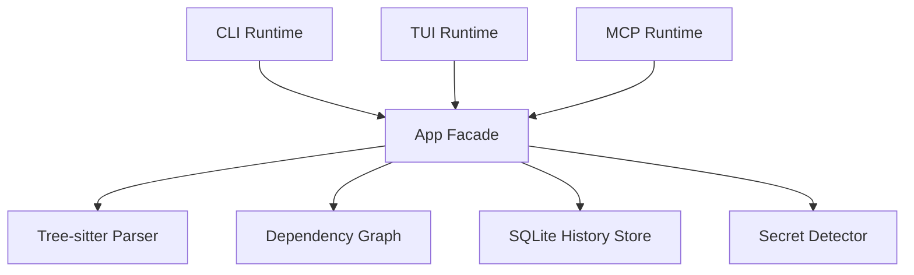
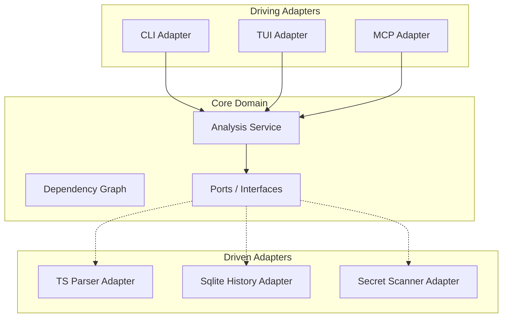

# Hexagonal Architecture Refactor Plan
# docs/plans/hexagonal-architecture-refactor.md

This plan outlines the transition of the `circular` codebase from a coupled, facade-based architecture to a **Hexagonal Architecture** (Ports and Adapters). This will improve testability, maintainability, and extensibility, especially as we add multi-interface support (CLI, TUI, MCP) and dynamic components.

## Objective
Decouple the core application logic (`App` struct) from concrete infrastructure implementations (Parsers, Storage, UI).

## Implementation Status

Status date: 2026-02-14

| Phase | Status | Notes |
| :--- | :--- | :--- |
| Phase 1: Driven Ports | Complete | `internal/core/ports/ports.go` contains driven and driving contracts consumed by runtime/adapters. |
| Phase 2: Domain Refactor | Complete | `internal/core/app/service.go` exposes `AnalysisService`, and output/report + summary compatibility behavior is extracted into `internal/core/app/presentation_service.go` while `App` stays as a compatibility facade. |
| Phase 3: Driven Adapters | Complete | Parser/secrets/history adapters are implemented and wired through ports. |
| Phase 4: Driving Adapters | Complete | CLI/TUI/MCP flows run through `AnalysisService` + driving ports, runtime startup uses interface-first factories, and parity tests now cover shared summary/output contracts. |

Estimated completion (session 11):
- Phase 1: **100%**
- Phase 2: **100%**
- Phase 3: **100%**
- Phase 4: **100%**

Plan fully implemented: **Yes**.

### Session 2 Checkpoint (2026-02-14)

- Completed this session:
  - Added `internal/engine/secrets/adapter.go` to bridge `secrets.Detector` into `ports.SecretScanner`.
  - Added `internal/data/history/adapter.go` to bridge `history.Store` into `ports.HistoryStore`.
  - Updated `internal/core/app` dependency wiring to use parser/secret adapters through ports and removed direct parser field ownership.
- Remaining for full plan completion:
  - Phase 2 `AnalysisService` extraction and compatibility facade.
  - Phase 4 driving-adapter migration for CLI/TUI/MCP.
- Is this plan fully implemented at end of session 2? **No**.

### Session 3 Checkpoint (2026-02-14)

- Completed this session:
  - Added driving-port contracts in `internal/core/ports/ports.go`:
    - `AnalysisService`
    - `QueryService`
    - `ScanRequest`/`ScanResult`
  - Added `internal/core/app/service.go` with `NewAnalysisService(...)` and `(*App).AnalysisService()` as the first extracted use-case surface.
  - Migrated CLI query entrypoints to consume `AnalysisService.QueryService(...)`.
  - Migrated MCP adapter scan/query entrypoints to consume `AnalysisService.RunScan(...)` and `AnalysisService.QueryService(...)`.
- Remaining for full plan completion:
  - Continue Phase 2 by moving additional orchestration behavior out of `App` into service-focused use-case methods.
  - Continue Phase 4 by migrating TUI/watch and remaining MCP/CLI orchestration entrypoints to driving ports.
- Is this plan fully implemented at end of session 3? **No**.

### Session 4 Checkpoint (2026-02-14)

- Completed this session:
  - Extended `internal/core/ports/ports.go` with history-trend driving contracts (`HistoryTrendRequest`, `HistoryTrendResult`) and `AnalysisService.CaptureHistoryTrend(...)`.
  - Implemented history snapshot/trend orchestration in `internal/core/app/service.go` so adapters can request project-scoped snapshot capture and trend report generation from the service layer.
  - Migrated CLI history flow (`internal/ui/cli/runtime.go`) to use `AnalysisService.CaptureHistoryTrend(...)` instead of inline runtime orchestration.
  - Updated MCP scan adapter (`internal/mcp/adapters/adapter.go`) to capture history snapshots via the shared analysis-service history use case when DB/history is available.
- Remaining for full plan completion:
  - Continue Phase 2 by extracting additional orchestration and watch/update lifecycle behavior from `App`.
  - Continue Phase 4 by migrating TUI/watch startup/update flow and remaining runtime orchestration entrypoints to dedicated driving-port contracts.
- Is this plan fully implemented at end of session 4? **No**.

### Session 5 Checkpoint (2026-02-14)

- Completed this session:
  - Extended `internal/core/ports/ports.go` with watch lifecycle driving contracts (`WatchService`, `WatchUpdate`) and `AnalysisService.WatchService()`.
  - Implemented watch driving-port behavior in `internal/core/app/service.go` for watcher start, current snapshot retrieval, and update subscription.
  - Migrated CLI watch startup and TUI update flow (`internal/ui/cli/runtime.go`, `internal/ui/cli/run_ui.go`) to consume driving-port APIs instead of direct `App` watch/update orchestration.
  - Migrated MCP `system.watch` runtime flow (`internal/mcp/runtime/server.go`) to use the watch driving port.
- Remaining for full plan completion:
  - Continue Phase 2 by extracting remaining orchestration responsibilities from `internal/core/app.App` into service-focused use cases.
  - Continue Phase 4 by migrating any remaining direct `App` entrypoints in adapters/runtimes to dedicated driving-port contracts where practical.
- Is this plan fully implemented at end of session 5? **No**.

### Session 6 Checkpoint (2026-02-14)

- Completed this session:
  - Extended `internal/core/ports/ports.go` with output/report driving contracts:
    - `SyncOutputsRequest` / `SyncOutputsResult`
    - `MarkdownReportRequest` / `MarkdownReportResult`
    - `AnalysisService.SyncOutputs(...)`
    - `AnalysisService.GenerateMarkdownReport(...)`
  - Implemented output synchronization + markdown report orchestration in `internal/core/app/service.go` behind the `AnalysisService` driving surface.
  - Migrated MCP adapter output/report entrypoints (`internal/mcp/adapters/adapter.go`) to use the new analysis-service methods instead of direct orchestration against `App`.
- Remaining for full plan completion:
  - Continue Phase 2 by extracting additional `App`-owned graph/query/report orchestration into dedicated service-focused contracts where high-value coupling remains.
  - Continue Phase 4 by reducing remaining direct `App` usage in MCP/CLI/TUI adapters when a driving-port contract can represent the use case cleanly.
- Is this plan fully implemented at end of session 6? **No**.

### Session 7 Checkpoint (2026-02-14)

- Completed this session:
  - Extended `internal/core/ports/ports.go` with additional driving methods on `AnalysisService`:
    - `TraceImportChain(...)`
    - `AnalyzeImpact(...)`
    - `DetectCycles(...)`
    - `ListFiles(...)`
  - Implemented the new trace/impact/cycle/file-list use cases in `internal/core/app/service.go`.
  - Migrated CLI single-command runtime flow (`internal/ui/cli/runtime.go`) so `--trace` and `--impact` use `AnalysisService` methods.
  - Migrated MCP adapter cycle/secret read paths (`internal/mcp/adapters/adapter.go`) to use `AnalysisService.DetectCycles(...)` and `AnalysisService.ListFiles(...)` instead of direct graph access from adapters.
  - Added service tests in `internal/core/app/service_test.go` for cycle detection and file-list driving-port behavior.
- Remaining for full plan completion:
  - Continue Phase 2 by extracting remaining summary/output-orchestration reads still done directly in CLI/App compatibility paths.
  - Continue Phase 4 by removing residual adapter/runtime dependencies on concrete `App` fields where a driving-port contract can represent the use case.
- Is this plan fully implemented at end of session 7? **No**.

### Session 8 Checkpoint (2026-02-14)

- Completed this session:
  - Extended `internal/core/ports/ports.go` with `SummarySnapshot` and `AnalysisService.SummarySnapshot(...)` to expose summary/state reads as driving-port contracts.
  - Implemented summary snapshot orchestration in `internal/core/app/service.go` for cycles, unresolved refs, unused imports, metrics, violations, hotspots, and aggregate counts.
  - Migrated CLI runtime (`internal/ui/cli/runtime.go`) to use `AnalysisService` for summary-state reads and output sync orchestration (`SummarySnapshot`, `SyncOutputs`) instead of direct `App.Graph` analysis reads.
  - Migrated MCP startup auto-output management in CLI runtime to use `AnalysisService.SyncOutputs(...)`.
  - Added `internal/core/app/service_test.go` coverage for `SummarySnapshot`.
- Remaining for full plan completion:
  - Continue Phase 2 by extracting remaining terminal-summary rendering and compatibility helper logic from `App` into service/domain-facing collaborators.
  - Continue Phase 4 by reducing remaining runtime dependency on concrete `*app.App` where a driving-port contract can own the interaction end-to-end.
- Is this plan fully implemented at end of session 8? **No**.

### Session 9 Checkpoint (2026-02-14)

- Completed this session:
  - Refactored MCP runtime dependencies (`internal/mcp/runtime/server.go`, `internal/mcp/runtime/bootstrap.go`) to depend on `ports.AnalysisService` + `ports.WatchService` instead of concrete `*app.App`.
  - Refactored MCP adapter construction (`internal/mcp/adapters/adapter.go`) to accept `ports.AnalysisService` directly.
  - Added summary-print driving contract in `internal/core/ports/ports.go` (`SummaryPrintRequest`, `AnalysisService.PrintSummary(...)`) and implemented it in `internal/core/app/service.go`.
  - Migrated CLI summary rendering (`internal/ui/cli/runtime.go`) to dispatch through `AnalysisService.PrintSummary(...)` instead of direct `App.PrintSummary(...)`.
  - Updated MCP runtime and tool tests to construct adapters from `AnalysisService` instead of `*app.App`.
- Remaining for full plan completion:
  - Continue Phase 2 by moving remaining compatibility helper behavior still owned by `App` (especially output/report orchestration internals) into focused service collaborators.
  - Continue Phase 4 by reducing direct concrete `App` construction dependencies in driving adapters/runtimes where interface-first factories can be introduced safely.
- Is this plan fully implemented at end of session 9? **No**.

### Session 10 Checkpoint (2026-02-14)

- Completed this session:
  - Added interface-first CLI runtime wiring via `internal/ui/cli/runtime_factory.go` (`analysisFactory`, `coreAnalysisFactory`, `initializeAnalysis(...)`).
  - Refactored CLI startup and MCP-mode startup paths in `internal/ui/cli/runtime.go` to request `ports.AnalysisService` from the factory instead of constructing concrete `*app.App` directly in runtime orchestration code.
  - Added runtime tests in `internal/ui/cli/runtime_test.go` to verify factory injection behavior (`runMCPModeIfEnabledWithFactory`) and required-factory validation (`initializeAnalysis`).
- Remaining for full plan completion:
  - Continue Phase 2 by extracting remaining output/report compatibility helpers still owned by `App` into dedicated service collaborators.
  - Continue Phase 4 by introducing parity tests that assert CLI and MCP produce equivalent summary/output contracts from the same fixture state.
- Is this plan fully implemented at end of session 10? **No**.

### Session 11 Checkpoint (2026-02-14)

- Completed this session:
  - Extracted output/report compatibility behavior from `App` methods into a dedicated collaborator: `internal/core/app/presentation_service.go`.
  - Updated `internal/core/app/app.go` compatibility facade methods (`GenerateMarkdownReport`, `PrintSummary`) to delegate to the collaborator instead of owning full orchestration internals.
  - Updated `internal/core/app/service.go` to route summary rendering and markdown report generation through the collaborator, reducing direct service dependence on compatibility `App` methods.
  - Added parity coverage in `internal/mcp/adapters/adapter_test.go` (`TestCLIAndMCPParity_SummaryAndOutputs`) to assert CLI-facing `AnalysisService` and MCP adapter summary/output contracts stay equivalent for the same fixture graph state.
- Remaining for full plan completion:
  - None.
- Is this plan fully implemented at end of session 11? **Yes**.

## Architecture Overview

### Current State (Simplified)


### Target State (Hexagonal)


## Standards & Best Practices
- **Dependency Inversion Principle:** Core logic should depend on abstractions (ports), not concrete implementations.
- **Single Responsibility Principle:** Each adapter should handle exactly one infrastructure concern.
- **Interface Segregation:** Ports should be focused and minimal.
- **Clean Boundaries:** Avoid leaking infrastructure details (like `sitter.Node` or `sql.Rows`) into the core domain.

## Detailed Phase Breakdown

### Phase 1: Driven Ports (Infrastructure Abstractions)
Define the interfaces that the core application requires.

| Task | File | Description |
| :--- | :--- | :--- |
| Create `ports` package | `internal/core/ports/ports.go` | Define all driven and driving ports. |
| Define `CodeParser` port | `internal/core/ports/ports.go` | Interface for file parsing. |
| Define `HistoryStore` port | `internal/core/ports/ports.go` | Interface for snapshot persistence. |
| Define `SecretScanner` port | `internal/core/ports/ports.go` | Interface for sensitive data detection. |

#### Code Snippet: Driven Ports
```go
package ports

import (
    "circular/internal/engine/graph"
    "circular/internal/engine/parser"
    "context"
)

type CodeParser interface {
    ParseFile(path string, content []byte) (*parser.File, error)
    IsSupported(path string) bool
    SupportedExtensions() []string
}

type SecretScanner interface {
    Scan(path string, content []byte) ([]parser.Secret, error)
}

type HistoryStore interface {
    SaveSnapshot(key string, snap graph.Snapshot) error
    LoadSnapshots(key string) ([]graph.Snapshot, error)
}

type GraphStorage interface {
    PersistNode(node *graph.Node) error
    FetchNode(id string) (*graph.Node, error)
    QueryEdges(fromID string) ([]graph.Edge, error)
}
```

### Phase 2: Domain Refactor (Analysis Service)
Refactor `internal/core/app/app.go` into an `AnalysisService` that uses ports.

| Task | File | Description |
| :--- | :--- | :--- |
| Refactor `App` to `Service` | `internal/core/app/service.go` | Update struct to use ports instead of concrete types. |
| Update `New` constructor | `internal/core/app/service.go` | Support Dependency Injection. |
| Extract Use Cases | `internal/core/app/usecases.go` | Define driving ports (Application interfaces). |

#### Implementation Strategy
- **DO:** Use constructor injection for all ports.
- **DONT:** Instantiate concrete adapters inside the `app` package.
- **DO:** Keep the `Graph` struct as a pure domain model (it doesn't need a port).

### Phase 3: Driven Adapters
Wrap existing implementations to fulfill the new ports.

| Task | File | Description |
| :--- | :--- | :--- |
| Create Parser Adapter | `internal/engine/parser/adapter.go` | Wrap `parser.Parser` to fulfill `CodeParser`. |
| Create History Adapter | `internal/data/history/adapter.go` | Wrap `history.Store` to fulfill `HistoryStore`. |
| Create Secrets Adapter | `internal/engine/secrets/adapter.go` | Wrap `secrets.Detector` to fulfill `SecretScanner`. |

### Phase 4: Driving Adapters (Presentation Layer)
Update CLI, TUI, and MCP to use the `AnalysisService` via driving ports.

| Task | File | Description |
| :--- | :--- | :--- |
| Update CLI runtime | `internal/ui/cli/runtime.go` | Wire up adapters and service. |
| Update MCP server | `internal/mcp/runtime/server.go` | Use service interfaces. |
| Update TUI | `internal/ui/cli/run_ui.go` | Decouple from concrete App. |

## Do's and Don'ts

| DO | DONT |
| :--- | :--- |
| Pass interfaces in constructors. | Use global state for dependencies. |
| Keep domain models (File, Definition) in `parser` or `graph`. | Leak Tree-sitter specific types into `ports`. |
| Write unit tests using mock ports. | Skip testing the wiring (integration tests). |
| Implement No-op adapters for optional features. | Use `if engine != nil` checks everywhere. |

## New Files Purpose

| File | Purpose | Known Functions |
| :--- | :--- | :--- |
| `internal/core/ports/ports.go` | Defines all system interfaces. | `CodeParser`, `SecretScanner`, `HistoryStore` |
| `internal/core/app/service.go` | Core business logic orchestrator. | `RunScan`, `ProcessChange`, `GetMetrics` |
| `internal/engine/parser/adapter.go` | Adapts Tree-sitter to `CodeParser`. | `ParseFile`, `IsSupported` |

## Verification Plan
1. **Unit Tests:** All logic in `internal/core/app` should be testable with 100% mocks.
2. **Integration Tests:** Verify that CLI still produces identical output after refactor.
3. **MCP Validation:** Ensure MCP tools still function correctly with the new service layer.
