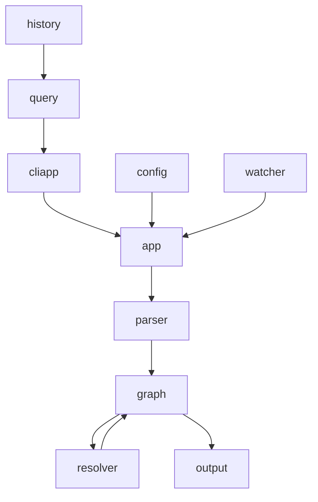
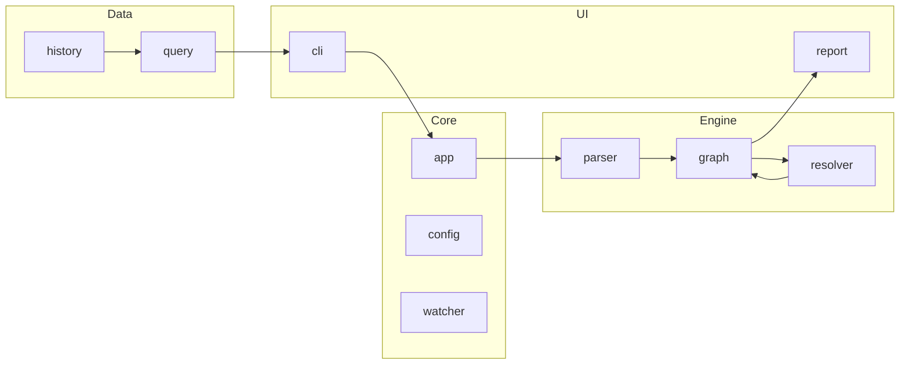

# Internal Package Refactor Plan

## 1. Objective
Consolidate the existing 10 packages in `internal/` into a more hierarchical structure that follows the **Separation of Concerns** principle. The goal is to reduce the top-level folder count in `internal/` while improving maintainability and testability through logical grouping and smaller, focused packages (aiming for ~5 files per package).

## 2. Current Architecture Overview
The project currently has 10 flat packages under `internal/`:
- `app`: Application orchestration.
- `cliapp`: CLI and TUI implementation.
- `config`: Configuration management.
- `graph`: Dependency graph and cycle detection.
- `history`: Historical snapshot storage.
- `output`: Report generation.
- `parser`: Code parsing (Tree-sitter).
- `query`: Data querying service.
- `resolver`: Symbol and import resolution.
- `watcher`: File system monitoring.

### 2.1. Current Data Flow


## 3. Proposed Architecture
We will group the packages into four main functional pillars: `core`, `engine`, `data`, and `ui`.

### 3.1. Pillar Breakdown
| Pillar | Concern | Sub-Packages |
| :--- | :--- | :--- |
| **core** | Infrastructure and orchestration | `app`, `config`, `watcher` |
| **engine** | Core analysis logic | `parser`, `resolver`, `graph` |
| **data** | Persistence and querying | `history`, `query` |
| **ui** | Interaction and reporting | `cli`, `report` |

### 3.2. Detailed Package Mapping
| Original Path | New Path | Reasoning |
| :--- | :--- | :--- |
| `internal/app` | `internal/core/app` | Main application lifecycle. |
| `internal/config` | `internal/core/config` | Global settings. |
| `internal/watcher` | `internal/core/watcher` | Low-level FS events. |
| `internal/parser` | `internal/engine/parser` | Code to AST conversion. |
| `internal/resolver` | `internal/engine/resolver` | AST to Module mapping. |
| `internal/graph` | `internal/engine/graph` | Module relationship management. |
| `internal/history` | `internal/data/history` | Historical storage. |
| `internal/query` | `internal/data/query` | Insight retrieval. |
| `internal/cliapp` | `internal/ui/cli` | Primary user interface. |
| `internal/output` | `internal/ui/report` | Secondary data representation. |

## 4. Sub-Package Decomposition (Meeting the ~5 Files Goal)
To adhere to the goal of ~5 files per package, some large packages will be further subdivided.

### 4.1. `internal/engine/parser`
The current parser package is bloated (16 files).
- `internal/engine/parser`: Core types and engine (`engine.go`, `types.go`, `scope.go`).
- `internal/engine/parser/registry`: Language registration logic (`language_registry.go`).
- `internal/engine/parser/grammar`: Grammar loading and verification (`loader.go`, `grammar_manifest.go`, `grammar_verify.go`).
- `internal/engine/parser/extractors`: Concrete language implementations (`golang.go`, `python.go`).

### 4.2. `internal/engine/resolver`
- `internal/engine/resolver`: Main resolution logic (`resolver.go`, `heuristics.go`).
- `internal/engine/resolver/drivers`: Language-specific resolution (`go_resolver.go`, `python_resolver.go`).

### 4.3. `internal/ui/report`
- `internal/ui/report`: Common interfaces and Markdown logic.
- `internal/ui/report/formats`: Specific format generators (`dot.go`, `mermaid.go`, `plantuml.go`, `tsv.go`).

## 5. Standards & Best Practices

### 5.1. Code Snippets: Import Transformation
**Before:**
```go
import (
	"circular/internal/config"
	"circular/internal/graph"
	"circular/internal/parser"
	"circular/internal/resolver"
)
```

**After:**
```go
import (
	"circular/internal/core/config"
	"circular/internal/engine/graph"
	"circular/internal/engine/parser"
	"circular/internal/engine/resolver"
)
```

### 5.2. Standards
- **Explicit Imports**: All internal imports must be updated to the new hierarchical paths (e.g., `circular/internal/engine/graph`).
- **Package Names**: Package names should match their directory name (e.g., `package report` in `internal/ui/report`).
- **Internal Visibility**: Use `internal` directories to prevent external leakage where appropriate.

### 5.3. Best Practices (DO's and DONT's)
| DO | DON'T |
| :--- | :--- |
| Use hierarchical grouping for related concerns. | Create circular dependencies between sub-packages. |
| Aim for ~5 source files per package for clarity. | Merge unrelated logic into "utils" packages. |
| Use sub-packages to hide implementation details. | Expose private implementation types in public API. |
| Update all tests to use new package paths. | Leave orphaned files in old locations. |

## 6. Implementation Checklist

### Phase 1: Core Consolidation
- [x] Create `internal/core` directory.
- [x] Move `config` to `internal/core/config`.
- [x] Move `app` to `internal/core/app`.
- [x] Move `watcher` to `internal/core/watcher`.
- [x] Update imports in `main.go` and within `core`.

### Phase 2: Engine Consolidation
- [x] Create `internal/engine`.
- [x] Refactor `parser` into `internal/engine/parser` + sub-packages.
- [x] Refactor `resolver` into `internal/engine/resolver` + sub-packages.
- [x] Move `graph` to `internal/engine/graph`.
- [x] Update imports.

### Phase 3: Data & UI Consolidation
- [x] Create `internal/data` and `internal/ui`.
- [x] Move `history` and `query` to `internal/data`.
- [x] Move `cliapp` to `internal/ui/cli`.
- [x] Move `output` to `internal/ui/report` + sub-packages.

### Phase 4: Verification
- [x] Run `go mod tidy`.
- [x] Execute all tests: `go test ./...`.
- [x] Build the project: `go build ./cmd/circular`.

## 7. Known Symbols & Functions
The implementation AI must ensure the following key interfaces remain consistent:

- `core/app.App`: Main orchestrator.
- `engine/parser.Parser`: File parsing engine.
- `engine/graph.Graph`: Dependency graph structure.
- `engine/resolver.Resolver`: Import resolution logic.
- `data/history.Store`: Snapshot persistence.
- `ui/cli.Runner`: TUI/CLI execution loop.

## 8. Impact on Data Flow
The high-level data flow remains the same, but the internal boundaries are more strictly defined by the pillar packages.


