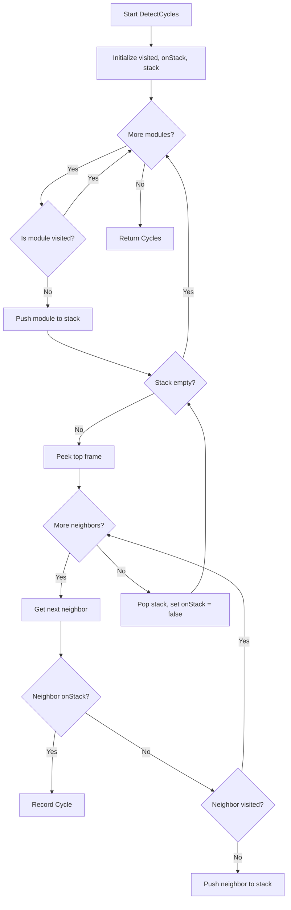

# Implementation Plan: Iterative DFS for Cycle Detection

**ID:** PLAN-010  
**Status:** Draft  
**Target Package:** `internal/engine/graph`  
**User Context:** Stability on large/messy legacy codebases

## Overview

The current cycle detection logic in `internal/engine/graph/detect.go` uses a recursive DFS approach. While correct for small to medium graphs, it is susceptible to stack overflow errors when analyzing codebases with extremely deep dependency chains or messy legacy structures. This plan refactors the `findCycles` function to use an iterative DFS approach with an explicit slice-based stack.

## Current State

`DetectCycles` calls `findCycles`, which recursively explores neighbors:
```go
func (g *Graph) findCycles(curr string, visited, onStack map[string]bool, path []string, cycles *[][]string) {
    ...
    for next := range g.imports[curr] {
        if onStack[next] {
            // Cycle logic
        } else if !visited[next] {
            g.findCycles(next, visited, onStack, path, cycles)
        }
    }
    ...
}
```

## Proposed Changes

### 1. Refactor `DetectCycles`
Update `DetectCycles` to manage the outer loop and shared state (visited nodes).

### 2. Implement Iterative DFS
Replace `findCycles` with a version that uses an explicit stack of "frames". Each frame tracks:
- The current module being visited.
- The index of the next neighbor to explore.
- The current path.

```go
type dfsFrame struct {
    mod      string
    neighbor int
}
```

### 3. Cycle Identification Logic
When a node is encountered that is already on the current traversal stack (`onStack`), identify the cycle by tracing back through the current path.

## Implementation Steps

### Phase 1: Iterative Refactor
1. Modify `internal/engine/graph/detect.go`.
2. Rewrite `DetectCycles` to use a loop-based traversal.
3. Implement the iterative DFS logic using a slice as a stack.
4. Ensure `onStack` is properly managed (pushed when entering a node, popped when finishing its neighbors).

### Phase 2: Optimization
1. Ensure neighbors are sorted before exploration to keep detection deterministic (as in the current implementation).

## Data Flow (Mermaid)



## DO's and DON'Ts

| DO | DON'T |
|----|-------|
| Use a slice (`[]dfsFrame`) for the stack to avoid recursion limits. | Use a fixed-size array for the stack. |
| Maintain deterministic behavior by sorting neighbors. | Forget to clear `onStack` when popping from the DFS stack. |
| Handle nested cycles correctly (ensuring all are detected). | Introduce unnecessary memory allocations inside the inner loop. |

## Verification Plan

### Automated Tests
- Run existing tests in `internal/engine/graph/detect_test.go` (if they exist) or `graph_test.go`.
- Create a new test case with a very deep dependency chain (e.g., 10,000 modules in a line) to verify stack overflow is avoided.

### Manual Verification
- Run `circular` on a large project and ensure it completes without crashing.
- Verify that the reported cycles are identical to those found by the recursive version.
