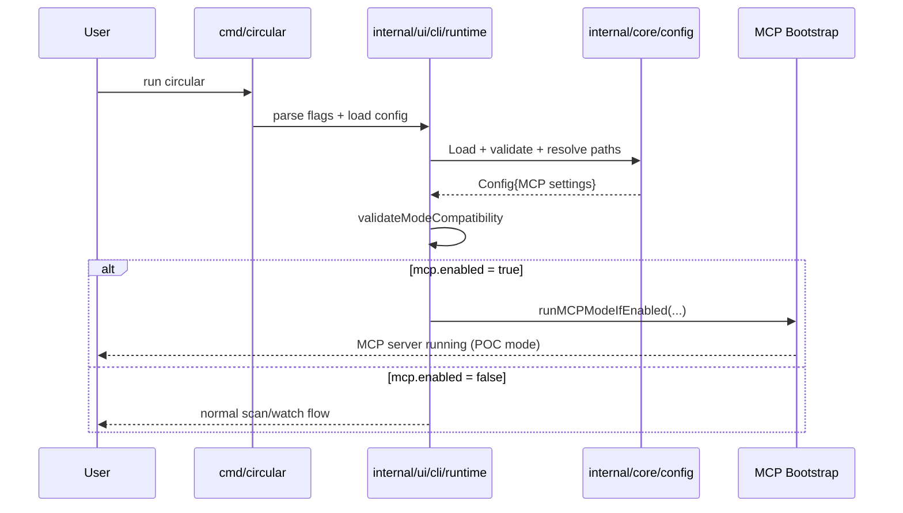
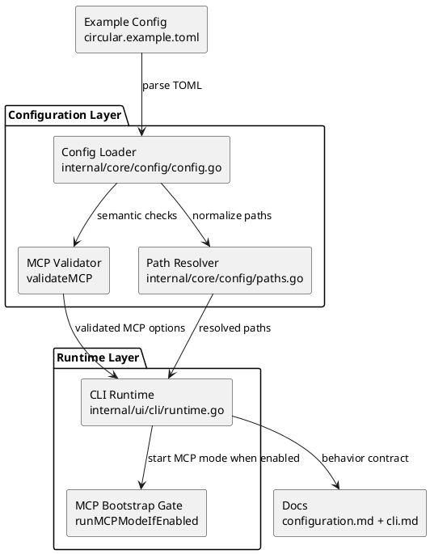

# MCP POC Configuration Layer Plan (No Gateway Scope)

Cross-reference:
- Companion execution plan: `docs/plans/mcp-poc-server-tools-plan.md`
- Date baseline: 2026-02-13

## Scope, Assumptions, Constraints

Scope:
- Prepare a production-safe configuration layer for an in-repo MCP proof-of-concept server.
- Harden config semantics so MCP startup, tool exposure, and operational mode can be controlled without CLI-only switches.
- Keep all changes inside this repository's runtime (`cmd/circular` + `internal/*`) with no gateway process.
- Keep all MCP runtime behavior TOML-driven (no hardcoded operation limits, project paths, or output targets).

Out of scope:
- External API gateway, reverse proxy, auth gateway, or multi-tenant remote hosting.
- Client SDK generation and external control-plane management.

Assumptions:
- Existing `[mcp]` block in `internal/core/config/config.go` is the baseline contract and remains additive.
- MCP runtime initially targets `stdio` as the default transport for local POC usage.
- `http` transport can remain reserved/feature-flagged while config still validates combinations cleanly.

Constraints:
- Preserve backward compatibility for non-MCP workflows.
- Keep Go 1.24.x compatibility.
- Avoid breaking existing `--ui` and watch behaviors.
- MCP implementation must follow strict SoC packaging (`internal/mcp/*` subpackages with single primary concern each).

## Must-Have Requirements

| ID | Requirement | Why |
| --- | --- | --- |
| R1 | TOML is the source of truth for MCP runtime settings (no hardcoded config behavior) | predictable multi-project operations |
| R2 | Expand `projects` config for explicit multi-project routing and SQLite namespace isolation | prevent data collisions across projects |
| R3 | MCP must auto-manage `mermaid`/`plantuml`/`dot`/`tsv` outputs and active config sync without needing AI prompts | reliable autonomous report/config maintenance |

## Current-State Snapshot

| Area | Current state | Gap to close for MCP POC |
| --- | --- | --- |
| Config schema | `[mcp]` includes `enabled/mode/transport/address/config_path` | No tool exposure policy or runtime limits in config |
| Validation | Mode/transport combinations validated | No explicit startup profile separation for POC server behavior |
| Runtime guards | `--ui` and MCP enabled are mutually exclusive | No end-to-end MCP bootstrap path from config |
| Documentation | Config reference lists MCP fields | Missing operational examples for POC server modes |

## Plan Overview

| Task ID | Goal | Owner | Depends On | Risk |
| --- | --- | --- | --- | --- |
| C1 | Extend TOML config model for MCP + multi-project DB isolation | Core | - | Medium |
| C2 | Add strict validation and normalization rules | Core | C1 | Medium |
| C3 | Wire config-driven MCP bootstrap and automatic output/config sync | Core | C1,C2 | Medium |
| C4 | Add compatibility and migration tests | Core | C1,C2,C3 | Low |
| C5 | Update docs/examples and rollout notes | Core | C1,C2,C3 | Low |
| C6 | Add OpenAPI spec source config keys (path/URL) | Core | C1,C2 | Low |

## Tasks

- C1 Extend TOML config model for MCP + multi-project DB isolation [x]
Summary: Add additive TOML fields for MCP runtime policy, multi-project routing, and project-aware SQLite behavior.
Inputs/outputs: existing `MCP` struct in; expanded config contract out.
File changes (with classes/functions):
- `internal/core/config/config.go` (update)
  - Classes/structs: `MCP` add fields: `ServerName`, `ServerVersion`, `ExposedToolName`, `OperationAllowlist`, `MaxResponseItems`, `RequestTimeout`, `AllowMutations`, `AutoManageOutputs`, `AutoSyncConfig`.
  - Classes/structs: `Projects`/`ProjectEntry` add explicit `config_file` and required `db_namespace` normalization rules for multi-project SQLite scope.
  - Main functions: `func applyDefaults(cfg *Config)` updated for deterministic defaults.
- `circular.example.toml` (update)
  - Main sections: `[mcp]`, `[projects]`, and `[[projects.entries]]` add commented multi-project + auto-management examples.
Best practices and standards:
- Keep new fields optional with safe defaults.
- Use explicit naming, avoid overloaded config keys.
- Keep policy fields transport-agnostic.
- Avoid embedding environment-specific paths in defaults.
- Ensure every runtime knob comes from TOML (or TOML-derived defaults), not in-code literals.
Acceptance checks:
- Existing config files continue to load unchanged.
- New fields decode correctly from TOML with defaults.
- No behavior changes when `mcp.enabled=false`.

- C2 Add strict validation and normalization rules [x]
Summary: Ensure config catches invalid MCP settings before runtime startup.
Inputs/outputs: raw MCP config in; normalized validated runtime options out.
File changes (with classes/functions):
- `internal/core/config/config.go` (update)
  - Main functions: `func validateMCP(cfg *Config) error` extend rules for single exposed tool name, operation allowlist, limits, timeout bounds, server metadata, and auto-management toggles.
  - Main functions: `func validateProjects(cfg *Config) error` enforce unique project names, non-empty `db_namespace`, optional per-project `config_file` resolution.
- `internal/core/config/paths.go` (update)
  - Main functions: `func ResolvePaths(cfg *Config, cwd string) (ResolvedPaths, error)` ensure `mcp.config_path` path normalization remains deterministic.
Best practices and standards:
- Fail fast with actionable error text.
- Prefer allow-lists for enum-like fields.
- Enforce upper bounds for untrusted output limits/timeouts.
- Keep validation independent from runtime networking code.
- Validate project namespace uniqueness for SQLite writes/queries.
Acceptance checks:
- Invalid combinations fail config load with clear messages.
- Empty/whitespace metadata is normalized safely.
- Path normalization is stable across relative and absolute inputs.
- Duplicate project namespaces fail validation with explicit errors.

- C3 Wire config-driven MCP bootstrap and automatic output/config sync [x]
Summary: Start MCP mode from TOML config and enforce automatic output/config management behavior per active project.
Inputs/outputs: parsed config + CLI options in; explicit MCP runtime bootstrap decision out.
File changes (with classes/functions):
- `internal/ui/cli/runtime.go` (update)
  - Main functions: `func validateModeCompatibility(opts cliOptions, cfg *config.Config) error` extend compatibility policy.
  - Main functions: `func runMCPModeIfEnabled(...) error` (new) isolated startup gate and orchestration handoff.
- `internal/mcp/runtime/bootstrap.go` (new)
  - Main functions: `func Build(cfg Config, appDeps AppDeps) (*Server, error)` compose SoC subpackages.
- `internal/mcp/runtime/project_context.go` (new)
  - Main functions: `func ResolveActiveProjectContext(cfg *config.Config, name string) (ProjectContext, error)`; `func SyncProjectConfig(ctx ProjectContext) error`.
- `internal/ui/cli/cli.go` (update)
  - Main functions: CLI help text alignment with config-driven MCP mode.
Best practices and standards:
- Keep one ownership point for mode selection.
- Runtime entrypoint composes subpackages only; it does not own contracts/validation/tool logic.
- Ensure mutually exclusive runtime modes are explicit.
- Keep startup logging structured and minimal.
- Do not hard-wire MCP defaults in CLI package when config already owns them.
- Automatic output/config sync must be controlled only by TOML flags.
Acceptance checks:
- Enabling MCP in config triggers MCP bootstrap path.
- Non-MCP command usage remains unchanged.
- Conflicting mode combinations exit with deterministic errors.
- MCP mode auto-updates configured output artifacts and project config without needing AI to request each file write.

- C4 Add compatibility and migration tests [x]
Summary: Lock down additive behavior and avoid regressions across existing config workflows.
Inputs/outputs: legacy/new TOML fixtures in; deterministic validation/runtime behavior out.
File changes (with classes/functions):
- `internal/core/config/config_test.go` (update)
  - Main functions: `TestLoad_MCPPOCDefaults`, `TestLoad_MCPPOCValidation`, `TestLoad_LegacyConfigStillValid`.
- `internal/ui/cli/runtime_test.go` (update)
  - Main functions: `TestValidateModeCompatibility_MCPPOC`, `TestMCPBootstrapDecision`.
Best practices and standards:
- Use table-driven tests with explicit expected errors.
- Test both old and new schema shapes.
- Keep tests independent from network ports/filesystem side effects.
- Assert user-facing error strings for critical failures.
Acceptance checks:
- `go test ./internal/core/config ./internal/ui/cli` passes.
- Legacy non-MCP test fixtures remain green.
- New MCP tests cover invalid and valid matrices.

- C5 Update docs/examples and rollout notes [x]
Summary: Align config reference with final MCP POC contract and migration guidance.
Inputs/outputs: finalized schema in; user-facing docs and release notes out.
File changes (with classes/functions):
- `docs/documentation/configuration.md` (update)
  - Main sections: MCP reference expanded with examples and constraints.
- `docs/documentation/cli.md` (update)
  - Main sections: config-driven MCP startup behavior.
- `CHANGELOG.md` (update)
  - Main sections: additive config contract for MCP POC.
Best practices and standards:
- Keep examples minimal and runnable.
- Separate "current POC behavior" from "reserved for future" fields.
- Keep docs consistent with validator behavior.
- Provide one migration checklist for existing users.
Acceptance checks:
- Docs reflect final defaults and validation rules exactly.
- Changelog entry is user-facing and backward-compatibility aware.
- No references to gateway architecture in MCP docs.

- C6 Add OpenAPI spec source config keys (path/URL) [ ]
Summary: Add explicit config keys for the OpenAPI spec source used by MCP operation conversion.
Inputs/outputs: MCP config in; optional spec path/URL available to OpenAPI loader out.
File changes (with classes/functions):
- `internal/core/config/config.go` (update)
  - Classes/structs: `MCP` add fields: `OpenAPISpecPath`, `OpenAPISpecURL`.
  - Main functions: `applyDefaults(cfg *Config)` set empty defaults; `validateMCP(cfg *Config) error` enforce mutual exclusivity when OpenAPI conversion is enabled.
- `internal/core/config/paths.go` (update)
  - Main functions: `ResolvePaths` resolve `mcp.openapi_spec_path` under `paths.config_dir` when relative.
- `docs/documentation/configuration.md` (update)
  - Main sections: document new `mcp.openapi_spec_path`/`mcp.openapi_spec_url` behavior and exclusivity rules.
- `circular.example.toml` (update)
  - Main sections: `[mcp]` include commented example for spec path.
Best practices and standards:
- Keep keys optional and additive.
- Enforce mutual exclusivity when conversion is enabled; allow both empty when conversion is disabled.
- Keep path resolution deterministic relative to `paths.config_dir`.
Acceptance checks:
- Config loads unchanged when new keys are unset.
- Setting both keys fails validation with actionable error text.

## File Inventory

| File | Type | Classes (name + main methods) | Main functions (name + signature) | Purpose |
| --- | --- | --- | --- | --- |
| `internal/core/config/config.go` | update | `MCP` (`policy fields`) | `applyDefaults(cfg *Config)`; `validateMCP(cfg *Config) error` | Add MCP POC config contract and validation |
| `internal/core/config/paths.go` | update | `ResolvedPaths` | `ResolvePaths(cfg *Config, cwd string) (ResolvedPaths, error)` | Normalize MCP config-linked paths |
| `internal/ui/cli/runtime.go` | update | n/a | `validateModeCompatibility(opts cliOptions, cfg *config.Config) error`; `runMCPModeIfEnabled(...) error` | Startup gating and runtime orchestration hook |
| `internal/mcp/runtime/bootstrap.go` | new | n/a | `Build(cfg Config, appDeps AppDeps) (*Server, error)` | Compose SoC MCP subpackages from validated config |
| `internal/mcp/runtime/project_context.go` | new | `ProjectContext` | `ResolveActiveProjectContext(cfg *config.Config, name string) (ProjectContext, error)`; `SyncProjectConfig(ctx ProjectContext) error` | Multi-project config and SQLite namespace context |
| `internal/ui/cli/cli.go` | update | n/a | CLI flag/config help wiring functions | Keep user-facing mode help aligned |
| `internal/core/config/config_test.go` | update | n/a | `TestLoad_MCPPOCDefaults(t *testing.T)`; `TestLoad_MCPPOCValidation(t *testing.T)` | Config behavior regression coverage |
| `internal/ui/cli/runtime_test.go` | update | n/a | `TestValidateModeCompatibility_MCPPOC(t *testing.T)` | Runtime compatibility coverage |
| `docs/documentation/configuration.md` | update | n/a | n/a | MCP configuration reference and examples |
| `docs/documentation/cli.md` | update | n/a | n/a | Explain config-driven MCP startup |
| `circular.example.toml` | update | n/a | n/a | User-ready MCP POC config template |
| `CHANGELOG.md` | update | n/a | n/a | Release notes for additive MCP config work |

## Diagrams

## Risks and Mitigations

| Risk | Impact | Mitigation |
| --- | --- | --- |
| Over-configuring early POC | Complexity without delivery | Keep fields minimal and additive; defer non-essential knobs |
| Config/runtime drift | User confusion | Test error messages and sync docs in same milestone |
| Invalid mode interactions | Runtime failures | Strict compatibility checks before bootstrap |

## Testing and Verification

- Config tests:
  - Invalid matrix tests for mode/transport/toolset/limits.
  - Legacy config fixture compatibility tests.
- Runtime tests:
  - MCP enabled/disabled bootstrap routing tests.
  - Mutual exclusion tests (`--ui` vs MCP).
- Documentation checks:
  - Examples parse successfully in fixture tests.

## Folder List

- `docs/plans/mcp-poc-configuration-layer-plan.md`
- `docs/plans/mcp-poc-server-tools-plan.md`
- `internal/core/config/`
- `internal/ui/cli/`
- `docs/documentation/`
