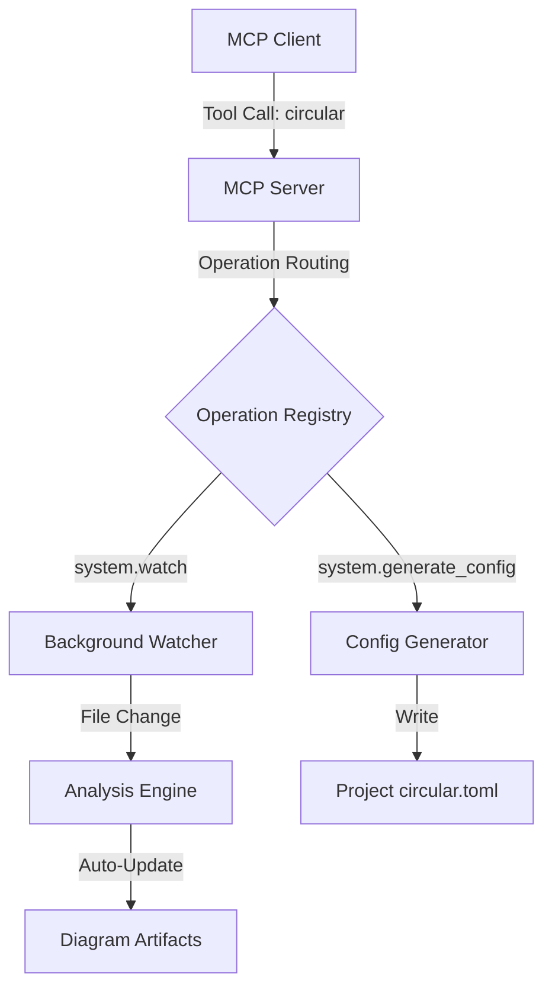

# docs/plans/mcp-server-expansion-plan.md
# path/to/file: docs/plans/mcp-server-expansion-plan.md

# MCP Server Capability Expansion: Config Generation & Diagram Orchestration

This plan outlines the enhancements to the MCP (Model Context Protocol) server to support automated project configuration generation, live diagram orchestration, and background watch mode.

## Objective
Expand the `internal/mcp/` server capabilities to:
1.  **Autogenerate Configuration**: Create a project-local `circular.toml` based on `data/config/circular.example.toml` when the MCP server is initialized.
2.  **API-as-Tools Pattern**: Expose exactly one MCP tool (`circular`) that dynamically routes to operations via a registry.
3.  **Automatic Sync**: Implement automatic file synchronization for configured outputs (Mermaid, PlantUML, DOT, TSV) and configuration files.
4.  **Background Watch Mode**: Add a `system.watch` operation that starts a non-blocking background process to monitor file changes and auto-update diagrams.
5.  **Simplified Interaction**: Provide a shell script wrapper to allow command-based interaction (e.g., `./circular-mcp system.watch`) instead of raw JSON CLI inputs.

## Standards & Best Practices
- **Parallelism**: Use goroutines for background tasks (like the watcher) to ensure the MCP server remains responsive to other tool calls.
- **Idempotency**: All operations (generation, syncing, watching) must be idempotent and safe to restart.
- **Library**: Continue using `github.com/mark3labs/mcp-go` for the core MCP transport.
- **CLI Ergonomics**: Wrap complex JSON-RPC calls in a user-friendly shell interface.

## Technical Architecture

### Data Flow


## Proposed Changes

### 1. Background Watcher Operation
- **Operation**: `system.watch`
- **Implementation**: Starts a background goroutine that invokes `app.StartWatcher()`.
- **Constraint**: Must ensure only one watcher is active per project/session.

### 2. Simplified CLI Interaction (Scripting)
- Create a `scripts/circular-mcp` (or similar) shell script.
- The script translates command-line flags into the JSON structure expected by the MCP server.
- Example: `./circular-mcp scan --tests` becomes `{"operation": "scan", "params": {"include_tests": true}}`.

### 3. New Operations

| Operation ID | Purpose |
| :--- | :--- |
| `system.generate_config` | Generates a project-local `circular.toml` from the example template. |
| `graph.sync_diagrams` | Manages synchronization of all configured output formats. |
| `system.watch` | Starts a continuous, non-blocking file watcher for auto-updates. |

## Implementation Tasks

| Task | Description | Status |
| :--- | :--- | :--- |
| T1: Background Watcher | Integrate `app.StartWatcher` into the MCP `system.watch` handler. | [x] |
| T2: CLI Wrapper Script | Develop a shell script for simplified `/command --flag` interaction. | [x] |
| T3: Tool Consolidation | Ensure the single `circular` tool handles all operations asynchronously. | [x] |
| T4: Config Generator | Implement the `circular.toml` generation from `circular.example.toml`. | [x] |

## Implementation Update (2026-02-14)
- Canonical diagram sync operation is now `graph.sync_diagrams` with backward-compatible alias support for `system.sync_outputs`.
- Added `system.generate_config` and startup config generation (idempotent) from `data/config/circular.example.toml`.
- Added `system.generate_script` and startup project script generation for `circular-mcp` (idempotent, executable output).
- Added `system.watch` non-blocking background watcher with single-instance protection in the MCP runtime.
- Added `scripts/circular-mcp` wrapper for command-style interaction over the single `circular` MCP tool.

## DO's and DON'Ts

| DO | DON'T |
| :--- | :--- |
| Use goroutines for the watcher to avoid blocking the MCP message loop. | Don't allow multiple watcher instances to run concurrently on the same project. |
| Provide clear feedback in the MCP response when a background task starts. | Don't require the user to manually send JSON for common operations. |

## Code Snippet Examples

### Background Watcher Implementation
```go
// internal/mcp/tools/system/handler.go

func HandleWatch(ctx context.Context, app *app.App, allowMutations bool) (contracts.SystemWatchOutput, error) {
    if !allowMutations {
        return contracts.SystemWatchOutput{}, contracts.ToolError{Code: contracts.ErrorUnavailable, Message: "mutations disabled"}
    }
    
    // Start watcher in background
    go func() {
        if err := app.StartWatcher(); err != nil {
            slog.Error("mcp background watcher failed", "error", err)
        }
    }()
    
    return contracts.SystemWatchOutput{Status: "watching"}, nil
}
```

### CLI Wrapper Script Idea
```bash
#!/bin/bash
# scripts/circular-mcp

OP=$1
shift
PARAMS=$(parse_flags_to_json "$@")

echo "{\"operation\": \"$OP\", \"params\": $PARAMS}" | circular -mcp
```

## Future Upgrades
- **Status API**: A tool to check the health and status of background watchers.
- **Event Streaming**: Use MCP notifications to push update alerts to the client UI.
