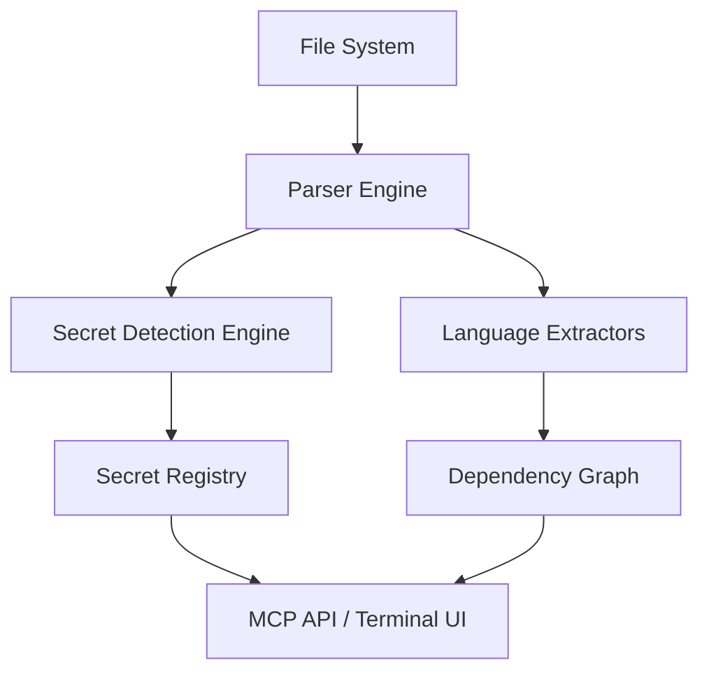

# Plan: Secret Detection Implementation

## Overview
Add a robust secret detection engine to Circular's analysis pipeline to identify hardcoded credentials, API keys, and other sensitive information. This feature will be integrated into the core analysis and exposed through the MCP API.

## Core Components

### 1. Secret Detection Engine
- **Location:** `internal/engine/secrets/`
- **Features:**
  - Regex-based matching for common patterns (AWS keys, Stripe keys, etc.).
  - Shannon entropy analysis for high-entropy string detection.
  - Context-aware validation (e.g., checking variable names like `apiKey`, `password`).
- **Data Structures:**
  ```go
  type Secret struct {
      Kind     string
      Value    string
      Entropy  float64
      Location parser.Location
  }
  ```

### 2. Core Integration
- Update `internal/core/app/app.go` to trigger secret detection during `ProcessFile`.
- Store detected secrets in a new field in `parser.File` or a separate `SecretRegistry`.
- Update `Update` struct to include `SecretCount`.

### 3. MCP API Expansion
- **Tool:** `secrets.scan`
- **Contract:**
  - Input: `ScanRunInput` (optional paths)
  - Output: List of detected secrets with location and severity.
- **Adapter:** Update `internal/mcp/adapters/adapter.go` to handle secret queries.

### 4. Configuration
- Add `[secrets]` section to `circular.toml`.
- Allow users to define custom regex patterns and entropy thresholds.
- Option to exclude certain files or directories from secret scanning.

## Implementation Steps

| Phase | Task | Description |
| :--- | :--- | :--- |
| **Phase 1: Engine** | Implementation of `internal/engine/secrets` | Create the detector with regex and entropy support. |
| **Phase 2: Registry** | Update `parser.File` and `app.App` | Integrate the detector into the file processing flow. |
| **Phase 3: API** | Add MCP tools for secrets | Implement `secrets.scan` and `secrets.list`. |
| **Phase 4: UI/Reporting** | Update Terminal & File Outputs | Show detected secrets in summary and generated reports. |

## Do's and Don'ts

### DO
- Use well-known regex patterns from established tools like `gitleaks` or `trufflehog`.
- Implement a "confidence" score based on pattern matching + entropy.
- Mask secret values in logs and terminal output (e.g., `AKIA...XXXX`).

### DON'T
- Block analysis if a secret is found; just report it.
- Store raw secrets in the history database without encryption or masking.
- Run heavy entropy analysis on large binary files (skip them).

## Dataflow Diagram


