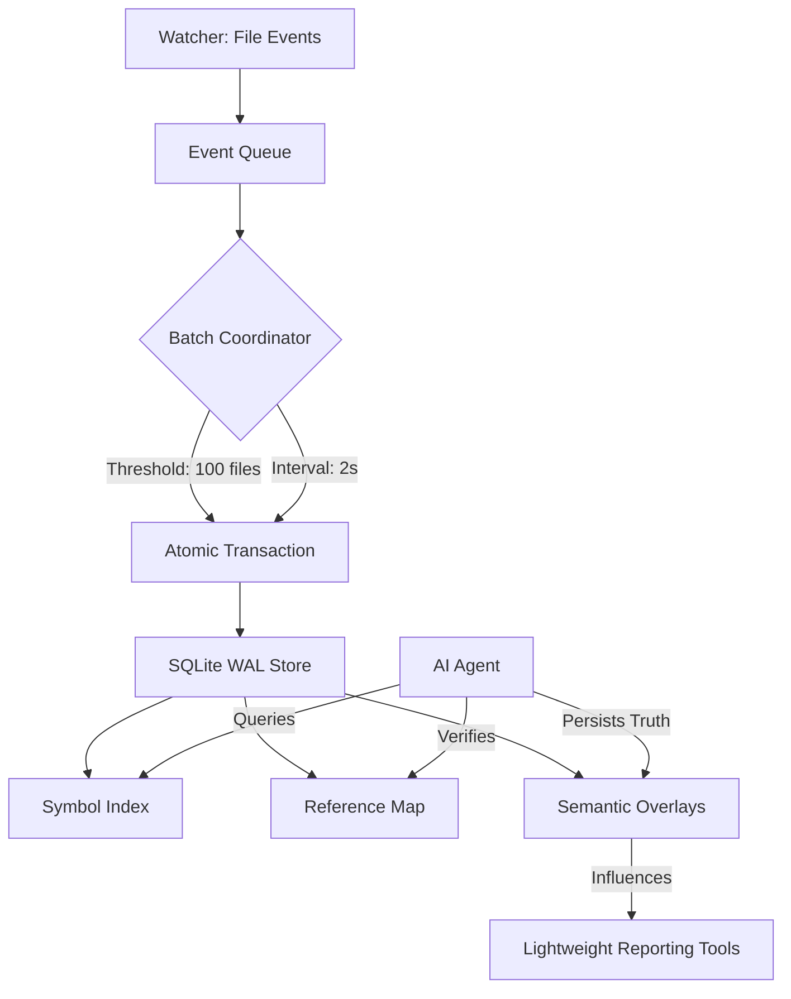

# docs/plans/symbol-store-implementation.md

# Persistent Symbol & Pattern Store Implementation Plan

## Implementation Status (2026-02-20)

| Phase | Status | Notes |
| :--- | :--- | :--- |
| **I: Concurrency** | ✅ Implemented | `SQLiteSymbolStore` in `internal/engine/graph/symbol_store.go` |
| **II: Universal Parser** | ✅ Implemented | `internal/engine/parser/universal.go` and default extractor routing in `internal/engine/parser/profile_extractors.go` |
| **III: Schema v4** | ✅ Implemented | `symbols` schema includes `usage_tag`, `confidence`, `ancestry` (plus `line_number` in v5 migration path) |
| **IV: Overlays** | ✅ Implemented | `semantic_overlays` schema + MCP overlay tooling in `internal/mcp/tools/overlays/handler.go` |
| **V: Surgical API** | ✅ Implemented | Symbol context extraction in `internal/ui/report/surgical.go` |

**Plan completion:** ✅ Fully implemented.

## 1. Objective
Transition the current lightweight analyzer from a volatile memory-first approach to a **Persistent Symbol & Pattern Store** architecture. This system must handle 7+ backends and 165 languages with "architectural truth," providing a high-concurrency, AI-teachable interface via MCP.

---

## 2. High-Level Architecture

The system follows a **Change Data Capture (CDC)** pattern for code. The Watcher treats file changes as events, which are buffered and flushed into a persistent SQLite/DuckDB-ready schema.

### 2.1 Concurrency & Persistence Flow

---

## 3. Core Components

### 3.1 Concurrent Batch Writer
To avoid `SQLITE_BUSY` locks during massive ingestion (e.g., initial scan or git branch switches):
*   **WAL Mode:** Force `PRAGMA journal_mode=WAL` for concurrent reads/writes.
*   **Configurable Buffer:**
    *   `batch_size`: Number of file updates before an automatic flush (Default: 50).
    *   `flush_interval`: Max time to wait before flushing pending changes (Default: 1s).
*   **Single-Writer Goroutine:** A dedicated channel-driven coordinator ensures only one write transaction happens at a time.

### 3.2 Universal Dynamic Parser & Engine (The "One-to-Many" Pattern)
We will retire the `RegisterExtractor` registry and all language-specific files (`golang.go`, `python.go`) in favor of a single, **Regex-Driven Universal Engine**.
*   **Unified Parser:** The `Parser` struct no longer manages a map of extractors. It becomes a thin orchestrator that loads the correct Tree-sitter grammar and hands the AST to the `UniversalExtractor`.
*   **Regex-Driven Routing:** Instead of hardcoded node kind checks, the engine uses a compiled library of regex patterns (Definitions, References, Blocks, Imports) to route AST nodes to semantic handlers.
*   **Config-Driven Personalities:** Each language's behavior is defined in external TOML configuration. This config maps your universal regex patterns (like `.*_declaration$`) to semantic categories like `SYM_DEF` or `REF_CALL`.
*   **100% Node Coverage:** The engine walks every node in the 165 languages, but only "captures" and "tags" those that match the **Universal Pattern Library** tiers.

### 3.3 Enhanced Semantic Tagging Engine
The Universal Engine will attach structured **Usage Tags** with **Confidence Levels**.

| Tag | Level | Meaning | Structural Context |
| :--- | :--- | :--- | :--- |
| `SYM_DEF` | 1.0 | Primary Definition | `module -> class -> func` |
| `REF_CALL` | 0.9 | Direct Invocation | `func_body -> call_expr` |
| `REF_TYPE` | 0.8 | Type Reference | `var_decl -> type_ident` |
| `REF_DYN` | 0.4 | Potential Dynamic | `call_expr -> string_lit` |
| `REF_SIDE` | 0.7 | Side-Effect (init) | `import_spec -> blank` |

### 3.4 The AI Semantic Overlay (Persistent Truth)
This layer allows AI agents to "fix" false positives permanently.
*   **Overlay Types:** `EXCLUSION`, `VETTED_USAGE`, `RE-ALIAS`.
*   **Staleness Detection:** Overlays store a `source_hash`. If the file changes significantly, the overlay is marked for `RE-VERIFICATION`.
*   **Metadata:** Stores `verified_by`, `timestamp`, and `reason`.

---

## 4. Implementation Phases

| Phase | Task | Deliverable |
| :--- | :--- | :--- |
| **I: Concurrency** | Implement `BatchWriter` with configurable flush logic. | `internal/engine/graph/writer.go` |
| **II: Universal Parser** | Build the Regex-driven `UniversalExtractor` and refactor `Parser.go`. | `internal/engine/parser/universal.go` |
| **III: Schema v4** | Update DB to support `references`, `confidence`, and `ancestry`. | `internal/engine/graph/schema.go` |
| **IV: Overlays** | Create MCP tools for AI to persist "Architectural Truth." | `internal/mcp/tools/overlays.go` |
| **V: Surgical API** | Implement `get_symbol_context` with structural snippet extraction. | `internal/ui/report/surgical.go` |

---

## 5. Technical Standards (DO's and DONT's)

### 5.1 Extraction
| DO | DON'T |
| :--- | :--- |
| Use compiled regex caches for node kind matching. | Write language-specific logic inside the `internal/` engine. |
| Capture the **Ancestry Path** (e.g. `main -> run -> err_handle`). | Hardcode "identifier" or "call_expression" string checks. |
| Assign `REF_DYN` to any symbol found inside a string. | Skip nodes that don't match; walk the tree fully. |
| Use 1 Dynamic Extractor for all 165 languages. | Maintain a map of language-specific extractor structs. |

### 5.2 Persistence & Context
| DO | DON'T |
| :--- | :--- |
| Use surgical line extraction (±5 lines) for AI verification. | Include full file contents in the `references` table. |
| Check `semantic_overlays` before reporting a false positive. | Block the Watcher while waiting for a DB lock. |

---

## 6. Solving the "os" False Positive (New Workflow)

1.  **Detection:** Universal Engine flags `import "os"` as unused in `cli.go`.
2.  **Surgical Query:** AI calls `get_symbol_context(symbol="os", file="cli.go")`.
3.  **Enhanced Result:**
    *   `Line 82: os.Stdout.Write(...)`
    *   `Confidence: 0.9`
    *   `Structural Context: main -> initUI -> buffer_setup`
4.  **AI Reasoning:** "The symbol is used in `buffer_setup`, but the basic pass missed the qualified reference. I will persist this."
5.  **Persistence:** AI calls `add_overlay(target="os", type="VETTED_USAGE", reason="stdout usage")`.
6.  **Silence:** Subsequent scans check `semantic_overlays` first and skip the warning.
