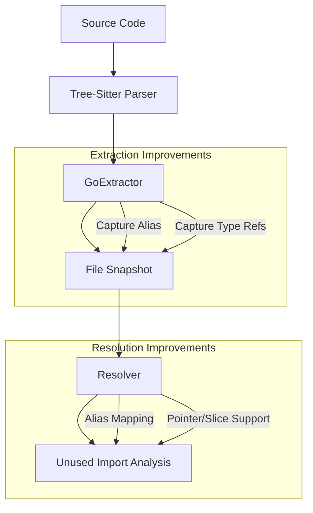

# Plan: Improve Unused Import Detection Accuracy (Go)

Fix systemic false positives in Go unused import detection by enhancing symbol extraction and refining the reference resolution logic.

**Status: Fully Implemented** (All tasks marked Done)
**Archived:** 2026-02-20 - All phases complete, verified in codebase.

## 1. Problem Analysis

The current detection logic reports false positives in several common Go scenarios:
- **Side-effect imports**: `_ "pkg"` is flagged because the alias is not consistently propagated.
- **Aliased imports**: Usage via custom aliases (e.g., `coreapp.Func`) is missed.
- **Type-only usage**: References in interfaces, struct fields, and function signatures are partially ignored.
- **Variable declarations**: Local symbol shadowing incorrectly suppresses legitimate package references.

## 2. Technical Goals

- [x] **Accurate Alias Capture**: Ensure `GoExtractor` consistently records `_`, `.`, and custom aliases.
- [x] **Robust Reference Matching**: Improve `hasSymbolUse` to correctly map references back to imported modules or their aliases.
- [x] **Type & Signature Extraction**: Ensure all types mentioned in function signatures and type declarations are recorded as references.
- [x] **Shadowing Prevention**: Refine `LocalSymbols` logic to prevent types or package names from being incorrectly treated as local variables.

## 3. Proposed Changes

### internal/engine/parser/golang.go
- [x] Update `walkImports` to strictly capture the `import_spec` children.
- [x] Enhance `extractCallable` and `extractType` to ensure `selector_expression` and `qualified_type` nodes are fully traversed.
- [x] Modify `extractVarDecl` to distinguish between the name being defined and the type being referenced.

### internal/engine/resolver/unused_imports.go
- [x] Update `findUnusedInFile` to prioritize checking `imp.Alias` when present.
- [x] Refine `hasSymbolUse` to handle edge cases like pointers (`*pkg.Type`) and slices (`[]pkg.Type`) more reliably.

## 4. Implementation Tasks

| Phase | Task | Description | Status |
| :--- | :--- | :--- | :--- |
| **I: Research** | Verify Tree-Sitter Nodes | Use `debug` logs to confirm node kinds for aliased imports and complex types. | Done |
| **II: Fix** | Update `GoExtractor` | Fix import alias capture and reference recording in declarations. | Done |
| **III: Fix** | Update `Resolver` | Improve the `hasSymbolUse` heuristic to be more alias-aware. | Done |
| **IV: Test** | Regression Testing | Run against `internal/core/ports/ports.go` to ensure no false positives for standard types. | Done |

## 5. Mermaid Data Flow

## 6. DO's and DONT's

| DO | DONT |
| :--- | :--- |
| Always respect `_` as a signal of intentional side-effects. | Don't assume the last part of a module path is the package name if an alias is present. |
| Recursively walk into complex types (maps, channels, slices). | Don't add package names to the `LocalSymbols` list. |
| Use existing unit tests in `unused_imports_test.go` as a baseline. | Don't change the `parser.File` struct unless absolutely necessary for compatibility. |

## 7. Affected Files

- `internal/engine/parser/golang.go`: Primary extractor logic.
- `internal/engine/resolver/unused_imports.go`: Detection heuristic.
- `internal/engine/resolver/unused_imports_test.go`: Verification suite.
