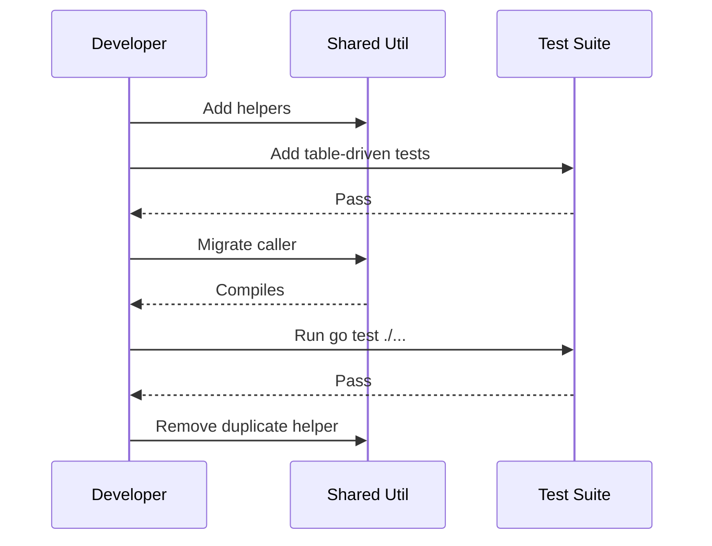
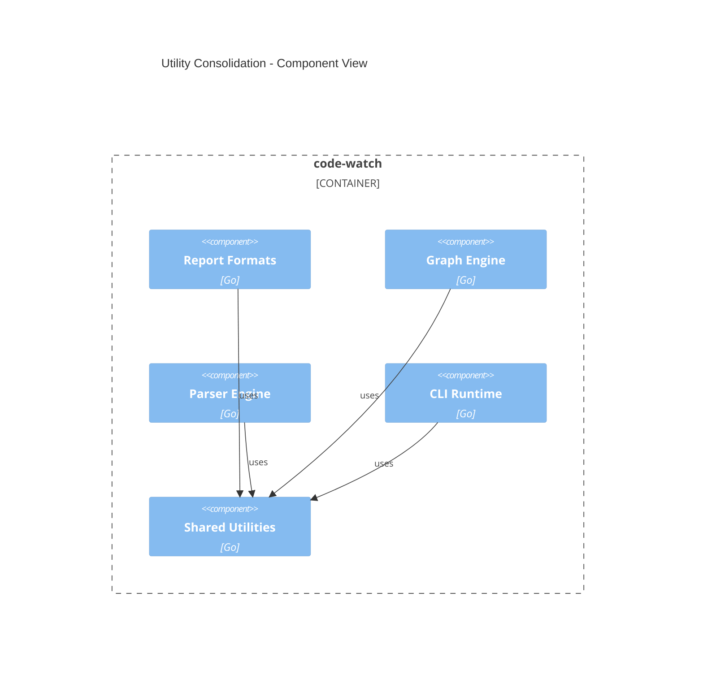
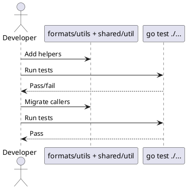
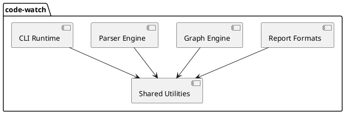

# Utility Consolidation Plan (2026-02-13)

## Overview
Goal: consolidate duplicate small helpers into shared utilities where they are cross-package, validate behavior with tests, migrate call sites incrementally, then remove original helpers. Package-specific utilities stay local in their owning package.

Assumptions:
- No API behavior changes; helpers are behavior-preserving.
- Consolidation is internal-only (`internal/` packages).
- Use a single shared util package for cross-package helpers: `internal/shared/util`.
- Keep package-specific helpers in their local package as `utils.go` (or similar) rather than exporting into shared util.
- Files within the same package do not import each other, so a local `utils.go` does not add import edges or circular import risk.

Out of scope:
- Reformatting or unrelated refactors.
- Cross-package behavior changes.

## Compatibility Table

| Area | Current | Target | Risk |
| --- | --- | --- | --- |
| Report formatting helpers | Per-format duplicates | `internal/ui/report/formats/utils.go` | Low |
| Path normalization/prefix | Duplicates in graph + report | `internal/shared/util` | Low |
| Sorted map keys | Duplicates in graph + parser + report | `internal/shared/util` | Low |
| File write helpers | Duplicates in app + CLI | `internal/shared/util` | Low |

## Plan Overview

| Task ID | Goal | Owner | Depends On | Risk |
| --- | --- | --- | --- | --- |
| T1 | Define utility API + test matrix | Go Dev | - | Low |
| T2 | Consolidate report format helpers locally + tests | Go Dev | T1 | Low |
| T3 | Implement shared util helpers (path/collections/io) + tests | Go Dev | T1 | Medium |
| T4 | Migrate call sites incrementally | Go Dev | T2,T3 | Medium |
| T5 | Remove original helpers and verify | Go Dev | T4 | Low |

## Tasks

- T1 Define utility APIs and test matrix [ ]
Summary: Specify shared util signatures and local report-format helper signatures; define table-driven test cases.
Inputs/outputs: Candidates report -> API and test spec.
File changes:
- `docs/plans/utility-consolidation-plan-2026-02-13.md` (update if needed)
Best practices and standards:
- Keep shared util minimal and cross-package only.
- Keep report-format helpers local to `formats` package.
- Write tests against public utility APIs only.
- Keep functions pure and deterministic.
Acceptance checks:
- Approved list of shared and local utilities.

- T2 Consolidate report format helpers locally and tests [ ]
Summary: Merge Mermaid/PlantUML label, ID, and escape logic into `formats/utils.go` used by both generators.
Inputs/outputs: Format helper group -> `formats` local utils + tests.
File changes:
- New: `internal/ui/report/formats/utils.go`
- New: `internal/ui/report/formats/utils_test.go`
- Update: `internal/ui/report/formats/mermaid.go`
- Update: `internal/ui/report/formats/plantuml.go`
Best practices and standards:
- Preserve label formatting exactly.
- Use table-driven tests with edge cases (empty, symbols, leading digits).
- Keep helpers unexported unless required by tests.
- Migrate one format at a time.
Acceptance checks:
- Tests pass and Mermaid/PlantUML output matches prior behavior.

- T3 Implement shared util helpers (path/collections/io) and tests [ ]
Summary: Consolidate shared helpers into a single `internal/shared/util` package.
Inputs/outputs: Path + collection + IO helpers -> shared util package + tests.
File changes:
- New: `internal/shared/util/util.go`
- New: `internal/shared/util/util_test.go`
- Update: `internal/ui/report/formats/mermaid.go`
- Update: `internal/engine/graph/architecture.go`
- Update: `internal/engine/graph/impact.go`
- Update: `internal/engine/parser/registry/language_registry.go`
- Update: `internal/engine/parser/loader.go`
- Update: `internal/core/app/app.go`
- Update: `internal/ui/cli/runtime.go`
Best practices and standards:
- Keep helpers small and side-effect free.
- Preserve current path semantics (Clean + Trim + Slash).
- Use generics carefully; avoid over-generalization.
- Preserve file permissions and error semantics.
- Add tests for edge cases (".", "./", whitespace).
Acceptance checks:
- Tests pass and call sites compile without behavior change.

- T4 Migrate call sites incrementally [ ]
Summary: Replace duplicate helpers with shared/local utilities in small, verifiable steps.
Inputs/outputs: New utilities -> updated call sites.
File changes:
- Update: same files from T2–T3
Best practices and standards:
- Migrate one helper group per commit step.
- Keep diffs focused to avoid behavior drift.
- Run targeted tests after each migration.
Acceptance checks:
- `go test ./...` passes with no output diffs for reports.

- T5 Remove original helpers and verify [ ]
Summary: Delete duplicate helper functions once all call sites use utilities.
Inputs/outputs: Updated call sites -> removed duplicates.
File changes:
- Remove functions in `mermaid.go`, `plantuml.go`, `architecture.go`, `impact.go`, `language_registry.go`, `loader.go`, `app.go`, `runtime.go`
Best practices and standards:
- Ensure no references remain before deletion.
- Keep removal localized to helper functions only.
- Re-run full test suite after cleanup.
Acceptance checks:
- `go test ./...` passes; no unused code warnings.

## File Inventory

| File | Type | Classes (main methods) | Main functions (signature) | Purpose |
| --- | --- | --- | --- | --- |
| `internal/ui/report/formats/utils.go` | new | - | `moduleLabel(module string, mod *graph.Module, metrics map[string]graph.ModuleMetrics, hotspots map[string]int) string`; `sanitizeID(module string) string`; `makeIDs(names []string) map[string]string`; `escapeLabel(s string) string` | Local format helpers for Mermaid/PlantUML |
| `internal/ui/report/formats/utils_test.go` | new | - | `TestModuleLabel`; `TestSanitizeID`; `TestMakeIDs`; `TestEscapeLabel` | Validate format helper behavior |
| `internal/shared/util/util.go` | new | - | `NormalizePatternPath(s string) string`; `HasPathPrefix(path, prefix string) bool`; `SortedStringKeys[T any](m map[string]T) []string`; `WriteFileWithDirs(path string, data []byte, perm fs.FileMode) error`; `WriteStringWithDirs(path, content string, perm fs.FileMode) error` | Shared helpers for path/collections/IO |
| `internal/shared/util/util_test.go` | new | - | `TestNormalizePatternPath`; `TestHasPathPrefix`; `TestSortedStringKeys`; `TestWriteFileWithDirs` | Validate shared helper behavior |
| `internal/ui/report/formats/mermaid.go` | update | - | - | Replace local helpers with `formats` utils + shared util |
| `internal/ui/report/formats/plantuml.go` | update | - | - | Replace local helpers with `formats` utils |
| `internal/engine/graph/architecture.go` | update | - | - | Replace local helpers with shared util |
| `internal/engine/graph/impact.go` | update | - | - | Replace local helpers with shared util |
| `internal/engine/parser/registry/language_registry.go` | update | - | - | Replace local helpers with shared util |
| `internal/engine/parser/loader.go` | update | - | - | Replace local helpers with shared util |
| `internal/core/app/app.go` | update | - | - | Replace `writeArtifact` with shared util |
| `internal/ui/cli/runtime.go` | update | - | - | Replace `writeBytes` with shared util |

## Diagrams

## Risks and Mitigations

- Risk: subtle output formatting changes.
  Mitigation: add label/ID/escape tests and compare sample outputs before/after.
- Risk: path normalization differences affecting architecture matching.
  Mitigation: preserve exact implementation and add edge-case tests.
- Risk: single shared util file becomes a dumping ground.
  Mitigation: only include confirmed cross-package duplicates; keep format-specific helpers local.

## Testing / Verification

- `go test ./...`
- Targeted tests:
  - `go test ./internal/ui/report/...`
  - `go test ./internal/engine/graph/...`
  - `go test ./internal/engine/parser/...`

## Folder List

- `docs/plans/`
- `internal/ui/report/formats/`
- `internal/shared/util/`
