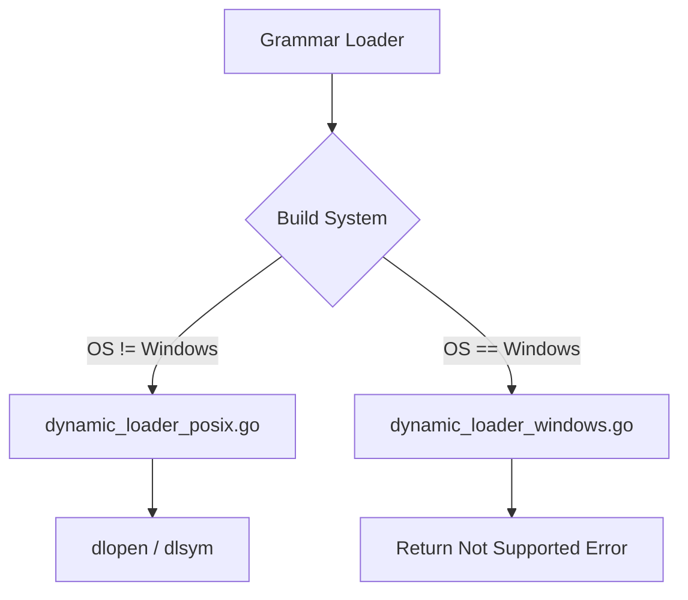

# Implementation Plan: Windows Compatibility for Dynamic Loading

**ID:** PLAN-009  
**Status:** Draft  
**Target Package:** `internal/engine/parser/grammar`  
**User Context:** Multi-platform support (ensuring Windows compilation)

## Overview

The current implementation of dynamic grammar loading in `internal/engine/parser/grammar/dynamic_loader.go` relies on POSIX-specific `dlfcn.h` (via CGO). This prevents the entire project from compiling on Windows. This plan introduces Go build tags to isolate the POSIX-specific logic and provides a placeholder implementation for Windows that returns a "not supported" error, allowing the rest of the application to function on Windows.

## Current State

`dynamic_loader.go` contains:
```go
/*
#include <dlfcn.h>
#include <stdlib.h>
...
*/
import "C"
```
This fails on Windows because `dlfcn.h` is missing.

## Proposed Changes

### 1. Build Tag Separation
Split `dynamic_loader.go` into two files:
- `dynamic_loader_posix.go`: Contains the current logic using `dlfcn.h`. Restricted to POSIX systems.
- `dynamic_loader_windows.go`: Contains a Windows-compatible implementation (stubbed for now).

### 2. POSIX Implementation (`dynamic_loader_posix.go`)
Add the following build tag at the top:
```go
//go:build !windows
```
Keep the existing logic using `dlopen` and `dlsym`.

### 3. Windows Implementation (`dynamic_loader_windows.go`)
Add the following build tag at the top:
```go
//go:build windows
```
Implement `LoadDynamic` to return an error:
```go
func LoadDynamic(path, langName string) (*sitter.Language, error) {
    return nil, fmt.Errorf("dynamic grammar loading is currently not supported on Windows")
}
```

## Implementation Steps

### Phase 1: Refactor POSIX logic
1. Rename `internal/engine/parser/grammar/dynamic_loader.go` to `internal/engine/parser/grammar/dynamic_loader_posix.go`.
2. Add `//go:build !windows` to the top of `dynamic_loader_posix.go`.

### Phase 2: Create Windows stub
1. Create `internal/engine/parser/grammar/dynamic_loader_windows.go`.
2. Add `//go:build windows` to the top.
3. Implement the `LoadDynamic` stub.

## Data Flow (Mermaid)



## DO's and DON'Ts

| DO | DON'T |
|----|-------|
| Use standard Go build tags (`//go:build`). | Use deprecated `// +build` tags alone. |
| Keep function signatures identical across files. | Change the `LoadDynamic` interface. |
| Ensure the project compiles on a Windows machine (or cross-compiles). | Leave CGO imports in the Windows file. |

## Verification Plan

### Automated Tests
- Since we are in a Linux environment, we can verify cross-compilation:
  `GOOS=windows go build ./cmd/circular`
- Ensure it compiles without error.

### Manual Verification
- Run `circular` on Linux to ensure POSIX logic still works.
- If possible, verify on a Windows machine that the error message is correctly displayed when attempting to use a dynamic grammar.
