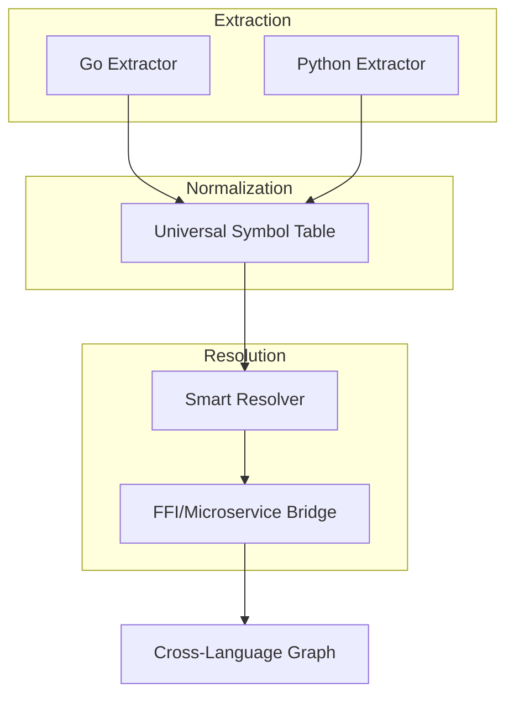

# Plan: Cross-Language Analysis Optimization

## Overview
Improve the depth and accuracy of symbol resolution across different programming languages. This plan focuses on making the resolver smarter at identifying relationships between Go, Python, and other supported languages, especially in polyglot repositories.

## Key Strategies

### 1. Enhanced Symbol Resolution
- **Contextual Heuristics:** Improve `internal/engine/resolver/heuristics.go` to recognize cross-language patterns (e.g., Python calling a Go binary, or Go using a Python-based microservice).
- **Universal Symbol Table:** Develop a more abstract symbol representation that can bridge language-specific types.
- **FFI Detection:** Automatically detect Foreign Function Interface (FFI) calls (e.g., Python `ctypes`, Go `cgo`) and attempt to resolve the underlying symbols.

### 2. Improved Language Extraction
- **Deep Tree-Sitter Queries:** Refine Sitter queries to capture more metadata (types, decorators, annotations) which can aid in resolution.
- **Reference Tracking:** Distinguish between direct calls, interface implementations, and dynamic lookups.
- **Scope Awareness:** Better handle nested scopes (classes, closures) in Python to ensure symbols are resolved to the correct definition.

### 3. Smarter Resolver Logic
- **Probabilistic Matching:** When an exact match isn't found, use fuzzy matching or name-based heuristics to suggest potential resolutions.
- **Inter-file Dependency Tracking:** Track how symbols flow across files, even if they change "shape" between languages.
- **Framework Support:** Add specific logic for popular polyglot frameworks (e.g., gRPC, Thrift) to resolve service definitions.

## Implementation Steps

| Phase | Task | Description |
| :--- | :--- | :--- |
| **Phase 1: Metadata** | Enrich `parser.Definition` | Add more fields for type info, decorators, and visibility. |
| **Phase 2: Queries** | Optimize Tree-Sitter Queries | Update extractors to use more precise queries for each language. |
| **Phase 3: FFI** | FFI Recognition | Implement basic detection for common cross-language call patterns. |
| **Phase 4: Resolving** | Advanced Resolver Logic | Implement multi-pass resolution for ambiguous symbols. |

## Do's and Don'ts

### DO
- Prioritize accuracy over speed; a wrong resolution is worse than no resolution.
- Cache resolution results to avoid redundant tree-walking.
- Use language-specific "bridges" for common inter-op scenarios.

### DON'T
- Over-engineer for rare edge cases; focus on the most common 80% of cross-language usage.
- Hardcode language-specific assumptions into the core `Graph` structure.
- Ignore build artifacts (like `.pyi` stubs or Go headers) that provide better type info.

## Analysis Dataflow

