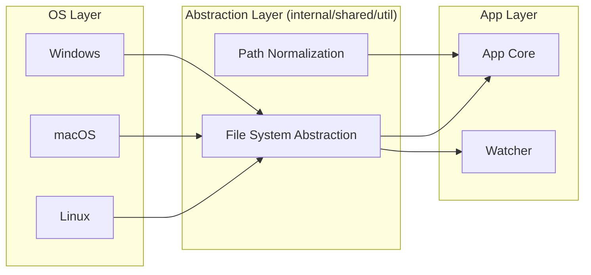

# Plan: Cross-Platform Compatibility

## Overview
Ensure Circular runs seamlessly on Windows, macOS, and Linux. This involves auditing path handling, managing OS-specific binary dependencies, and verifying behavior across different environments.

## Target Platforms
- **Linux:** x86_64, ARM64 (Primary)
- **macOS:** Intel, Apple Silicon (M1/M2/M3)
- **Windows:** x86_64 (via native Go and Powershell/CMD)

## Core Improvements

### 1. Unified Path Handling
- **Audit:** Replace all hardcoded `/` or `` with `filepath.Join` or `filepath.ToSlash`.
- **Module Names:** Ensure Go and Python module name resolution (which often uses `/` as a separator) is decoupled from physical file paths.
- **Normalization:** Ensure `filepath.Clean` and `filepath.Abs` are used consistently to avoid case-sensitivity issues on Windows/macOS.

### 2. Dependency Management
- **Tree-Sitter:** Verify that static bindings for Tree-Sitter work across all platforms.
- **Shared Libraries:** If `.so` files in `grammars/` are used, provide equivalents for Windows (`.dll`) and macOS (`.dylib`).
- **External Tools:** Ensure any shell calls (e.g., to `git`) use `exec.LookPath` to find the correct binary.

### 3. Build & CI
- Update `Makefile` to support cross-compilation.
- Add GitHub Actions or similar CI to test on `ubuntu-latest`, `macos-latest`, and `windows-latest`.
- Verify file system watcher (`internal/core/watcher`) behavior on Windows (using `fsevents` or `inotify` equivalents).

## Implementation Steps

| Phase | Task | Description |
| :--- | :--- | :--- |
| **Phase 1: Audit** | Path Handling Audit | Grep for hardcoded path separators and replace with `filepath` package. |
| **Phase 2: Grammars** | Cross-platform Grammars | Ensure tree-sitter bindings are correctly compiled for all targets. |
| **Phase 3: Watcher** | Watcher Verification | Test `internal/core/watcher` on Windows/macOS to ensure no events are missed. |
| **Phase 4: CI/CD** | CI Pipeline Expansion | Add multi-OS testing to the project's CI configuration. |

## Implementation Status (Updated: 2026-02-14)

| Phase | Status | Notes |
| :--- | :--- | :--- |
| **Phase 1: Audit** | In Progress | Added separator-agnostic path-prefix normalization and diagram output path resolution for both `/` and `\`. |
| **Phase 2: Grammars** | Not Started | Pending artifact strategy for `.so`/`.dylib`/`.dll` parity and loading. |
| **Phase 3: Watcher** | Not Started | Pending platform verification matrix (Windows/macOS event behavior). |
| **Phase 4: CI/CD** | Not Started | No multi-OS CI workflow added yet. |

### Phase 1 Checklist

- [x] Normalize prefix/path comparisons via shared utility (`internal/shared/util`).
- [x] Treat both slash styles as path separators when resolving relative diagram output paths.
- [x] Add regression tests for mixed separator handling.
- [ ] Complete full repository audit for hardcoded separator assumptions outside current hotspots.

## Do's and Don'ts

### DO
- Use `os.PathSeparator` when you need the actual system separator.
- Use `filepath.ToSlash` when generating paths for reports/DOT files to maintain consistency.
- Handle case-insensitive file systems (macOS/Windows) by normalizing paths before comparing.

### DON'T
- Assume `~` or `$HOME` exists (use `os.UserHomeDir()`).
- Use shell-specific commands like `ls`, `grep`, or `cat` in Go code (use `os` and `io` packages).
- Hardcode `/tmp/` (use `os.TempDir()`).

## Architecture Mapping

## Session Completion Check

- Date: 2026-02-14
- Planning document fully implemented: **No**
- Next required milestone: complete remaining Phase 1 path audit and begin Phase 2 grammar artifact compatibility work.
