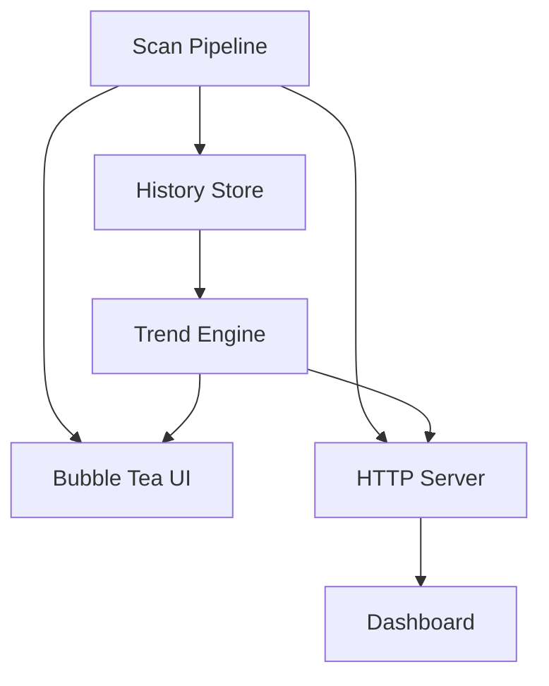
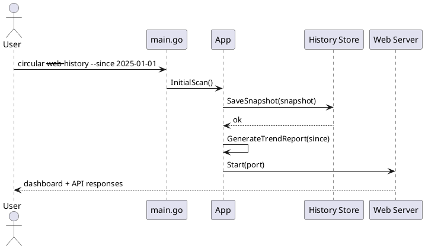

# High Complexity Plan: Historical Insights and Interactive Surfaces

## Overview

Scope: deliver advanced capabilities requiring new storage and interaction surfaces: historical trend tracking, interactive TUI exploration, and web dashboard visualization.

Assumptions:
- Users accept optional local persistence for analysis history.
- Existing watch pipeline can publish events to both terminal and UI/web views.
- Advanced features can be shipped behind explicit flags (`--history`, `--ui`, `--web`).

Constraints:
- Preserve core CLI reliability when advanced modules are disabled.
- Avoid mandatory cloud/network dependencies.
- Keep feature boundaries modular for phased rollout.

## Inputs and Outputs

| Input | Source | Format | Validation |
| --- | --- | --- | --- |
| Current snapshot metrics | graph/parser/resolver | structs | baseline scans pass |
| Commit metadata | local git context (optional) | hash + timestamp | fallback to scan timestamp |
| UI interaction events | keyboard/web requests | event structs | schema validation |

| Output | Consumer | Format | Backward Compatibility |
| --- | --- | --- | --- |
| Historical snapshots | local sqlite DB | normalized tables | optional subsystem |
| Interactive explorer | terminal UI | Bubble Tea views | existing `--ui` preserved |
| Web dashboard | browser | HTML/CSS/JS + JSON APIs | isolated `--web` mode |

## Plan Overview

| Task ID | Goal | Owner | Depends On | Risk |
| --- | --- | --- | --- | --- |
| T1 | Add persistence layer for historical snapshots | Core | - | High |
| T2 | Implement trend ingestion and reporting | Core | T1 | Medium |
| T3 | Expand interactive TUI with graph exploration panels | Core | T2 | Medium |
| T4 | Add web dashboard server and graph APIs | Core | T2 | High |
| T5 | Harden architecture, tests, and rollout strategy | Core | T1,T2,T3,T4 | Medium |

## Tasks

- T1 Build history storage subsystem (SQLite) [ ]
Summary: persist snapshot metrics keyed by scan time and optional commit hash.
Inputs/outputs: runtime metric snapshot in; durable snapshot rows out.
File changes (with classes/functions):
- `internal/history/store.go` (new): `type Store struct` with DB lifecycle methods.
- `internal/history/schema.go` (new): schema migrations and indexes.
- `internal/history/models.go` (new): snapshot row structs.
Best practices and standards:
- Keep schema migration idempotent.
- Use prepared statements and bounded transactions.
- Version schema explicitly for forward migrations.
Acceptance checks:
- Fresh DB initializes on first run.
- Repeated writes produce monotonic snapshot history.

- T2 Implement trend pipeline and reporting CLI [ ]
Summary: compute trend deltas for cycles, module counts, complexity, and dead code over time.
Inputs/outputs: current scan + prior snapshots in; trend summary + TSV/JSON out.
File changes (with classes/functions):
- `internal/history/trends.go` (new): `type TrendPoint struct`, `type TrendReport struct`.
- `internal/history/trends.go` (new): `func BuildTrendReport(points []TrendPoint) TrendReport`.
- `cmd/circular/main.go`: add `--history` and `--since` option wiring.
- `cmd/circular/app.go`: add `func (a *App) GenerateTrendReport(since time.Time) (history.TrendReport, error)`.
Best practices and standards:
- Handle sparse history windows safely.
- Keep trend math deterministic and documented.
- Emit machine-readable output for downstream dashboards.
Acceptance checks:
- Trend report matches seeded fixture snapshots.
- `--history --since` works with and without git metadata.

- T3 Upgrade TUI for interactive dependency exploration [ ]
Summary: add module tree, filtering, detail pane, and jump-to-source actions.
Inputs/outputs: graph + metrics snapshots in; interactive views/actions out.
File changes (with classes/functions):
- `cmd/circular/ui.go`: extend `type model` update/view state and keymaps.
- `cmd/circular/ui_panels.go` (new): reusable panel renderers.
- `cmd/circular/ui_actions.go` (new): action handlers (`openFile`, `toggleFilter`, `focusModule`).
Best practices and standards:
- Keep update loop non-blocking; offload heavy queries.
- Standardize keybindings and show hints in footer.
- Support narrow terminal widths gracefully.
Acceptance checks:
- UI remains responsive on repositories with hundreds of modules.
- Key flows (search/filter/detail) are covered by model tests.

- T4 Build local web dashboard with graph APIs [ ]
Summary: run embedded web server with interactive graph and module detail endpoints.
Inputs/outputs: graph/trend data in; REST/WS payloads and rendered UI out.
File changes (with classes/functions):
- `internal/web/server.go` (new): `type Server struct` with route registration.
- `internal/web/handlers.go` (new): HTTP handlers for graph, module, trends.
- `internal/web/assets/` (new): dashboard frontend (HTML/CSS/JS).
- `cmd/circular/main.go`: add `--web --port` options.
Best practices and standards:
- Separate API contracts from frontend rendering.
- Use read-only endpoints by default.
- Guard long-running scans with context cancellation.
Acceptance checks:
- Browser view loads graph and module details from live run.
- API endpoints return stable schemas and status codes.

- T5 End-to-end hardening and phased rollout [ ]
Summary: finalize integration tests, benchmark memory/latency, and stage feature flags.
Inputs/outputs: integrated subsystems in; release-ready gated features out.
File changes (with classes/functions):
- `internal/history/history_test.go` (new): DB lifecycle and trend math tests.
- `internal/web/server_test.go` (new): API contract tests.
- `cmd/circular/app_test.go`: advanced mode integration tests.
- `docs/documentation/advanced.md` (new): operational guide and rollout flags.
Best practices and standards:
- Keep advanced features opt-in until performance is validated.
- Add benchmark baselines for scan, UI update, and API latency.
- Document failure modes and recovery steps.
Acceptance checks:
- `go test ./...` passes including advanced modules.
- Benchmarks stay within agreed budget on representative repo.

## File Inventory

| File | Type | Classes (name + main methods) | Main functions (name + signature) | Purpose |
| --- | --- | --- | --- | --- |
| `internal/history/store.go` | new | `Store` (`Open`, `Close`, `SaveSnapshot`, `LoadSnapshots`) | `Open(path string) (*Store, error)` | Persist analysis snapshots |
| `internal/history/schema.go` | new | n/a | `EnsureSchema(db *sql.DB) error` | Create/update DB schema |
| `internal/history/models.go` | new | `Snapshot`, `SnapshotMetric` | n/a | History data models |
| `internal/history/trends.go` | new | `TrendPoint`, `TrendReport` | `BuildTrendReport(points []TrendPoint) TrendReport` | Trend aggregation |
| `internal/web/server.go` | new | `Server` (`Start`, `Shutdown`, `registerRoutes`) | `NewServer(app *App, port int) *Server` | Web runtime |
| `internal/web/handlers.go` | new | `Handlers` (`Graph`, `Module`, `Trends`) | `GraphHandler(w http.ResponseWriter, r *http.Request)` | Dashboard APIs |
| `cmd/circular/ui.go` | update | `model` (`Update`, `View`) | existing Bubble Tea update loop | Richer terminal UX |
| `cmd/circular/ui_panels.go` | new | `ModulePanel`, `TrendPanel` | `renderModulePanel(...) string` | Modular UI rendering |
| `cmd/circular/ui_actions.go` | new | n/a | `openFile(path string) error` | Input/action abstraction |
| `cmd/circular/main.go` | update | n/a | flag parsing for `--history`, `--web` | CLI mode extensions |
| `cmd/circular/app.go` | update | `App` (`GenerateTrendReport`) | `GenerateTrendReport(since time.Time) (history.TrendReport, error)` | Advanced orchestration |

## Diagrams

## Risks and Mitigations

- Risk: advanced features increase startup and memory cost. Mitigation: lazy-init history/web subsystems behind flags.
- Risk: data-model churn in early iterations. Mitigation: versioned API and schema migration strategy.
- Risk: UI/Web duplicate logic. Mitigation: shared service layer for query/filter logic.

## Testing and Verification

- Run `go test ./...` including new `internal/history` and `internal/web` packages.
- Add integration tests for `--history` and `--web` startup paths.
- Run basic benchmark suite for scan latency, memory use, and API response times.

## Folder List

- `docs/plans/high-complexity-feature-plan.md`
- `docs/documentation/advanced.md` (new)
- `cmd/circular/`
- `internal/history/`
- `internal/web/`
