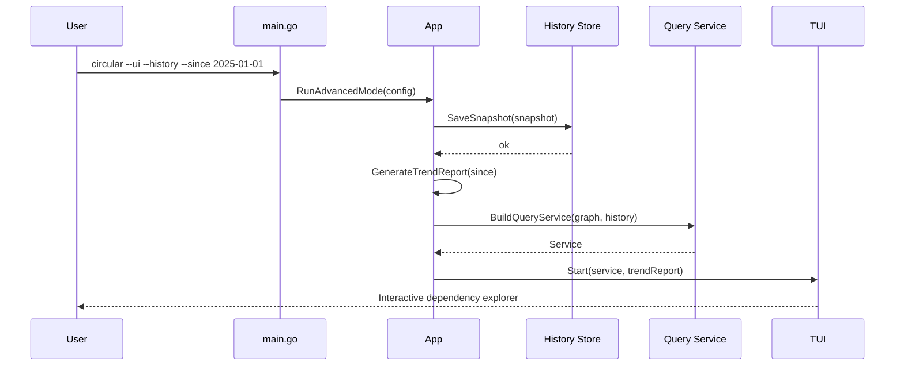
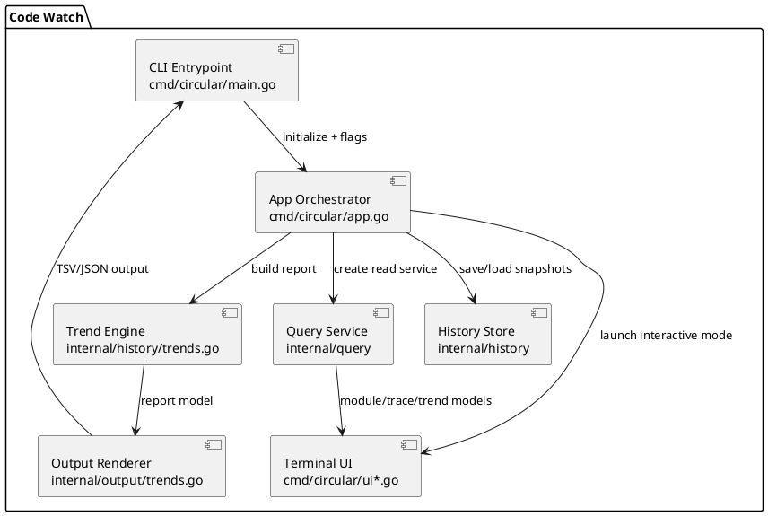

# High Complexity Plan: Historical Insights and Advanced TUI Exploration

## Overview

Scope: deliver high-complexity capabilities centered on historical trend analysis and a richer terminal experience, without introducing web integration.

## Current Implementation Status (2026-02-13)

### Implemented

- T1: history persistence implemented with local SQLite store at `.circular/history.db`, schema migration/version checks, ordered load/upsert behavior, and lock-retry policy.
- T2: trend computation includes deltas, moving averages, module growth, fan-in/fan-out drift, configurable windows (`--history-window`), and additive TSV/JSON exports.
- T3: shared query service is exposed in CLI and TUI (`--query-modules`, `--query-module`, `--query-trace`, `--query-trends`) with deterministic ordering and tests.
- T4: TUI module explorer supports drill-down panels, dependency cursoring, trend overlays, and jump-to-source actions.
- T5: end-to-end hardening includes SQLite lifecycle coverage, advanced integration tests, benchmarks, and updated docs/changelog.

### Missing

- None for scope T1-T5 in this plan.

Out of scope:
- Embedded web server, browser dashboard, REST/WS APIs, and frontend assets.

Assumptions:
- Users may opt into local persistence for history.
- Existing scan/watch pipeline can publish stable snapshots to downstream services.
- Features remain opt-in behind explicit flags (`--history`, `--ui`, `--since`).

Constraints:
- Preserve default CLI behavior when advanced features are disabled.
- Keep runtime overhead bounded for large repositories.
- Maintain Go 1.24.x compatibility.

## Inputs and Outputs

| Input | Source | Format | Validation |
| --- | --- | --- | --- |
| Dependency graph snapshot | parser/graph/resolver pipeline | Go structs | existing scan tests pass |
| File/module metrics | parser + graph aggregates | Go structs | non-negative counters and stable IDs |
| Optional commit metadata | local git context | hash + timestamp | fallback to scan timestamp |
| TUI interaction events | keyboard input | Bubble Tea messages | keymap + state guard checks |

| Output | Consumer | Format | Backward Compatibility |
| --- | --- | --- | --- |
| Historical snapshots | history subsystem | local SQLite tables | optional subsystem only |
| Trend reports | CLI + output package | terminal + TSV/JSON | additive outputs |
| Interactive explorer | terminal UI | Bubble Tea panels/views | preserves `--ui` path |

## Plan Overview

| Task ID | Goal | Owner | Depends On | Risk |
| --- | --- | --- | --- | --- |
| T1 | Add persistence layer for historical snapshots | Core | - | High |
| T2 | Implement trend computation and report export | Core | T1 | Medium |
| T3 | Add query service for graph/history read models | Core | T1,T2 | Medium |
| T4 | Expand TUI for deep dependency exploration | Core | T2,T3 | Medium |
| T5 | Harden integration, tests, docs, and rollout | Core | T1,T2,T3,T4 | Medium |

## Tasks

- T1 Build history storage subsystem (SQLite) [done]
Summary: persist scan snapshots keyed by timestamp and optional commit hash with explicit schema versioning.
Inputs/outputs: scan snapshot in; normalized rows for snapshots/metrics out.
File changes (with classes/functions):
- `internal/history/store.go` (new): `type Store struct` with lifecycle and CRUD methods.
- `internal/history/schema.go` (new): migration bootstrap and index management.
- `internal/history/models.go` (new): storage model structs.
Best practices and standards:
- Keep migrations idempotent and versioned.
- Use prepared statements and bounded transactions.
- Fail fast on schema drift and surface actionable errors.
Acceptance checks:
- First run initializes schema successfully.
- Repeated writes produce ordered, non-duplicated snapshots.
- Corrupt DB path returns explicit, test-covered errors.
Status notes:
- Implemented: `internal/history/store.go` with SQLite persistence, schema bootstrap, upsert semantics, and lock-aware retry policy.
- Implemented: `internal/history/schema.go` migration/version handling with drift detection.

- T2 Implement trend pipeline and reporting CLI [done]
Summary: compute deltas and moving summaries (cycles, unresolved refs, module growth, fan-in/fan-out drift).
Inputs/outputs: historical snapshot series in; trend report model + CLI/export output out.
File changes (with classes/functions):
- `internal/history/trends.go` (new): `type TrendPoint`, `type TrendReport`, builder methods.
- `internal/output/trends.go` (new): TSV/JSON rendering helpers for trend reports.
- `cmd/circular/main.go` (update): flag wiring for `--history` and `--since`.
- `cmd/circular/app.go` (update): orchestration method for trend generation.
Best practices and standards:
- Keep math deterministic and documented.
- Handle sparse windows and missing prior points safely.
- Ensure export schemas are stable and additive.
Acceptance checks:
- Seeded fixtures produce deterministic trend output.
- `--history --since <date>` works with and without commit metadata.
- Output includes explicit window metadata and scan counts.
Status notes:
- Implemented: trend builder and CLI/runtime wiring with configurable windows (`--history-window`) and additive drift metrics.
- Implemented: trend overlay rendering in TUI panel views.

- T3 Add shared query service for graph/history reads [done]
Summary: centralize read queries used by CLI and TUI to avoid duplicated filtering and traversal logic.
Inputs/outputs: graph state + history store in; typed read models for modules/dependencies/trends out.
File changes (with classes/functions):
- `internal/query/service.go` (new): `type Service struct` with traversal/filter/query methods.
- `internal/query/models.go` (new): read model types for module detail and dependency traces.
- `internal/query/service_test.go` (new): behavior tests for filtering and traversal depth.
Best practices and standards:
- Keep query methods side-effect free.
- Use context-aware APIs for cancellation-safe long traversals.
- Define stable sort order for deterministic UI/CLI rendering.
Acceptance checks:
- Query outputs match expected fixtures on representative repos.
- Complex dependency trace requests complete within agreed bounds.
- No direct graph/history coupling leaks into TUI view code.
Status notes:
- Implemented: `internal/query/service.go`, `internal/query/models.go`, and test coverage.
- Implemented: dedicated query-backed CLI command surface for module listing/details/traces and trend slices.

- T4 Upgrade TUI for interactive dependency exploration [done]
Summary: add focused module explorer panels, advanced filters, trend overlays, and jump-to-source actions.
Inputs/outputs: query service read models in; responsive panel state transitions out.
File changes (with classes/functions):
- `cmd/circular/ui.go` (update): expanded model state and update routing.
- `cmd/circular/ui_panels.go` (new): panel renderers for module list/detail/trend overlays.
- `cmd/circular/ui_actions.go` (new): keyboard actions and focus transitions.
- `cmd/circular/ui_model_test.go` (new): model transition tests for key user flows.
Best practices and standards:
- Keep the Bubble Tea update loop non-blocking.
- Standardize keybindings and footer hints.
- Degrade gracefully on narrow terminals.
Acceptance checks:
- Repositories with hundreds of modules remain responsive.
- Search/filter/focus flows are covered by model tests.
- Trend overlays reflect the same values as CLI trend reports.
Status notes:
- Implemented: dedicated TUI panel/action files with module drill-down, dependency focus movement, trend overlays, and source-jump actions.
- Implemented: model transition coverage for panel switching, module detail opening, and overlay toggles.

- T5 End-to-end hardening and phased rollout [done]
Summary: finalize integration boundaries, performance guardrails, docs, and release strategy for advanced mode.
Inputs/outputs: integrated subsystem changes in; release-ready feature gates and docs out.
File changes (with classes/functions):
- `cmd/circular/app_test.go` (update): integration tests for advanced CLI and TUI paths.
- `internal/history/history_test.go` (new): DB lifecycle and trend math tests.
- `docs/documentation/advanced.md` (new): operational guide for history/TUI capabilities.
- `CHANGELOG.md` (update): user-facing release notes for advanced non-web features.
Best practices and standards:
- Keep advanced capabilities opt-in until performance gates are met.
- Benchmark scan latency, memory, and TUI refresh timing.
- Document failure modes and recovery actions.
Acceptance checks:
- `go test ./...` passes across all packages.
- Benchmarks stay within defined budgets on representative repositories.
- Documentation covers enablement, limits, and troubleshooting.
Status notes:
- Implemented: advanced integration tests in CLI/runtime and history lifecycle coverage.
- Implemented: benchmark guardrails via history subsystem benchmark tests.
- Implemented: documentation and changelog updates aligned with advanced behavior.

## File Inventory

| File | Type | Classes (name + main methods) | Main functions (name + signature) | Purpose |
| --- | --- | --- | --- | --- |
| `internal/history/store.go` | new | `Store` (`Open`, `Close`, `SaveSnapshot`, `LoadSnapshots`) | `Open(path string) (*Store, error)` | Persist analysis snapshots |
| `internal/history/schema.go` | new | n/a | `EnsureSchema(db *sql.DB) error` | Create/update schema and indexes |
| `internal/history/models.go` | new | `Snapshot`, `SnapshotMetric` | n/a | History storage models |
| `internal/history/trends.go` | new | `TrendPoint`, `TrendReport` | `BuildTrendReport(points []TrendPoint, window time.Duration) (TrendReport, error)` | Trend aggregation |
| `internal/output/trends.go` | new | n/a | `RenderTrendTSV(r history.TrendReport) ([]byte, error)`; `RenderTrendJSON(r history.TrendReport) ([]byte, error)` | Trend report export |
| `internal/query/service.go` | new | `Service` (`ModuleDetails`, `DependencyTrace`, `TrendSlice`) | `NewService(g *graph.State, h *history.Store) *Service` | Shared query layer |
| `internal/query/models.go` | new | `ModuleDetails`, `DependencyEdge`, `TraceResult` | n/a | Query read models |
| `internal/query/service_test.go` | new | n/a | `TestService_DependencyTrace(t *testing.T)` | Query correctness tests |
| `cmd/circular/main.go` | update | n/a | flag wiring for `--history`, `--since`, `--ui` | CLI mode extensions |
| `cmd/circular/app.go` | update | `App` (`GenerateTrendReport`, `BuildQueryService`) | `GenerateTrendReport(since time.Time) (history.TrendReport, error)` | Advanced orchestration |
| `cmd/circular/ui.go` | update | `model` (`Update`, `View`, `applyQueryResult`) | existing Bubble Tea loop integration | Stateful TUI orchestration |
| `cmd/circular/ui_panels.go` | new | `ModulePanel`, `TrendPanel` | `renderModulePanel(m ModuleDetails) string` | Reusable panel rendering |
| `cmd/circular/ui_actions.go` | new | n/a | `handleFocusChange(msg tea.Msg, m model) (model, tea.Cmd)` | User action handling |
| `cmd/circular/ui_model_test.go` | new | n/a | `TestModel_FilterAndFocusFlow(t *testing.T)` | TUI behavior tests |
| `cmd/circular/app_test.go` | update | n/a | `TestApp_GenerateTrendReport(t *testing.T)` | End-to-end application checks |
| `internal/history/history_test.go` | new | n/a | `TestStore_SaveLoadSnapshots(t *testing.T)` | Storage and trend verification |
| `docs/documentation/advanced.md` | new | n/a | n/a | User and operator documentation |
| `CHANGELOG.md` | update | n/a | n/a | Release notes |

## Diagrams

## Risks and Mitigations

- Risk: SQLite locking or slow writes during rapid watch updates.
  Mitigation: bounded write queue, short transactions, and retry policy with backoff.
- Risk: drift between CLI trend calculations and TUI overlays.
  Mitigation: single trend engine API reused by both outputs.
- Risk: heavy dependency traces reduce TUI responsiveness.
  Mitigation: async query execution with cancellation and capped traversal defaults.
- Risk: complexity growth across packages.
  Mitigation: strict package boundaries (`history`, `query`, `output`, `cmd/circular`).

## Testing and Verification

- Unit tests:
  - `internal/history`: schema, write/read lifecycle, trend math edge cases.
  - `internal/query`: deterministic ordering, filter correctness, traversal limits.
  - `cmd/circular`: TUI model transitions and app orchestration.
- Integration tests:
  - `--history` with seeded snapshots and `--since` windows.
  - `--ui` with query service-backed flows.
- Performance checks:
  - benchmark snapshot write/read overhead.
  - benchmark dependency trace latency at several graph sizes.
  - measure TUI frame/update timing under stress fixtures.

## Folder List

- `docs/plans/high-complexity-feature-plan.md`
- `docs/documentation/advanced.md` (new)
- `cmd/circular/`
- `internal/history/`
- `internal/query/`
- `internal/output/`
