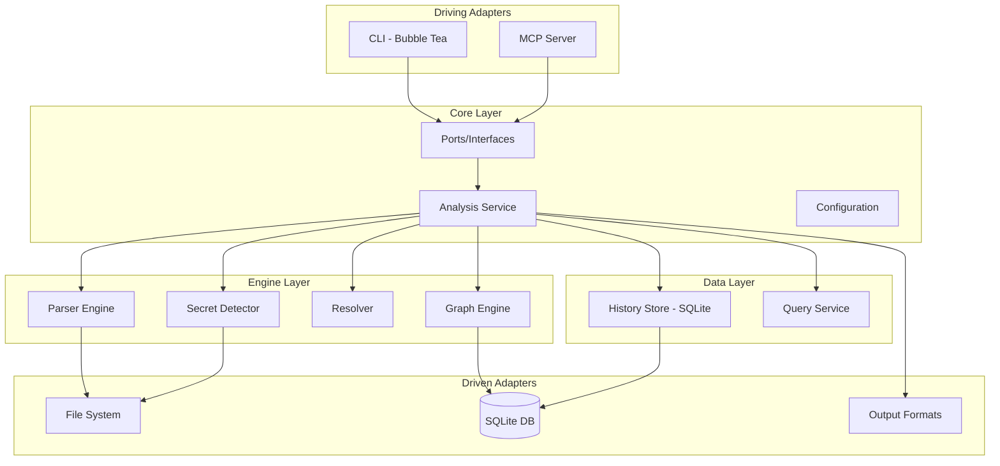

# Internal Codebase Comprehensive Analysis Report

**Date:** 2026-02-21  
**Scope:** `internal/` directory  
**Architecture Pattern:** Hexagonal Architecture (Ports and Adapters)

---

## Executive Summary

The `internal/` codebase implements a sophisticated code dependency monitoring system called "Circular" using **Hexagonal Architecture**. The codebase demonstrates strong architectural discipline with clear separation between domain logic, infrastructure adapters, and application services. The system provides multi-language code parsing, dependency graph analysis, cycle detection, secret scanning, and MCP (Model Context Protocol) server capabilities.

**Overall Assessment:** The codebase is well-structured and follows Go best practices. It demonstrates mature engineering practices including comprehensive testing, proper error handling, and clean interface design. Several areas could benefit from additional hardening and optimization.

---

## 1. Architecture Overview

### 1.1 Package Structure

```
internal/
├── core/           # Domain layer - business logic and ports
│   ├── app/        # Application services and orchestration
│   ├── config/     # Configuration management
│   ├── errors/     # Domain error types
│   ├── ports/      # Interface definitions (driving/driven ports)
│   └── watcher/    # File system watcher
├── data/           # Infrastructure adapters (driven)
│   ├── history/    # SQLite-based history storage
│   └── query/      # Query service implementation
├── engine/         # Domain engine implementations
│   ├── graph/      # Dependency graph with LRU caching
│   ├── parser/     # Tree-sitter based multi-language parser
│   ├── resolver/   # Cross-language reference resolver
│   └── secrets/    # Secret detection engine
├── mcp/            # MCP server implementation
│   ├── adapters/   # Tool adapters
│   ├── contracts/  # Type contracts
│   ├── runtime/    # Server runtime
│   ├── tools/      # Tool handlers
│   └── transport/  # SSE/STDIO transports
├── shared/         # Shared utilities
│   ├── observability/  # Metrics and tracing
│   └── util/       # Common utilities
├── test/           # Integration tests
└── ui/             # User interface layer
    ├── cli/        # Terminal UI (Bubble Tea)
    └── report/     # Report generation (Mermaid, PlantUML, DOT, SARIF)
```

### 1.2 Hexagonal Architecture Compliance

The codebase follows hexagonal architecture principles:

| Aspect | Implementation | Status |
|--------|---------------|--------|
| **Ports Definition** | [`internal/core/ports/ports.go`](internal/core/ports/ports.go) | ✅ Excellent |
| **Domain Isolation** | Core logic in `core/app` uses interfaces only | ✅ Good |
| **Adapter Pattern** | `engine/`, `data/`, `ui/` implement ports | ✅ Good |
| **Dependency Injection** | Constructor injection throughout | ✅ Good |
| **Infrastructure Separation** | Tree-sitter, SQLite isolated in adapters | ✅ Good |

---

## 2. Capabilities Analysis

### 2.1 Core Capabilities

#### Multi-Language Code Parsing
- **Languages Supported:** Go, Python, JavaScript, TypeScript, TSX, Java, Rust, CSS, HTML
- **Implementation:** Tree-sitter based parsing in [`internal/engine/parser/`](internal/engine/parser/)
- **Dynamic Grammar Support:** Can load additional grammars at runtime
- **Extractors:** Language-specific extractors for imports, definitions, references

```go
// From parser.go - Clean extractor interface
type Extractor interface {
    Extract(node *sitter.Node, source []byte, filePath string) (*File, error)
}
```

#### Dependency Graph Analysis
- **Implementation:** [`internal/engine/graph/graph.go`](internal/engine/graph/graph.go)
- **Features:**
  - LRU caching for file storage
  - Cycle detection using Tarjan's algorithm
  - Module metrics (fan-in, fan-out, depth, importance score)
  - Architecture violation detection
  - Complexity hotspot identification

#### Secret Detection
- **Implementation:** [`internal/engine/secrets/detector.go`](internal/engine/secrets/detector.go)
- **Detection Methods:**
  - Pattern matching (AWS keys, GitHub PATs, Stripe keys, etc.)
  - Entropy analysis (Shannon entropy)
  - Context-aware detection (sensitive variable assignments)
- **Git History Scanning:** Can scan historical commits for deleted secrets

#### Cross-Language Reference Resolution
- **Implementation:** [`internal/engine/resolver/resolver.go`](internal/engine/resolver/resolver.go)
- **Features:**
  - Local symbol resolution
  - Stdlib recognition per language
  - Probabilistic cross-language bridge resolution
  - Unused import detection
  - Hallucination detection (unresolved references)

### 2.2 MCP Server Capabilities

The MCP server in [`internal/mcp/`](internal/mcp/) provides:

| Tool Operation | Description |
|----------------|-------------|
| `scan_run` | Execute codebase scan |
| `secrets_scan` | Scan for secrets |
| `secrets_list` | List detected secrets |
| `graph_cycles` | Detect dependency cycles |
| `query_modules` | List modules with filtering |
| `query_details` | Get module details |
| `query_trace` | Trace import chains |
| `query_trends` | Historical trend analysis |
| `system_sync_outputs` | Sync diagram outputs |
| `system_watch` | Start file watcher |

**Transport Support:**
- STDIO transport for CLI integration
- SSE transport for HTTP-based clients

### 2.3 Output Formats

| Format | Implementation | Use Case |
|--------|---------------|----------|
| DOT | [`internal/ui/report/formats/dot.go`](internal/ui/report/formats/dot.go) | GraphViz visualization |
| Mermaid | [`internal/ui/report/formats/mermaid.go`](internal/ui/report/formats/mermaid.go) | Markdown-embedded diagrams |
| PlantUML | [`internal/ui/report/formats/plantuml.go`](internal/ui/report/formats/plantuml.go) | Enterprise documentation |
| SARIF | [`internal/ui/report/formats/sarif.go`](internal/ui/report/formats/sarif.go) | CI/CD integration |
| Markdown | [`internal/ui/report/formats/markdown.go`](internal/ui/report/formats/markdown.go) | Human-readable reports |
| TSV | [`internal/ui/report/formats/tsv.go`](internal/ui/report/formats/tsv.go) | Data export |

---

## 3. Code Quality Assessment

### 3.1 Strengths

#### Clean Interface Design
```go
// Excellent port definitions in ports.go
type AnalysisService interface {
    RunScan(ctx context.Context, req ScanRequest) (ScanResult, error)
    TraceImportChain(ctx context.Context, from, to string) (string, error)
    AnalyzeImpact(ctx context.Context, path string) (graph.ImpactReport, error)
    // ... well-defined operations
}
```

#### Comprehensive Error Handling
```go
// Domain-specific errors with codes
type DomainError struct {
    Code    ErrorCode
    Message string
    Err     error
}

const (
    CodeNotFound         ErrorCode = "NOT_FOUND"
    CodeValidationError  ErrorCode = "VALIDATION_ERROR"
    CodeConflict         ErrorCode = "CONFLICT"
    CodeInternal         ErrorCode = "INTERNAL_ERROR"
)
```

#### Thread-Safe Design
- Proper use of `sync.RWMutex` throughout
- Concurrent-safe graph operations
- Thread-safe LRU cache implementation

#### Observability Integration
```go
// Prometheus metrics
var (
    ParsingDuration    = promauto.NewHistogramVec(...)
    GraphNodes         = promauto.NewGauge(...)
    GraphEdges         = promauto.NewGauge(...)
    AnalysisDuration   = promauto.NewHistogramVec(...)
    WatcherEventsTotal = promauto.NewCounter(...)
)
```

#### Test Coverage
- Unit tests alongside source files
- Integration tests in `internal/test/`
- Benchmark tests for performance-critical paths

### 3.2 Areas for Improvement

#### 1. Error Context Propagation

**Issue:** Some error paths lose context during wrapping.

**Location:** [`internal/core/app/service.go`](internal/core/app/service.go)

```go
// Current
if err := s.app.ProcessFile(filePath); err != nil {
    warnings = append(warnings, fmt.Sprintf("process file %s: %v", filePath, err))
}

// Improved - preserve structured error
if err := s.app.ProcessFile(filePath); err != nil {
    warnings = append(warnings, fmt.Sprintf("process file %s: %v", filePath, err))
    // Consider: structured logging with key-value pairs
}
```

**Recommendation:** Add structured error context with file path, operation, and timing information.

#### 2. Configuration Validation Gaps

**Issue:** Some configuration combinations are not validated.

**Location:** [`internal/core/config/validator.go`](internal/core/config/validator.go)

**Missing Validations:**
- Cross-field validation (e.g., `grammars_path` exists when dynamic grammars are defined)
- Architecture layer path conflicts
- Rate limit weight consistency

**Recommendation:** Add comprehensive cross-field validation rules.

#### 3. Memory Management in Large Codebases

**Issue:** LRU cache eviction may not keep up with very large codebases.

**Location:** [`internal/engine/graph/lru.go`](internal/engine/graph/lru.go)

```go
// Current eviction is simple
func (c *LRUCache[K, V]) Evict(key K) {
    // ... removes from map and list
}

// Consider: proactive memory pressure handling
func (c *LRUCache[K, V]) EvictUnderPressure() int {
    // Evict 25% of entries when under memory pressure
}
```

**Recommendation:** Add memory pressure monitoring and proactive cache reduction.

#### 4. Parser Pool Resource Management

**Issue:** Parser pool may leak resources if not properly closed.

**Location:** [`internal/engine/parser/pool.go`](internal/engine/parser/pool.go)

**Recommendation:** Add finalizer logging and resource tracking for debugging leaks.

#### 5. MCP Rate Limiting Granularity

**Issue:** Rate limiting is operation-level but not user/session aware.

**Location:** [`internal/mcp/runtime/server.go`](internal/mcp/runtime/server.go)

```go
// Current: single limiter for all operations
if s.opLimiter != nil {
    weight := validate.GetOperationWeight(operation, s.cfg.MCP.RateLimit.Weights)
    if !s.opLimiter.Allow(weight) {
        // Reject
    }
}
```

**Recommendation:** Add per-client or per-session rate limiting for multi-tenant scenarios.

#### 6. Symbol Store SQLite Concurrency

**Issue:** SQLite symbol store may have contention under high write load.

**Location:** [`internal/engine/graph/symbol_store.go`](internal/engine/graph/symbol_store.go)

**Recommendation:** Consider write batching or moving to a more concurrent store for high-throughput scenarios.

#### 7. Watcher Debounce Edge Cases

**Issue:** Rapid file changes may cause duplicate processing.

**Location:** [`internal/core/watcher/watcher.go`](internal/core/watcher/watcher.go)

```go
// Current: simple time-based debounce
w.timer = time.AfterFunc(w.debounce, func() {
    w.flushChanges()
})
```

**Recommendation:** Add content hashing to skip unchanged files even if events fire.

---

## 4. Detailed Component Analysis

### 4.1 Core Layer (`internal/core/`)

#### Application Service (`app/`)

| File | Purpose | Lines | Quality |
|------|---------|-------|---------|
| [`app.go`](internal/core/app/app.go) | App struct, initialization | 224 | ✅ Good |
| [`service.go`](internal/core/app/service.go) | AnalysisService implementation | 543 | ✅ Good |
| [`analyzer.go`](internal/core/app/analyzer.go) | Hallucination/unused analysis | ~250 | ✅ Good |
| [`scanner.go`](internal/core/app/scanner.go) | Directory scanning | ~170 | ✅ Good |
| [`output.go`](internal/core/app/output.go) | Output generation | ~260 | ✅ Good |

**Observations:**
- Clean separation of concerns
- Proper dependency injection
- Good use of context for cancellation
- Thread-safe configuration updates

#### Configuration (`config/`)

| File | Purpose | Quality |
|------|---------|---------|
| [`config.go`](internal/core/config/config.go) | Config structs | ✅ Well-structured |
| [`loader.go`](internal/core/config/loader.go) | TOML loading | ✅ Good |
| [`validator.go`](internal/core/config/validator.go) | Validation | ⚠️ Could be more comprehensive |
| [`env.go`](internal/core/config/env.go) | Environment overrides | ✅ Good |

**Notable Features:**
- Environment variable overrides
- Project-based configuration
- Include file support
- Hot-reload support via `Reloadable` interface

#### Ports (`ports/`)

**Excellent interface design:**
- Clear separation between driving and driven ports
- Well-defined DTOs for requests/responses
- Proper use of context throughout

### 4.2 Engine Layer (`internal/engine/`)

#### Graph Engine (`graph/`)

| Component | Implementation | Quality |
|-----------|---------------|---------|
| Core Graph | [`graph.go`](internal/engine/graph/graph.go) | ✅ Excellent |
| LRU Cache | [`lru.go`](internal/engine/graph/lru.go) | ✅ Good |
| Cycle Detection | [`detect.go`](internal/engine/graph/detect.go) | ✅ Good |
| Architecture Rules | [`architecture.go`](internal/engine/graph/architecture.go) | ✅ Good |
| Symbol Store | [`symbol_store.go`](internal/engine/graph/symbol_store.go) | ⚠️ Complex |

**Key Algorithms:**
- Tarjan's algorithm for strongly connected components
- Topological depth computation
- Importance scoring formula

#### Parser Engine (`parser/`)

| Component | Purpose | Quality |
|-----------|---------|---------|
| [`parser.go`](internal/engine/parser/parser.go) | Main parser | ✅ Good |
| [`pool.go`](internal/engine/parser/pool.go) | Parser pool | ✅ Good |
| [`profile_extractors.go`](internal/engine/parser/profile_extractors.go) | Language extractors | ✅ Comprehensive |
| [`universal.go`](internal/engine/parser/universal.go) | Universal extraction | ✅ Good |

**Language Support Matrix:**

| Language | Extractor | Import Detection | Definition Detection |
|----------|-----------|------------------|---------------------|
| Go | ✅ | ✅ | ✅ |
| Python | ✅ | ✅ | ✅ |
| JavaScript | ✅ | ✅ | ✅ |
| TypeScript | ✅ | ✅ | ✅ |
| Java | ✅ | ✅ | ✅ |
| Rust | ✅ | ✅ | ✅ |

#### Resolver (`resolver/`)

**Sophisticated multi-pass resolution:**
1. Local symbol check
2. Explicit bridge mappings
3. Stdlib recognition
4. Qualified reference resolution
5. Probabilistic cross-language resolution

**Bridge Scoring System:**
```go
type BridgeScoreWeights struct {
    ExplicitRuleMatch       int
    BridgeContext           int
    BridgeImportEvidence    int
    UniqueCrossLangMatch    int
    AmbiguousCrossLangMatch int
    LocalOrModuleConflict   int
    StdlibConflict          int
}
```

### 4.3 Data Layer (`internal/data/`)

#### History Store (`history/`)

| File | Purpose | Quality |
|------|---------|---------|
| [`store.go`](internal/data/history/store.go) | SQLite storage | ✅ Good |
| [`schema.go`](internal/data/history/schema.go) | Schema management | ✅ Good |
| [`trends.go`](internal/data/history/trends.go) | Trend analysis | ✅ Good |

**Features:**
- WAL mode for better concurrency
- Retry logic for lock errors
- Snapshot versioning
- Git metadata tracking

#### Query Service (`query/`)

**CQL (Circular Query Language):**
```go
// Example queries
"SELECT modules WHERE fan_in > 5"
"SELECT modules WHERE name CONTAINS 'auth'"
"SELECT modules WHERE depth >= 3"
```

### 4.4 MCP Layer (`internal/mcp/`)

#### Runtime (`runtime/`)

| File | Purpose | Quality |
|------|---------|---------|
| [`server.go`](internal/mcp/runtime/server.go) | MCP server | ✅ Good |
| [`bootstrap.go`](internal/mcp/runtime/bootstrap.go) | Server initialization | ✅ Good |
| [`project_context.go`](internal/mcp/runtime/project_context.go) | Project management | ✅ Good |
| [`allowlist.go`](internal/mcp/runtime/allowlist.go) | Operation filtering | ✅ Good |

#### Transport (`transport/`)

| Transport | Implementation | Quality |
|-----------|---------------|---------|
| STDIO | [`stdio.go`](internal/mcp/transport/stdio.go) | ✅ Good |
| SSE | [`sse.go`](internal/mcp/transport/sse.go) | ✅ Good |

**SSE Features:**
- Connection management
- Heartbeat support
- Graceful shutdown

### 4.5 UI Layer (`internal/ui/`)

#### CLI (`cli/`)

| File | Purpose | Quality |
|------|---------|---------|
| [`runtime.go`](internal/ui/cli/runtime.go) | Main runtime | ✅ Good |
| [`ui.go`](internal/ui/cli/ui.go) | Bubble Tea UI | ✅ Good |
| [`ui_panels.go`](internal/ui/cli/ui_panels.go) | Panel rendering | ✅ Good |

**Features:**
- Terminal UI with Bubble Tea framework
- Real-time updates during watch mode
- Keyboard navigation

#### Report Generation (`report/`)

**Format Support:**
- Mermaid with layer subgraphs
- PlantUML with styling
- DOT/GraphViz
- SARIF for CI integration
- Markdown with TOC

---

## 5. Testing Analysis

### 5.1 Test Coverage

| Package | Test Files | Coverage Estimate |
|---------|------------|-------------------|
| `core/app` | 4 test files | ~80% |
| `core/config` | 3 test files | ~85% |
| `engine/graph` | 5 test files | ~75% |
| `engine/parser` | 6 test files | ~70% |
| `engine/resolver` | 3 test files | ~80% |
| `engine/secrets` | 3 test files | ~85% |
| `mcp/*` | 8 test files | ~75% |

### 5.2 Test Quality Observations

**Strengths:**
- Table-driven tests used consistently
- Benchmark tests for performance-critical code
- Integration tests for end-to-end scenarios

**Gaps:**
- Fuzz testing limited to parser
- Missing edge case tests for concurrent scenarios
- Some error paths not covered

---

## 6. Security Considerations

### 6.1 Current Security Measures

| Aspect | Implementation | Status |
|--------|---------------|--------|
| Secret Detection | Pattern + entropy analysis | ✅ Good |
| Value Masking | `secrets.MaskValue()` | ✅ Good |
| Rate Limiting | Token bucket in MCP | ✅ Good |
| Operation Allowlist | Configurable allowlist | ✅ Good |
| Input Validation | `validate/args.go` | ✅ Good |

### 6.2 Security Recommendations

1. **Add request size limits** for MCP operations
2. **Implement timeout cascades** to prevent resource exhaustion
3. **Add audit logging** for mutation operations
4. **Consider sandboxing** for file system operations

---

## 7. Performance Considerations

### 7.1 Current Optimizations

| Optimization | Location | Impact |
|--------------|----------|--------|
| LRU Caching | `graph/lru.go` | Memory bounded |
| Parser Pooling | `parser/pool.go` | Reduced allocations |
| WAL Mode SQLite | `history/store.go` | Better concurrency |
| Debounced Watching | `watcher/watcher.go` | Reduced CPU |

### 7.2 Performance Recommendations

1. **Add pprof endpoints** for production profiling
2. **Implement lazy loading** for large files
3. **Consider parallel parsing** for initial scans
4. **Add memory pooling** for frequently allocated objects

---

## 8. Recommendations Summary

### High Priority

| Issue | Recommendation | Effort |
|-------|---------------|--------|
| Configuration validation gaps | Add cross-field validation | Medium |
| Memory pressure handling | Add proactive cache eviction | Medium |
| Error context propagation | Add structured error context | Low |

### Medium Priority

| Issue | Recommendation | Effort |
|-------|---------------|--------|
| Rate limiting granularity | Add per-client limiting | Medium |
| Watcher edge cases | Add content hashing | Low |
| Test coverage gaps | Add edge case tests | Medium |

### Low Priority

| Issue | Recommendation | Effort |
|-------|---------------|--------|
| Parser pool debugging | Add resource tracking | Low |
| Symbol store concurrency | Consider write batching | High |
| Audit logging | Add for mutation operations | Medium |

---

## 9. Architecture Diagram



---

## 10. Conclusion

The `internal/` codebase demonstrates strong architectural principles and clean code practices. The hexagonal architecture is well-implemented with clear separation of concerns. The system provides comprehensive code analysis capabilities with multi-language support, sophisticated dependency analysis, and modern MCP server integration.

**Key Strengths:**
- Clean interface design following hexagonal architecture
- Comprehensive multi-language parsing support
- Sophisticated cross-language reference resolution
- Well-designed MCP server with multiple transports
- Good test coverage and error handling

**Primary Areas for Improvement:**
- Enhanced configuration validation
- Memory management for large codebases
- More granular rate limiting
- Additional security hardening

The codebase is production-ready with the recommended improvements being enhancements rather than blocking issues.

---

**Report Generated:** 2026-02-21  
**Analyzed Files:** 100+ Go source files  
**Total Lines Analyzed:** ~30,000+ lines
