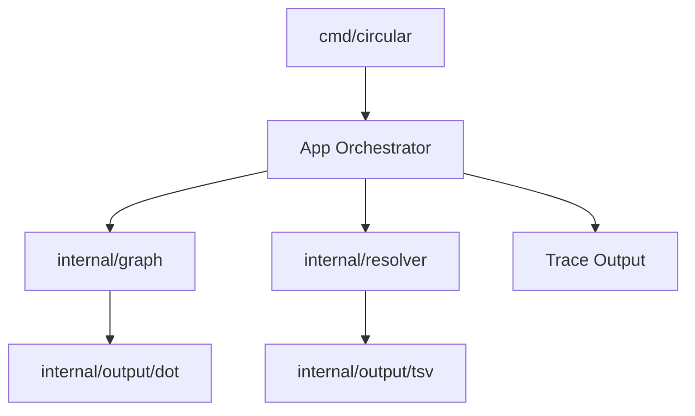
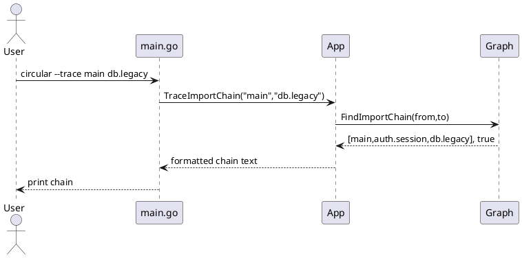

# Low Complexity Plan: Fast Feature Additions

## Overview

Scope: implement fast, high-value analysis features from `docs/possible_upgrades.md` with minimal architectural disruption.

Assumptions:
- Existing parser/reference extraction remains source of truth.
- CLI UX stays compatible with current `--once` and watch workflows.
- No new external runtime dependencies are required.

Constraints:
- Preserve current output files (`graph.dot`, `dependencies.tsv`) by default.
- Keep incremental scan behavior in `cmd/circular/app.go` intact.

## Inputs and Outputs

| Input | Source | Format | Validation |
| --- | --- | --- | --- |
| Parsed files and imports | `internal/parser` + `internal/graph` | in-memory structs | existing parser tests pass |
| User flags/config | `circular.toml` + CLI flags | TOML/flags | config load succeeds |

| Output | Consumer | Format | Backward Compatibility |
| --- | --- | --- | --- |
| Unused import findings | terminal + TSV | text + TSV rows | additive fields only |
| Dependency depth/fan metrics | terminal + DOT | summary + node attributes | default DOT still valid |
| Import chain trace | CLI command output | text path trace | new command only |

## Plan Overview

| Task ID | Goal | Owner | Depends On | Risk | Status |
| --- | --- | --- | --- | --- | --- |
| T1 | Add unused import detection | Core | - | Low | Done |
| T2 | Add dependency depth/fan metrics | Core | T1 | Low | Done |
| T3 | Add import chain tracing CLI | Core | T2 | Medium | Done |
| T4 | Tests and docs for quick-win features | Core | T1,T2,T3 | Low | Done |

## Implementation Status (as of 2026-02-13)

Implemented:
- Unused import analysis in resolver, with conservative handling for Go `_`/`.` imports.
- TSV support for `unused_import` rows.
- App wiring for initial + incremental unused-import analysis, summary display, and TSV emission.
- Module metrics (`depth`, `fan-in`, `fan-out`) with cycle-safe SCC-based depth computation.
- DOT optional metric annotation (label + depth-based fill colors).
- Summary metric highlights in terminal output.
- Tests added for resolver unused imports, TSV unused output, graph metrics, and DOT metric rendering.

Missing:
- No remaining low-complexity T1-T4 items.

## Tasks

- T1 Add unused import detection in analysis pipeline [x]
Summary: compare imported symbols/modules against file references and emit findings.
Inputs/outputs: parser imports/references in; finding list and TSV rows out.
File changes (with classes/functions):
- `internal/parser/types.go`: update `type Import struct` with usage metadata fields.
- `internal/resolver/resolver.go`: add `func (r *Resolver) FindUnusedImports(paths []string) []UnusedImport`.
- `internal/output/tsv.go`: add `func (t *TSVGenerator) GenerateUnusedImports(rows []resolver.UnusedImport) (string, error)`.
Best practices and standards:
- Keep language-specific logic in parser/resolver layers, not CLI.
- Mark uncertain matches conservatively to avoid false positives.
- Keep TSV output additive (`type=unused_import`) instead of breaking schema.
Acceptance checks:
- Mixed Go/Python fixture identifies known unused imports.
- No regression in unresolved-reference detection.
Current status:
- Completed in `internal/parser/types.go`, `internal/resolver/resolver.go`, `internal/output/tsv.go`, `cmd/circular/app.go`, and associated tests.

- T2 Add dependency depth/fan metrics and reporting [x]
Summary: compute depth, fan-in, fan-out per module from graph edges.
Inputs/outputs: module graph in; metrics map and terminal summary out.
File changes (with classes/functions):
- `internal/graph/graph.go`: add `type ModuleMetrics struct` and `func (g *Graph) ComputeModuleMetrics() map[string]ModuleMetrics`.
- `internal/output/dot.go`: update `func (d *DOTGenerator) Generate(cycles [][]string) (string, error)` to optionally annotate metrics.
- `cmd/circular/app.go`: update `func (a *App) PrintSummary(...)` to print metric highlights.
Best practices and standards:
- Handle cycles explicitly when calculating depth.
- Keep metric computation pure and deterministic for testing.
- Add clear defaults when metrics are unavailable.
Acceptance checks:
- Metrics are stable across repeated runs.
- DOT still renders when metric mode is off.
Current status:
- Completed in `internal/graph/graph.go`, `internal/output/dot.go`, `cmd/circular/app.go`, `cmd/circular/main.go`, with unit coverage.

- T3 Add import-chain tracing command [x]
Summary: add `--trace from to` mode for shortest dependency path output.
Inputs/outputs: source and target module names in; path text (or not found) out.
File changes (with classes/functions):
- `internal/graph/detect.go`: add `func (g *Graph) FindImportChain(from, to string) ([]string, bool)`.
- `cmd/circular/main.go`: parse and validate new trace flags.
- `cmd/circular/app.go`: add `func (a *App) TraceImportChain(from, to string) (string, error)`.
Best practices and standards:
- Use BFS for shortest readable path.
- Return explicit errors for missing modules.
- Keep trace mode side-effect free.
Acceptance checks:
- Trace output matches expected chain in test fixtures.
- Nonexistent path exits cleanly with user-facing message.
Current status:
- Completed in `internal/graph/detect.go`, `cmd/circular/app.go`, and `cmd/circular/main.go`.

- T4 Add tests and docs for quick-win scope [x]
Summary: add targeted test coverage and usage docs for all low-complexity features.
Inputs/outputs: feature behavior in; tested and documented workflows out.
File changes (with classes/functions):
- `internal/resolver/resolver_test.go`: add `func TestResolver_FindUnusedImports(t *testing.T)`.
- `internal/graph/graph_test.go`: add `func TestGraph_ComputeModuleMetrics(t *testing.T)` and `func TestGraph_FindImportChain(t *testing.T)`.
- `docs/documentation/cli.md`: document `--trace` mode.
- `docs/documentation/output.md`: document new TSV row type and metric fields.
Best practices and standards:
- Favor table-driven tests with mixed language fixtures.
- Cover happy path and failure path for CLI options.
- Keep examples copy/paste runnable.
Acceptance checks:
- `go test ./...` passes.
- Docs include one example per feature.
Current status:
- Completed with `TestGraph_FindImportChain`, app trace tests, trace CLI docs, and `docs/documentation/output.md`.

## File Inventory

| File | Type | Classes (name + main methods) | Main functions (name + signature) | Purpose |
| --- | --- | --- | --- | --- |
| `internal/parser/types.go` | update | `Import` (data struct extension) | n/a | Track import usage metadata |
| `internal/resolver/resolver.go` | update | `Resolver` (`FindUnresolved`, `FindUnusedImports`) | `FindUnusedImports(paths []string) []UnusedImport` | Compute unused imports |
| `internal/graph/graph.go` | update | `Graph` (`AddFile`, `ComputeModuleMetrics`) | `ComputeModuleMetrics() map[string]ModuleMetrics` | Dependency metrics |
| `internal/graph/detect.go` | update | `Graph` (`DetectCycles`, `FindImportChain`) | `FindImportChain(from, to string) ([]string, bool)` | Trace import paths |
| `internal/output/tsv.go` | update | `TSVGenerator` (`Generate`, `GenerateUnusedImports`) | `GenerateUnusedImports(rows []resolver.UnusedImport) (string, error)` | Emit new TSV rows |
| `internal/output/dot.go` | update | `DOTGenerator` (`Generate`) | `Generate(cycles [][]string) (string, error)` | Add optional metric styles |
| `cmd/circular/main.go` | update | n/a | `main()`, flag wiring for trace mode | CLI entrypoint changes |
| `cmd/circular/app.go` | update | `App` (`TraceImportChain`, `PrintSummary`) | `TraceImportChain(from, to string) (string, error)` | Orchestrate output |
| `internal/resolver/resolver_test.go` | update | n/a | `TestResolver_FindUnusedImports(t *testing.T)` | Unused import tests |
| `internal/graph/graph_test.go` | update | n/a | `TestGraph_ComputeModuleMetrics(t *testing.T)` | Metrics/trace tests |

## Diagrams

## Risks and Mitigations

- Risk: false positives on wildcard or aliased imports. Mitigation: language-specific normalization and fixture coverage.
- Risk: metrics mis-handle cycles. Mitigation: explicit cycle-safe traversal and cycle unit tests.
- Risk: output bloat. Mitigation: keep new outputs behind config/flag toggles.

## Testing and Verification

- Run `go test ./...`.
- Add parser+resolver fixtures for Go and Python import edge cases.
- Validate DOT output with and without metric annotations.

## Folder List

- `docs/plans/low-complexity-fast-features-plan.md`
- `docs/documentation/cli.md` (update)
- `docs/documentation/output.md` (update)
- `cmd/circular/`
- `internal/graph/`
- `internal/resolver/`
- `internal/output/`
- `internal/parser/`
