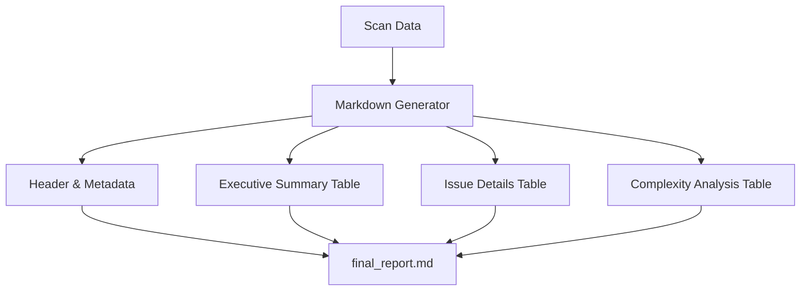

# Plan: Markdown Analysis Report Generation

## Overview
Implement a standalone Markdown report generator that provides a comprehensive, structured analysis of the codebase. This report will include summary statistics, detailed tables for circular imports, unresolved references, unused imports, and architecture violations, as well as complexity hotspots.

## Core Components

### 1. Markdown Generator Engine
- **Location:** `internal/ui/report/formats/markdown.go` (Note: Move or extend existing logic)
- **Features:**
  - **Frontmatter:** Include metadata like scan time, project name, and version.
  - **Summary Tables:** High-level metrics (Total Modules, Files, Cycles found).
  - **Detailed Sections:**
    - **Circular Imports:** A table showing the cycles and their impact.
    - **Architecture Violations:** A table mapping rules to specific files/lines.
    - **Complexity Hotspots:** Top functions/classes by complexity score.
    - **Unresolved References:** Tracking potential "hallucinations" or broken links.

### 2. Output Formatting
- Use GitHub Flavored Markdown (GFM) for tables and task lists.
- Support collapsible sections (`
`) for long lists to keep the report readable.
- Integrate Mermaid diagrams directly into the markdown report if enabled.

### 3. Core Integration
- Update `internal/core/app/app.go` to include `markdown` as a supported output target.
- Add configuration options in `circular.toml` for the report's layout and verbosity.

### 4. MCP API Expansion
- **Tool:** `report.generate_markdown`
- **Output:** The raw markdown content or a path to the generated file.

## Implementation Steps

| Phase | Task | Description |
| :--- | :--- | :--- |
| **Phase 1: Generator** | Implementation of `MarkdownGenerator` | Create the core generator class in `internal/ui/report/formats/`. |
| **Phase 2: Templates** | Structured Sections | Define methods for generating tables for each analysis type (Cycles, Violations, etc.). |
| **Phase 3: Integration** | Update `App.GenerateOutputs` | Connect the new generator to the main output pipeline. |
| **Phase 4: CLI/API** | Exposure | Add a CLI flag `--report-md` and an MCP tool to trigger generation. |

## Implementation Status (2026-02-14)

- [x] Phase 1 implemented: `internal/ui/report/formats/markdown.go` now provides `MarkdownGenerator` with frontmatter, summary metrics, issue tables, and optional Mermaid embedding.
- [x] Phase 2 implemented: cycle, architecture violation, complexity hotspot, unresolved reference, and unused import sections render as GFM tables with optional collapsible blocks.
- [x] Phase 3 implemented: `internal/core/app/app.go` now supports markdown output generation via `output.markdown` and `[output.report]` settings.
- [x] Phase 4 implemented: CLI flag `--report-md` and MCP operation `report.generate_markdown` are wired and tested.
- [x] Docs updated: `README.md` plus `docs/documentation/{README,architecture,cli,configuration,mcp,output,packages}.md`.

Plan completion summary: fully implemented in current codebase as of 2026-02-14.

## Do's and Don'ts

### DO
- Use clean, readable tables with proper alignment.
- Include a "Table of Contents" for large reports.
- Use emojis to highlight severity (e.g., 🔴 for Cycles, 🟡 for Warnings).
- Make paths relative to the project root for better portability.

### DON'T
- Overload the report with too much raw data; use summaries where appropriate.
- Hardcode the report structure; allow it to be configurable via the template/config.
- Use HTML tags that aren't widely supported by Markdown renderers (stick to standard GFM).

## Report Structure Example

### Mockup Example:
# Analysis Report - 2026-02-14

## Executive Summary
| Metric | Value |
| :--- | :--- |
| Total Modules | 42 |
| Circular Imports | 3 |
| Architecture Violations | 12 |

## Circular Imports
| Cycle Path | Impact Score |
| :--- | :--- |
| `a -> b -> a` | High |
