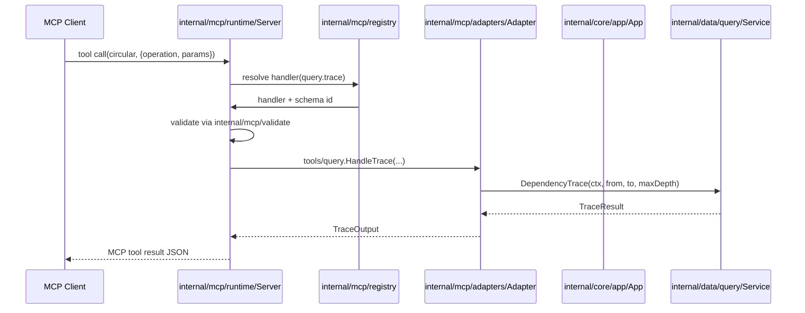
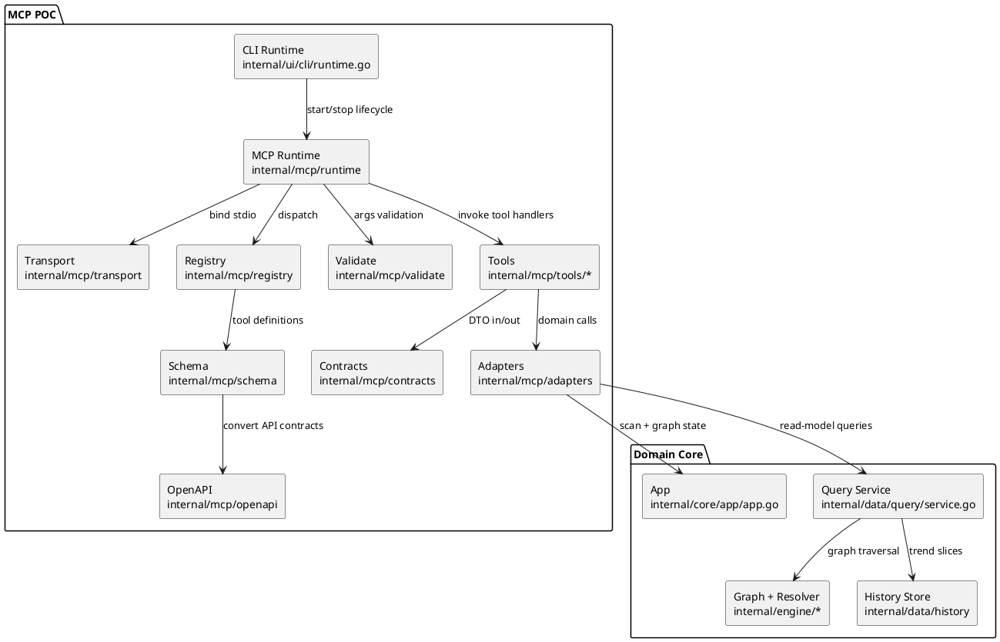

# MCP POC Server and Tools Conversion Plan (In-Repo, No Gateway)

Cross-reference:
- Companion config plan: `docs/plans/mcp-poc-configuration-layer-plan.md`
- Date baseline: 2026-02-13

## Scope, Assumptions, Constraints

Scope:
- Build a fully working MCP POC server inside this project.
- Convert existing internal analysis/query APIs into MCP tools with stable request/response contracts.
- Start with local `stdio` transport and explicit tool registry.
- Expose exactly one MCP tool to AI clients (`circular`) and route all capabilities via operations.

Out of scope:
- Dedicated gateway service, auth proxy, external API facade, and distributed deployment concerns.
- Replacing existing CLI scan/watch UX.

Assumptions:
- Existing application orchestration in `internal/core/app` and read-model queries in `internal/data/query` are the canonical source of analysis logic.
- POC should prioritize correctness and contract stability over maximum tool count.
- Initial tool surface can be focused and expanded incrementally.
- API-as-tools conversion should align conceptually with FastMCP 3 + FastAPI gateway workflows, while remaining implemented in Go for this repository.

Constraints:
- Preserve package boundaries and avoid leaking parser/graph internals into MCP transport layer.
- Keep response payloads bounded and deterministic.
- Maintain compatibility with Go 1.24.x.
- Enforce SoC package policy: each package owns one concern (max two tightly related concerns).
- No hardcoded MCP runtime policy; read from TOML config.
- OpenAPI ingestion for API-to-tool conversion must use `kin-openapi` in Go.

## SoC Package Strategy (Mandatory)

| Package | Primary concern | Optional second concern | Must not contain |
| --- | --- | --- | --- |
| `internal/mcp/runtime` | Server lifecycle bootstrap | Dependency injection wiring | Tool validation/business logic |
| `internal/mcp/transport` | Transport adapters (`stdio`) | transport config mapping | Domain adapters/query logic |
| `internal/mcp/registry` | Tool registration/dispatch table | handler lookup metadata | Schema generation internals |
| `internal/mcp/contracts` | Tool request/response DTOs | DTO versioning tags | Runtime startup code |
| `internal/mcp/schema` | MCP tool schema definitions | argument normalization defaults | Domain service calls |
| `internal/mcp/validate` | Input validation | limit enforcement | Transport or runtime wiring |
| `internal/mcp/openapi` | OpenAPI parsing + operation extraction | schema-to-operation mapping | Runtime lifecycle and tool execution |
| `internal/mcp/adapters` | Bridge App/Query APIs | error mapping to MCP | Server lifecycle logic |
| `internal/mcp/tools/scan` | scan-related handlers | scan output shaping | unrelated query tools |
| `internal/mcp/tools/query` | query handlers | deterministic ordering | scan runtime actions |
| `internal/mcp/tools/graph` | graph/cycle handlers | bounded cycle formatting | trend/query listings |
| `internal/mcp/tools/system` | output/config auto-management operations | active-project switching | query traversal logic |

## Target MCP POC Capabilities

Exposed MCP tools to client:
- `circular` (single tool only)

Operations inside `circular` tool:

| Operation ID | Backing API | Purpose | Initial status |
| --- | --- | --- | --- |
| `scan.run` | `app.App.InitialScan` + snapshot helpers | Trigger full analysis and return summary | Phase 1 |
| `graph.cycles` | `graph.DetectCycles` via app state | Return cycle list with count/limits | Phase 1 |
| `query.modules` | `query.Service.ListModules` | Filtered module list for agent discovery | Phase 1 |
| `query.module_details` | `query.Service.ModuleDetails` | Rich dependency details for one module | Phase 1 |
| `query.trace` | `query.Service.DependencyTrace` | Import-chain path lookup | Phase 1 |
| `system.sync_outputs` | `internal/ui/report/*` + output config | Auto-write `mermaid`/`plantuml`/`dot`/`tsv` artifacts | Phase 1 MUST |
| `system.sync_config` | `internal/core/config` + project context | Auto-sync active project config and paths | Phase 1 MUST |
| `system.select_project` | `projects.entries` + DB namespace | Switch active project context safely | Phase 1 MUST |
| `query.trends` | `query.Service.TrendSlice` | Optional historical trend window | Phase 2 |

## Plan Overview (Session 3 Update)

| Task ID | Goal | Owner | Depends On | Risk | Stage Status |
| --- | --- | --- | --- | --- | --- |
| S1 | Create subpackage skeleton with strict SoC boundaries | Core | Config C1-C3 | Medium | complete |
| S2 | Define single-tool contracts/schema/validation in dedicated packages | Core | S1 | Medium | complete |
| S3 | Add OpenAPI-to-operations conversion via kin-openapi | Core | S1,S2 | High | complete |
| S4 | Implement adapters and tool handlers per concern package | Core | S1,S2,S3 | High | complete |
| S5 | Integrate runtime startup and graceful shutdown | Core | S1,S4 | Medium | complete |
| S6 | Add tests, fixtures, and docs for POC usage | Core | S2,S3,S4,S5 | Medium | complete |

## Tasks

- S1 Create subpackage skeleton with strict SoC boundaries [x]
Summary: Create `internal/mcp` as a subpackage tree where each package owns one concern.
Status: complete (runtime/registry/transport scaffolding added).
Inputs/outputs: validated MCP config in; SoC-aligned package boundaries and bootstrap entry points out.
File changes (with classes/functions):
- `internal/mcp/runtime/server.go` (new)
  - Classes/structs: `Server` (`Start`, `Stop`).
  - Main functions: `func New(cfg Config, deps Dependencies) (*Server, error)`.
- `internal/mcp/runtime/bootstrap.go` (new)
  - Main functions: `func Build(cfg Config, appDeps AppDeps) (*Server, error)`.
- `internal/mcp/transport/stdio.go` (new)
  - Main functions: `func NewStdio() (Adapter, error)`.
- `internal/mcp/registry/registry.go` (new)
  - Classes/structs: `Registry` (`Register`, `HandlerFor`).
Best practices and standards:
- One package, one concern; reject mixed responsibilities in review.
- Ensure `Start`/`Stop` are idempotent.
- Return typed errors with operation context.
- Keep MCP-library-specific types inside runtime/transport only.
Acceptance checks:
- Server boots and stops cleanly in test harness.
- Tool registration order is deterministic.
- No analysis logic embedded in runtime/transport/registry packages.

- S2 Define single-tool contracts/schema/validation in dedicated packages [x]
Summary: Keep one MCP tool definition (`circular`) while validating operation-specific argument contracts.
Status: complete (contracts/schema/validate packages wired with operation dispatch + tests).
Inputs/outputs: internal API models in; MCP tool schemas and normalized arguments out.
File changes (with classes/functions):
- `internal/mcp/contracts/types.go` (new)
  - Classes/structs: `CircularToolInput` (`operation`, `params`) and operation-specific DTOs.
- `internal/mcp/schema/tools.go` (new)
  - Main functions: `func BuildToolDefinitions() []ToolDefinition` (returns one tool definition).
- `internal/mcp/validate/args.go` (new)
  - Main functions: `func ValidateToolArgs(tool string, raw map[string]any) (any, error)` (validates `operation` and operation params).
Best practices and standards:
- Keep contracts explicit and versionable.
- Avoid exposing unstable internal types directly.
- Normalize defaults at schema/validate boundary only.
- Cap list sizes and depth values in validators.
Acceptance checks:
- Contract tests verify argument decoding and error details.
- Schema generation includes required/optional fields accurately.
- Exactly one tool definition remains stable across runs.

- S3 Add OpenAPI-to-operations conversion via kin-openapi [x]
Summary: Parse OpenAPI specs and convert API operations into internal MCP operation descriptors behind the single `circular` tool.
Status: complete (OpenAPI loader/converter/filter added and wired into MCP bootstrap with allowlist filtering + tests).
Inputs/outputs: OpenAPI spec (TOML-configured path/URL) in; validated operation descriptors and schemas out.
Spec source (explicit): Provide OpenAPI spec as a static file path in TOML (repository-local or absolute). Spec generation is out-of-scope for this POC; the plan assumes the spec already exists (e.g., from prior build/CI). If a URL is used, it must be an explicit http(s) URL and fetched once at startup.
File changes (with classes/functions):
- `internal/mcp/openapi/loader.go` (new)
  - Main functions: `func LoadSpec(path string) (*openapi3.T, error)`.
- `internal/mcp/openapi/converter.go` (new)
  - Main functions: `func Convert(spec *openapi3.T) ([]contracts.OperationDescriptor, error)`.
- `internal/mcp/openapi/filters.go` (new)
  - Main functions: `func ApplyAllowlist(ops []contracts.OperationDescriptor, allowlist []string) []contracts.OperationDescriptor`.
Best practices and standards:
- Use `kin-openapi` as the only parser.
- Reject ambiguous/invalid operation ids during conversion.
- Keep conversion deterministic for stable tool contracts.
- Keep OpenAPI concerns isolated from runtime and handler execution packages.
 - Config keys (to add in config plan if missing): `mcp.openapi_spec_path` (string, optional), `mcp.openapi_spec_url` (string, optional). Exactly one may be set when `mcp.enabled=true` and OpenAPI conversion is enabled.
Acceptance checks:
- Same OpenAPI input produces stable operation descriptors.
- Unsupported schema shapes fail with actionable conversion errors.
- Allowlist filtering is deterministic and test-covered.

- S4 Implement adapters and tool handlers per concern package [x]
Summary: Keep business bridges in `adapters` and keep tool implementations split by tool domain.
Inputs/outputs: App/query services in; MCP tool handler outputs out.
File changes (with classes/functions):
- `internal/mcp/adapters/adapter.go` (new)
  - Classes/structs: `Adapter` (`RunScan`, `ListModules`, `ModuleDetails`, `Trace`, `Cycles`, `TrendSlice`).
  - Main functions: `func NewAdapter(app *app.App, historyStore *history.Store, projectKey string) *Adapter`.
- `internal/mcp/tools/scan/handler.go` (new)
  - Main functions: `func HandleRun(ctx context.Context, a *adapters.Adapter, in contracts.ScanRunInput) (contracts.ScanRunOutput, error)`.
- `internal/mcp/tools/query/handler.go` (new)
  - Main functions: `HandleModules`, `HandleModuleDetails`, `HandleTrace`, `HandleTrends`.
- `internal/mcp/tools/graph/handler.go` (new)
  - Main functions: `func HandleCycles(ctx context.Context, a *adapters.Adapter, in contracts.GraphCyclesInput) (contracts.GraphCyclesOutput, error)`.
- `internal/mcp/tools/system/handler.go` (new)
  - Main functions: `HandleSyncOutputs`; `HandleSyncConfig`; `HandleSelectProject`.
Best practices and standards:
- Keep handlers thin and side-effect constrained.
- Use context cancellation checks on potentially expensive operations.
- Maintain deterministic sort order for returned slices.
- Convert domain errors to user-actionable MCP tool errors.
- `system.*` operations may mutate files only through TOML-configured targets and policy flags.
Acceptance checks:
- Tool handlers produce stable JSON-serializable outputs.
- Edge cases (missing module, no trace path) return explicit error payloads.
- Large results honor configured limits.
- Output artifact sync writes `mermaid`/`plantuml`/`dot`/`tsv` using configured paths without AI prompting each file.
- Project switching updates context and SQLite namespace safely.

- S5 Integrate runtime startup and graceful shutdown [x]
Summary: Wire MCP runtime into existing CLI runtime lifecycle when config enables MCP mode.
Inputs/outputs: CLI runtime state + config in; MCP mode execution path out.
File changes (with classes/functions):
- `internal/ui/cli/runtime.go` (update)
  - Main functions: `runMCPModeIfEnabled(...) error` finalize integration with app/query setup.
  - Main functions: startup branching to avoid scan/watch loop conflicts.
- `cmd/circular/main.go` (update)
  - Main functions: process exit handling for MCP runtime errors and signal shutdown.
Best practices and standards:
- Build app/query dependencies once and inject into MCP layer.
- Preserve current exit codes and log style.
- Ensure SIGINT/SIGTERM cleanly stop MCP server.
- Keep non-MCP startup path untouched.
Acceptance checks:
- MCP mode starts from config with expected transport.
- Shutdown closes resources cleanly (history store, parser, transport).
- Existing CLI commands still work when MCP disabled.

- S6 Add tests, fixtures, and docs for POC usage [x]
Summary: Validate behavior end-to-end and publish a practical POC runbook.
Status: complete (runtime/handler/openapi tests added and MCP docs/README updated for operator usage).
Inputs/outputs: implemented MCP layer in; deterministic test coverage and docs out.
File changes (with classes/functions):
- `internal/mcp/runtime/server_test.go` (new)
  - Main functions: `TestServer_StartStop`, `TestServer_RegisterTools`.
- `internal/mcp/tools/query/handler_test.go` (new)
  - Main functions: `TestHandleQueryModules`, `TestHandleQueryTrace`, `TestHandleGraphCycles`.
- `internal/mcp/tools/graph/handler_test.go` (new)
  - Main functions: `TestHandleCyclesLimits`.
- `internal/mcp/tools/system/handler_test.go` (new)
  - Main functions: `TestHandleSyncOutputs`, `TestHandleSelectProjectNamespaceIsolation`.
- `internal/mcp/openapi/converter_test.go` (new)
  - Main functions: `TestConvert_OpenAPIToOperations`, `TestConvert_InvalidSchema`.
- `internal/ui/cli/runtime_test.go` (update)
  - Main functions: `TestRunMCPModeIfEnabled`.
- `docs/documentation/mcp.md` (new)
  - Main sections: architecture, config examples, supported tools, error model, limitations.
- `README.md` (update)
  - Main sections: MCP POC quick start.
Best practices and standards:
- Prefer table-driven tests for tool argument matrices.
- Use minimal fixtures with deterministic graph outputs.
- Document known POC limits explicitly.
- Keep examples aligned with real config defaults.
- Add regression tests proving only one tool is exposed and all operations dispatch via that tool.
Acceptance checks:
- `go test ./internal/mcp ./internal/ui/cli` passes.
- Docs include one working example for local stdio execution.
- No references to gateway components in user-facing MCP docs.
- Tests verify no hardcoded output target paths are used when TOML specifies alternatives.

## File Inventory

| File | Type | Classes (name + main methods) | Main functions (name + signature) | Purpose |
| --- | --- | --- | --- | --- |
| `internal/mcp/runtime/server.go` | new | `Server` (`Start`, `Stop`) | `New(cfg Config, deps Dependencies) (*Server, error)` | Runtime lifecycle owner |
| `internal/mcp/runtime/bootstrap.go` | new | n/a | `Build(cfg Config, appDeps AppDeps) (*Server, error)` | Composition root for MCP runtime |
| `internal/mcp/transport/stdio.go` | new | n/a | `NewStdio() (Adapter, error)` | Stdio transport adapter |
| `internal/mcp/registry/registry.go` | new | `Registry` (`Register`, `HandlerFor`) | `New() *Registry` | Tool registry/dispatch catalog |
| `internal/mcp/contracts/types.go` | new | input/output DTO structs | n/a | Stable API-as-tools contracts |
| `internal/mcp/schema/tools.go` | new | n/a | `BuildToolDefinitions() []ToolDefinition` | Tool schema construction |
| `internal/mcp/validate/args.go` | new | n/a | `ValidateToolArgs(tool string, raw map[string]any) (any, error)` | Input validation and normalization |
| `internal/mcp/openapi/loader.go` | new | n/a | `LoadSpec(path string) (*openapi3.T, error)` | OpenAPI document loading via kin-openapi |
| `internal/mcp/openapi/converter.go` | new | n/a | `Convert(spec *openapi3.T) ([]contracts.OperationDescriptor, error)` | API-to-operation conversion |
| `internal/mcp/openapi/filters.go` | new | n/a | `ApplyAllowlist(ops []contracts.OperationDescriptor, allowlist []string) []contracts.OperationDescriptor` | Contract filtering |
| `internal/mcp/adapters/adapter.go` | new | `Adapter` (`RunScan`, `ListModules`, `ModuleDetails`, `Trace`, `Cycles`, `TrendSlice`) | `NewAdapter(app *app.App, historyStore *history.Store, projectKey string) *Adapter` | Bridge domain APIs to tools |
| `internal/mcp/tools/scan/handler.go` | new | n/a | `HandleRun(ctx context.Context, a *adapters.Adapter, in contracts.ScanRunInput) (contracts.ScanRunOutput, error)` | Scan tool handler |
| `internal/mcp/tools/query/handler.go` | new | n/a | `HandleModules`; `HandleModuleDetails`; `HandleTrace` | Query tool handlers |
| `internal/mcp/tools/graph/handler.go` | new | n/a | `HandleCycles(ctx context.Context, a *adapters.Adapter, in contracts.GraphCyclesInput) (contracts.GraphCyclesOutput, error)` | Graph tool handler |
| `internal/mcp/tools/system/handler.go` | new | n/a | `HandleSyncOutputs`; `HandleSyncConfig`; `HandleSelectProject` | Output/config/project-context operations |
| `internal/mcp/runtime/server_test.go` | new | n/a | `TestServer_StartStop(t *testing.T)` | Runtime lifecycle tests |
| `internal/mcp/tools/query/handler_test.go` | new | n/a | `TestHandleTrace(t *testing.T)` | Query handler tests |
| `internal/mcp/tools/graph/handler_test.go` | new | n/a | `TestHandleCyclesLimits(t *testing.T)` | Graph handler limits tests |
| `internal/mcp/tools/system/handler_test.go` | new | n/a | `TestHandleSyncOutputs(t *testing.T)` | System operation tests |
| `internal/mcp/openapi/converter_test.go` | new | n/a | `TestConvert_OpenAPIToOperations(t *testing.T)` | API conversion tests |
| `internal/ui/cli/runtime.go` | update | n/a | `runMCPModeIfEnabled(...) error` | Runtime integration point |
| `internal/ui/cli/runtime_test.go` | update | n/a | `TestRunMCPModeIfEnabled(t *testing.T)` | CLI integration tests |
| `docs/documentation/mcp.md` | new | n/a | n/a | MCP POC operator documentation |
| `README.md` | update | n/a | n/a | Project-level MCP POC quick start |

## Diagrams

## Risks and Mitigations

| Risk | Impact | Mitigation |
| --- | --- | --- |
| Handler bloat in transport layer | Hard-to-maintain code | Strict adapter boundary and DTO contracts |
| Unbounded responses from graph queries | Client instability | Configurable limits and validation caps |
| Tight coupling to one MCP library | Migration cost | Keep server abstraction minimal and typed |
| Runtime regressions in existing CLI paths | User-facing breakage | Startup branching tests and no-op behavior when disabled |

## Testing and Verification

- Unit tests:
  - Tool arg validation and schema stability tests.
  - Adapter behavior tests with fixture graphs.
- Integration tests:
  - CLI runtime enters MCP mode with config and exits cleanly.
  - End-to-end tool dispatch tests over stdio harness.
- Non-functional checks:
  - Deterministic ordering for list outputs.
  - Response-size bounding and timeout behavior.

## Folder List

- `docs/plans/mcp-poc-configuration-layer-plan.md`
- `docs/plans/mcp-poc-server-tools-plan.md`
- `internal/mcp/runtime/`
- `internal/mcp/transport/`
- `internal/mcp/registry/`
- `internal/mcp/contracts/`
- `internal/mcp/schema/`
- `internal/mcp/validate/`
- `internal/mcp/openapi/`
- `internal/mcp/adapters/`
- `internal/mcp/tools/scan/`
- `internal/mcp/tools/query/`
- `internal/mcp/tools/graph/`
- `internal/mcp/tools/system/`
- `internal/ui/cli/`
- `internal/core/app/`
- `internal/data/query/`
- `docs/documentation/`
