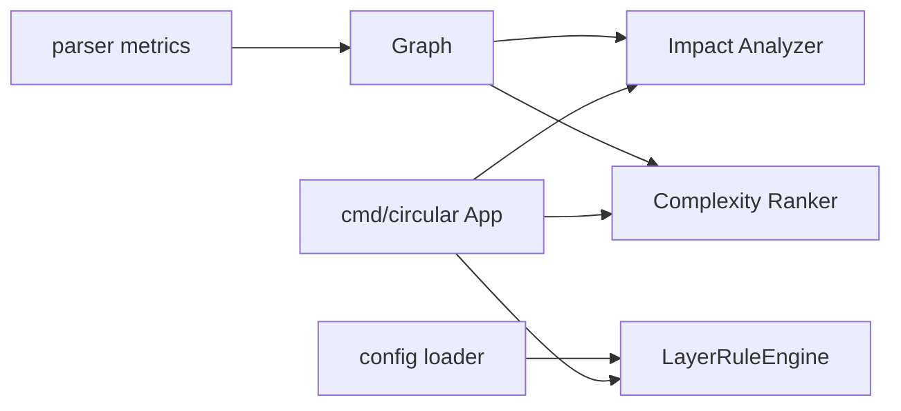
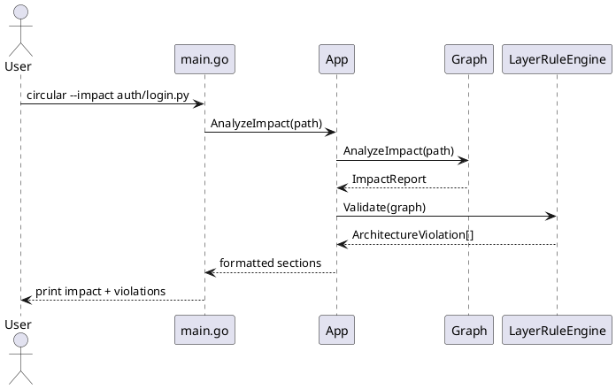

# Medium Complexity Plan: Architecture and Impact Analysis

## Overview

Scope: add structured architecture-rule validation, change-impact analysis, and complexity hotspot reporting.

Assumptions:
- Teams can map directories/modules into stable architectural layers.
- Graph data and parser references are sufficiently accurate for impact traversal.
- Complexity metrics will start heuristic-first (AST counts), not full compiler-grade static analysis.

Constraints:
- New checks must be optional and configurable.
- Performance in watch mode must remain acceptable for medium repositories.

## Inputs and Outputs

| Input | Source | Format | Validation |
| --- | --- | --- | --- |
| Layer rules | `circular.toml` | TOML arrays | config validation at startup |
| Changed files | watcher + CLI flag | paths | canonicalized and deduplicated |
| AST/function data | parser files | structs | parser tests pass |

| Output | Consumer | Format | Backward Compatibility |
| --- | --- | --- | --- |
| Architecture violations | terminal + TSV | rows with layer context | additive output |
| Impact analysis report | CLI | grouped text sections | new mode only |
| Complexity hotspots | terminal + DOT | ranked list + node attrs | opt-in rendering |

## Plan Overview

| Task ID | Goal | Owner | Depends On | Risk |
| --- | --- | --- | --- | --- |
| T1 | Add architecture config model and validation | Core | - | Medium |
| T2 | Implement layer-rule violation engine | Core | T1 | Medium |
| T3 | Implement change impact analysis mode | Core | T2 | Medium |
| T4 | Implement complexity metrics and hotspot reporting | Core | T2 | Medium |
| T5 | Add docs/tests for medium feature set | Core | T1,T2,T3,T4 | Low |

## Tasks

- T1 Add architecture rule schema and config validation [ ]
Summary: define layer/rule structures and validate rule consistency.
Inputs/outputs: TOML layer/rule declarations in; validated runtime model out.
File changes (with classes/functions):
- `internal/config/config.go`: extend `type Config` with `Architecture` section.
- `internal/config/config.go`: add `func validateArchitecture(cfg *Config) error`.
- `internal/config/config_test.go`: add `func TestLoadArchitectureRules(t *testing.T)`.
Best practices and standards:
- Reject overlapping/conflicting layer path definitions.
- Provide actionable error messages with rule names.
- Keep defaults disabled to preserve existing behavior.
Acceptance checks:
- Invalid rules fail fast with clear config errors.
- Existing config files continue to load unchanged.

- T2 Build architecture validation engine [ ]
Summary: map modules to layers and detect disallowed imports.
Inputs/outputs: graph imports + layer model in; violation list out.
File changes (with classes/functions):
- `internal/graph/architecture.go` (new): `type LayerRuleEngine struct`.
- `internal/graph/architecture.go` (new): `func (e *LayerRuleEngine) Validate(g *Graph) []ArchitectureViolation`.
- `cmd/circular/app.go`: integrate validation into analysis pipeline.
Best practices and standards:
- Prefer deterministic matching precedence for overlapping glob patterns.
- Store both source and target layer in violations.
- Keep engine pure for straightforward unit tests.
Acceptance checks:
- Fixture repo reports expected violations.
- No violations returned when rules permit dependency.

- T3 Add change impact analysis mode [ ]
Summary: report direct importers, transitive impact, and externally used symbols for a file.
Inputs/outputs: target file/module in; impact report sections out.
File changes (with classes/functions):
- `internal/graph/impact.go` (new): `type ImpactReport struct` and traversal helpers.
- `internal/graph/impact.go` (new): `func (g *Graph) AnalyzeImpact(path string) (ImpactReport, error)`.
- `cmd/circular/main.go`: add `--impact <path>` mode.
- `cmd/circular/app.go`: add `func (a *App) AnalyzeImpact(path string) (graph.ImpactReport, error)`.
Best practices and standards:
- Use reverse adjacency indexes for traversal performance.
- Distinguish direct vs transitive impact in report model.
- Return stable ordering for deterministic output.
Acceptance checks:
- Impact report includes direct and transitive sets.
- Missing file/module returns structured error.

- T4 Add complexity metrics and hotspot output [ ]
Summary: compute per-function/module complexity proxies (branches, LOC, depth, params).
Inputs/outputs: parser AST metadata in; ranked hotspot list out.
File changes (with classes/functions):
- `internal/parser/types.go`: extend `Definition` with metric fields.
- `internal/parser/golang.go`: populate Go complexity counters.
- `internal/parser/python.go`: populate Python complexity counters.
- `internal/graph/metrics.go` (new): `func (g *Graph) TopComplexity(n int) []ComplexityHotspot`.
- `cmd/circular/app.go`: print complexity hotspots in summary.
Best practices and standards:
- Keep metrics explainable and language-agnostic where possible.
- Avoid expensive recomputation for unchanged files.
- Bound output to configurable top N.
Acceptance checks:
- Known complex fixtures appear in top list.
- Metrics remain stable across repeated runs.

- T5 Add medium-tier documentation and test coverage [ ]
Summary: complete coverage for config validation, architecture checks, impact mode, and complexity ranking.
Inputs/outputs: behavior changes in; tested and documented user workflows out.
File changes (with classes/functions):
- `internal/graph/graph_test.go`: architecture and impact tests.
- `internal/parser/parser_test.go`: complexity extraction tests.
- `docs/documentation/config.md`: architecture rule examples.
- `docs/documentation/cli.md`: impact and complexity usage docs.
Best practices and standards:
- Use table-driven tests for rule matrices.
- Include negative tests for invalid config and invalid targets.
- Keep docs examples minimal and reproducible.
Acceptance checks:
- `go test ./...` passes with new tests.
- Docs include one end-to-end architecture validation example.

## File Inventory

| File | Type | Classes (name + main methods) | Main functions (name + signature) | Purpose |
| --- | --- | --- | --- | --- |
| `internal/config/config.go` | update | `Config` (expanded with architecture settings) | `validateArchitecture(cfg *Config) error` | Load and validate layer rules |
| `internal/config/config_test.go` | update | n/a | `TestLoadArchitectureRules(t *testing.T)` | Config rule validation tests |
| `internal/graph/architecture.go` | new | `LayerRuleEngine` (`Validate`) | `Validate(g *Graph) []ArchitectureViolation` | Enforce layering constraints |
| `internal/graph/impact.go` | new | `ImpactReport` (data model) | `AnalyzeImpact(path string) (ImpactReport, error)` | Blast-radius analysis |
| `internal/graph/metrics.go` | new | `ComplexityHotspot` (data model) | `TopComplexity(n int) []ComplexityHotspot` | Aggregate complexity rankings |
| `internal/parser/types.go` | update | `Definition` (metric fields) | n/a | Store extracted complexity attributes |
| `internal/parser/golang.go` | update | `GoExtractor` (`Extract`) | complexity helper functions | Go complexity extraction |
| `internal/parser/python.go` | update | `PythonExtractor` (`Extract`) | complexity helper functions | Python complexity extraction |
| `cmd/circular/main.go` | update | n/a | impact flag parsing and dispatch | Add impact CLI mode |
| `cmd/circular/app.go` | update | `App` (`AnalyzeImpact`) | `AnalyzeImpact(path string) (graph.ImpactReport, error)` | Orchestrate medium-tier features |

## Diagrams

## Risks and Mitigations

- Risk: layer mappings drift from repository structure. Mitigation: include dry-run diagnostics showing module-to-layer mapping.
- Risk: complexity metrics generate noisy rankings. Mitigation: publish scoring formula and expose threshold filters.
- Risk: impact traversal cost in large graphs. Mitigation: cache reverse edges and invalidate incrementally.

## Testing and Verification

- Run `go test ./...` and add focused tests for architecture/impact/metrics packages.
- Add fixture-based tests for allowed/disallowed layer imports.
- Verify `--impact` output in both found and missing-target cases.

## Folder List

- `docs/plans/medium-complexity-feature-plan.md`
- `docs/documentation/config.md` (update)
- `docs/documentation/cli.md` (update)
- `cmd/circular/`
- `internal/config/`
- `internal/graph/`
- `internal/parser/`
