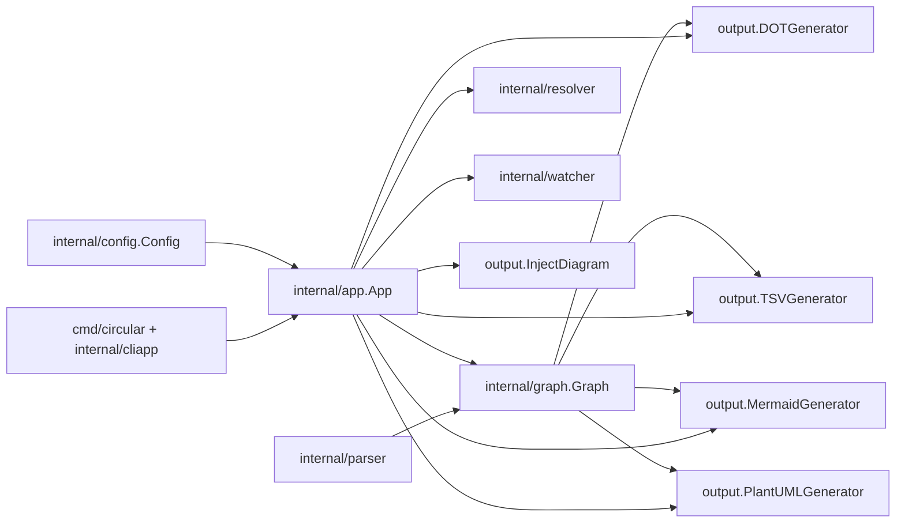
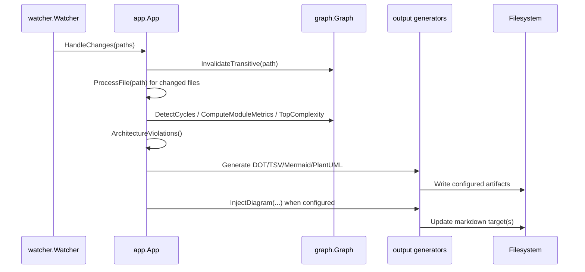
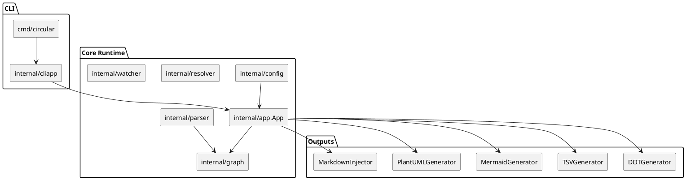

# Feature Plan: Mermaid + PlantUML Visual Documentation (Codebase-Aligned)

## Scope, Assumptions, Constraints

| Item | Details |
| --- | --- |
| Scope | Add Mermaid and PlantUML output generation to the existing scan/watch pipeline, using current `graph.Graph`, metrics, cycle detection, and architecture model data. |
| In scope | Config schema extensions, output generators, optional Markdown injection, orchestration updates in `internal/app`, tests, and docs/sample config updates. |
| Out of scope | MCP server/tooling and remote diagram rendering APIs. |
| Assumptions | `internal/app.App.GenerateOutputs(...)` remains the single orchestration point for file artifact writes. |
| Constraints | Preserve backward compatibility for existing `output.dot`/`output.tsv` users and Go 1.24.x compatibility. |

## Current Codebase Alignment Snapshot

| Area | Current State | Planning Implication |
| --- | --- | --- |
| Output pipeline | `internal/app/app.go` writes only DOT/TSV in `GenerateOutputs(...)`. | Extend this function without breaking current artifacts. |
| Output package | `DOTGenerator` and `TSVGenerator` exist in `internal/output`. | Add parallel `MermaidGenerator` and `PlantUMLGenerator` with similar ergonomics. |
| Config | `internal/config.Output` contains only `DOT` and `TSV`. | Add additive fields for Mermaid/PlantUML and markdown injection targets. |
| Architecture model | Layer/rule validation exists in `internal/config` and `internal/graph.LayerRuleEngine`. | Reuse these structures for visual grouping and violation highlights. |
| Tests | Output and config tests exist and are table-style friendly. | Extend existing tests and add focused generator/injection tests. |

## Plan Overview

| Task ID | Goal | Owner | Depends On | Risk |
| --- | --- | --- | --- | --- |
| T1 | Extend config schema for diagram outputs and markdown injection | Config | None | Low |
| T2 | Implement Mermaid generator in `internal/output` | Output | T1 | Medium |
| T3 | Implement PlantUML generator in `internal/output` | Output | T1 | Medium |
| T4 | Add markdown injection helper | Output | T1 | Medium |
| T5 | Wire generators into `App.GenerateOutputs` | App | T2, T3, T4 | Medium |
| T6 | Add tests and documentation updates | Config/App/Output/Docs | T1-T5 | Low |

## Tasks

### T1 Extend config schema for diagram outputs and markdown injection [ ]

Summary: Add additive config fields so users can opt into Mermaid/PlantUML file output and markdown auto-injection.

Inputs/outputs:
- Input: current `internal/config.Config` and `circular.example.toml` output block.
- Output: backward-compatible config with optional visual-output fields.

File changes (classes/functions):
- `internal/config/config.go` (update)
  - Structs: `type Output struct`
  - Main functions: `func Load(path string) (*Config, error)` (defaulting/normalization updates if needed)
- `internal/config/config_test.go` (update)
  - Main functions: `func TestLoad(...)`, new coverage for new output fields
- `circular.example.toml` (update)
  - Sample config for new optional fields

Best practices and standards:
- Keep all new fields optional and zero-value safe.
- Do not change behavior when new fields are unset.
- Keep TOML names short and explicit (`mermaid`, `plantuml`, `update_markdown`).
- Validate marker/injection config defensively but avoid breaking legacy configs.

Acceptance checks:
- Existing config files without new keys still load.
- New keys deserialize correctly.
- Existing tests pass; new config tests cover positive and malformed cases.

### T2 Implement Mermaid generator in `internal/output` [ ]

Summary: Add a Mermaid generator that reflects current graph semantics (internal/external edges, cycles, metrics/hotspots, layer grouping).

Inputs/outputs:
- Input: `graph.Graph`, cycles, module metrics, complexity hotspots, architecture model/layer matches.
- Output: Mermaid string (`flowchart LR`) ready to persist in `.mmd` or fenced Markdown.

File changes (classes/functions):
- `internal/output/mermaid.go` (new)
  - Structs: `type MermaidGenerator struct`
  - Main functions:
    - `func NewMermaidGenerator(g *graph.Graph) *MermaidGenerator`
    - `func (m *MermaidGenerator) SetModuleMetrics(metrics map[string]graph.ModuleMetrics)`
    - `func (m *MermaidGenerator) SetComplexityHotspots(hotspots []graph.ComplexityHotspot)`
    - `func (m *MermaidGenerator) Generate(cycles [][]string, violations []graph.ArchitectureViolation, model graph.ArchitectureModel) (string, error)`
    - `func sanitizeMermaidID(module string) string`

Best practices and standards:
- Deterministically sort modules/edges for stable diffs.
- Keep ID sanitization bijective enough to avoid collisions; add fallback suffixing.
- Encode cycle edges distinctly from normal edges.
- Keep renderer output independent from watcher/UI concerns.

Acceptance checks:
- Generator emits valid Mermaid for empty graph and non-empty graph.
- Cycle edges are highlighted.
- Layer grouping appears when architecture model is enabled.

### T3 Implement PlantUML generator in `internal/output` [ ]

Summary: Add a PlantUML component/package generator mirroring Mermaid semantics for parity.

Inputs/outputs:
- Input: same analysis payload used by Mermaid generator.
- Output: PlantUML text (`@startuml` ... `@enduml`).

File changes (classes/functions):
- `internal/output/plantuml.go` (new)
  - Structs: `type PlantUMLGenerator struct`
  - Main functions:
    - `func NewPlantUMLGenerator(g *graph.Graph) *PlantUMLGenerator`
    - `func (p *PlantUMLGenerator) SetModuleMetrics(metrics map[string]graph.ModuleMetrics)`
    - `func (p *PlantUMLGenerator) SetComplexityHotspots(hotspots []graph.ComplexityHotspot)`
    - `func (p *PlantUMLGenerator) Generate(cycles [][]string, violations []graph.ArchitectureViolation, model graph.ArchitectureModel) (string, error)`
    - `func sanitizePlantUMLAlias(module string) string`

Best practices and standards:
- Keep visual semantics consistent with DOT and Mermaid outputs.
- Use deterministic ordering for packages/components/edges.
- Keep style directives minimal and parser-safe.
- Treat external modules distinctly from internal modules.

Acceptance checks:
- Output starts with `@startuml` and ends with `@enduml`.
- Internal/external relationships render correctly.
- Layer packaging is present when architecture is enabled.

### T4 Add markdown injection helper [ ]

Summary: Support automatic replacement between markdown markers so generated diagrams can stay in docs/README files.

Inputs/outputs:
- Input: target markdown path(s), marker token, generated diagram string.
- Output: updated markdown file content between markers.

File changes (classes/functions):
- `internal/output/markdown.go` (new)
  - Main functions:
    - `func InjectDiagram(filePath, marker, diagram string) error`
    - `func ReplaceBetweenMarkers(content, marker, replacement string) (string, error)`

Best practices and standards:
- Preserve unrelated markdown content byte-for-byte where possible.
- Fail fast when markers are missing or duplicated ambiguously.
- Write atomically (temp file + rename) to reduce corruption risk.
- Keep marker format documented and tested.

Acceptance checks:
- Content between markers is replaced exactly once.
- Missing marker returns a clear error.
- Existing line endings are preserved.

### T5 Wire generators into `App.GenerateOutputs` [ ]

Summary: Extend orchestration so scans produce Mermaid/PlantUML files and optional markdown injection alongside DOT/TSV.

Inputs/outputs:
- Input: current `GenerateOutputs(...)` parameters and `Config.Output`.
- Output: diagram artifacts written conditionally by config.

File changes (classes/functions):
- `internal/app/app.go` (update)
  - Main functions:
    - `func (a *App) GenerateOutputs(...) error`
- `internal/app/app_test.go` (update)
  - Main functions: add output orchestration tests for new config paths

Best practices and standards:
- Keep write flow independent per artifact to isolate failures in logs.
- Reuse computed `cycles`, `metrics`, `hotspots`, and `violations` (no duplicate graph work).
- Keep existing DOT/TSV output behavior unchanged.
- Return actionable errors with artifact path context.

Acceptance checks:
- With only DOT/TSV configured, behavior matches today.
- With Mermaid/PlantUML configured, files are written each scan/update.
- Markdown targets update only when configured.

### T6 Add tests and docs updates [ ]

Summary: Complete coverage and documentation so the feature is maintainable and user-facing behavior is explicit.

Inputs/outputs:
- Input: new output code and config keys.
- Output: tests and documentation aligned with implemented behavior.

File changes (classes/functions):
- `internal/output/output_test.go` (update)
  - Main functions: add Mermaid/PlantUML/markdown assertions (or split into dedicated tests)
- `docs/documentation/configuration.md` (update)
- `docs/documentation/output.md` (update)
- `README.md` (update if needed)

Best practices and standards:
- Prefer table-driven tests for output variations.
- Assert deterministic ordering and marker replacement behavior.
- Keep docs examples minimal but executable.
- Include failure-mode examples (missing marker, invalid paths).

Acceptance checks:
- `go test ./...` passes.
- Docs reflect exact config keys and output semantics.
- Example config maps to implemented behavior.

## File Inventory

| File | Type | Classes / Structs (name + main methods) | Main functions (name + signature) | Purpose |
| --- | --- | --- | --- | --- |
| `internal/config/config.go` | update | `Output` (new fields for Mermaid/PlantUML/markdown) | `Load(path string) (*Config, error)` | Add additive output config surface. |
| `internal/config/config_test.go` | update | N/A | `TestLoad...` variants | Validate parsing/backward compatibility. |
| `circular.example.toml` | update | N/A | N/A | Provide user-facing sample settings. |
| `internal/output/mermaid.go` | new | `MermaidGenerator` (`SetModuleMetrics`, `SetComplexityHotspots`, `Generate`) | `NewMermaidGenerator(g *graph.Graph) *MermaidGenerator` | Generate Mermaid diagrams from graph data. |
| `internal/output/plantuml.go` | new | `PlantUMLGenerator` (`SetModuleMetrics`, `SetComplexityHotspots`, `Generate`) | `NewPlantUMLGenerator(g *graph.Graph) *PlantUMLGenerator` | Generate PlantUML diagrams from graph data. |
| `internal/output/markdown.go` | new | N/A | `InjectDiagram(filePath, marker, diagram string) error`; `ReplaceBetweenMarkers(content, marker, replacement string) (string, error)` | Inject generated diagrams into markdown files. |
| `internal/app/app.go` | update | `App` (existing) | `GenerateOutputs(...) error` | Orchestrate writing all output artifacts. |
| `internal/app/app_test.go` | update | N/A | `Test...GenerateOutputs...` | Verify orchestration and failure behavior. |
| `internal/output/output_test.go` | update | N/A | `TestMermaid...`; `TestPlantUML...`; `TestInjectDiagram...` | Ensure generator correctness and determinism. |
| `docs/documentation/configuration.md` | update | N/A | N/A | Document new config keys and defaults. |
| `docs/documentation/output.md` | update | N/A | N/A | Document output formats and marker behavior. |
| `README.md` | update | N/A | N/A | Surface feature usage and examples. |

## Mermaid Component Diagram

## Mermaid Sequence Diagram

## PlantUML Component Diagram

## Risks

- Invalid/ambiguous markdown markers could cause failed injection paths.
- Non-deterministic map iteration could cause noisy diagram diffs if not sorted.
- Large dependency graphs can reduce diagram readability and generation speed.
- Alias sanitization collisions can produce malformed references if not handled.

## Testing and Verification

- Unit: generator tests for empty graph, cycle graph, layered graph, and mixed internal/external imports.
- Unit: markdown injector tests for success/missing marker/duplicate marker cases.
- Integration: `App.GenerateOutputs` writes only configured artifacts and preserves DOT/TSV behavior.
- Regression: run `go test ./...` and confirm no changes to existing DOT/TSV snapshots/assertions.

## Folder List (After Implementation)

- `cmd/circular/`
- `internal/app/`
- `internal/config/`
- `internal/graph/`
- `internal/output/`
- `internal/parser/`
- `internal/resolver/`
- `internal/watcher/`
- `docs/documentation/`
- `docs/plans/`
