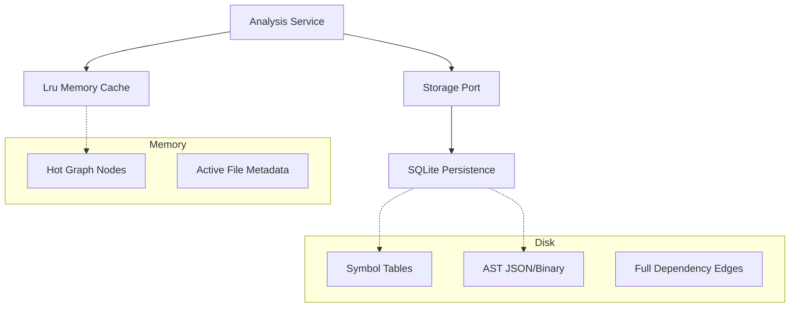

# Scalability & Memory Optimization Plan
# docs/plans/scalability-memory-optimization.md

This plan addresses memory constraints when analyzing massive codebases (e.g., >100,000 files) by transitioning from an all-in-memory model to a hybrid memory/disk approach.

## Objective
Reduce the RAM footprint of the `Graph` and MCP server by utilizing SQLite for cold data and implementing lazy-loading for AST nodes and symbol tables.

## Architecture Evolution

## Standards & Best Practices
- **LRU Caching:** Maintain only the most frequently accessed 10% of nodes in RAM.
- **Batch Processing:** When performing full-scan updates, use stream-processing or batched database writes.
- **Lazy Hydration:** Don't load file contents or full symbol lists until an operation (like hallucination detection) explicitly requests them.
- **Memory Profiling:** Regularly use `pprof` to identify heap allocations in the MCP server.

## Detailed Phase Breakdown

### Phase 1: Storage-backed Graph & Symbol Table
Modify the `internal/engine/graph` package to support disk-backed operations.

| Task | File | Description |
| :--- | :--- | :--- |
| Interface for Node Storage | `internal/engine/graph/storage.go` | Port for graph persistence. |
| SQLite Node Adapter | `internal/data/history/graph_storage.go` | Implementation of node persistence. |
| Persistent Symbol Table | `internal/engine/graph/symbol_table.go` | Move `UniversalSymbolTable` to SQLite to avoid full rebuilds. |

### Phase 2: Lazy Loading & Tainted Analysis
Update the MCP server and tools to request data incrementally.

| Task | File | Description |
| :--- | :--- | :--- |
| Paginated Tool Responses | `internal/mcp/tools/` | Implement limit/offset for large graph queries. |
| Tainted Secret Scanning | `internal/engine/secrets/detector.go` | Only scan changed lines (diff-based) or high-risk file types. |

### Phase 3: Resource Management
Implement better lifecycle management for heavy objects.

| Task | File | Description |
| :--- | :--- | :--- |
| Parser Pool | `internal/engine/parser/parser.go` | Recycle parser instances instead of creating new ones per file. |
| Connection Pooling | `internal/data/history/store.go` | Optimize SQLite connection usage for high-concurrency watch mode. |

## Do's and Don'ts

| DO | DONT |
| :--- | :--- |
| Use binary encoding (e.g., Gob or Protobuf) for AST storage. | Store raw text AST nodes in SQLite. |
| Implement `Close()` on all storage-backed engines. | Leak database connections in background watchers. |
| Prioritize memory over CPU speed for CLI "watch" mode. | Keep full symbol tables of the standard library in RAM. |

## New Files Purpose

| File | Purpose | Known Functions |
| :--- | :--- | :--- |
| `internal/engine/graph/lru.go` | Cache management for graph nodes. | `GetNode`, `EvictLeastRecent` |
| `internal/engine/graph/storage.go` | Port for disk-backed graph operations. | `SaveNode`, `LoadNode`, `QueryEdges` |

## Verification Plan
1. **Benchmark:** Run a scan on a simulated 100k-file repo. RAM usage should not exceed 1GB.
2. **Leak Test:** Monitor memory usage during 24 hours of "watch mode" with frequent file changes.
3. **Accuracy:** Verify that query results from a "cold" (disk-loaded) graph match the "hot" (memory-loaded) results.
