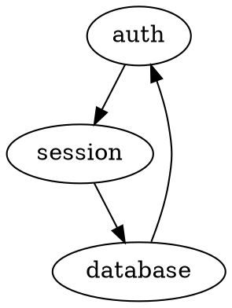
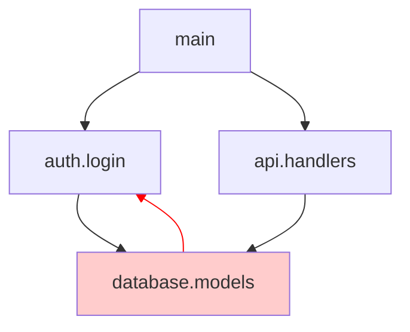

# Potential Upgrades for Code Dependency Monitor

Great! Let's explore enhancements that deepen the tool's insights while staying true to its mission: **understanding code structure, dependencies, and quality**.

---

## 🎯 Tier 1: Natural Extensions (High Value, Low Complexity)

### 1. **Unused Import Detection**
**What:** Flag imports that are never referenced in the file.

**Why:** Clean up dead weight, reduce parse time, clearer dependencies.

**Implementation:**
- During extraction, track which imports are actually used in references
- Mark unused imports
- Add to TSV output: `type=unused_import`
- Highlight in DOT with dashed edges

**Config:**
```toml
[analysis]
detect_unused_imports = true
```

**Output:**
```
⚠️  Unused imports (12):
   auth/login.py:3    - unused import 'hashlib'
   db/queries.go:8    - unused import 'strings'
```

---

### 2. **Dependency Depth Analysis**
**What:** Show how deep each module is in the dependency tree.

**Why:** Identify foundation vs. application layers, spot dependency inversion violations.

**Metrics:**
- **Depth:** Longest path from this module to a leaf (no dependencies)
- **Fan-in:** How many modules depend on this
- **Fan-out:** How many modules this depends on

**DOT Enhancement:**
```dot
// Color by depth
node [fillcolor="#e8f5e9"] // depth 0 (no deps)
node [fillcolor="#fff9c4"] // depth 1
node [fillcolor="#ffccbc"] // depth 2+
```

**Terminal Output:**
```
📊 Dependency Metrics:
   Core modules (depth 0):     auth.utils, db.connection
   Mid-layer (depth 1):        auth.login, api.handlers
   Top-layer (depth 2+):       main, cli

   High fan-in (widely used):
     - db.models (imported by 23 modules)
     - auth.utils (imported by 15 modules)
```

---

### 3. **Dead Code Detection (Unexported, Unreferenced)**
**What:** Find definitions that are never called anywhere.

**Why:** Identify code safe to delete.

**Logic:**
- Build reverse index: symbol → all references to it
- Find definitions with zero references
- Exclude entry points (main, tests, exported APIs)

**Config:**
```toml
[analysis]
detect_dead_code = true

# Don't flag these as dead
entry_points = ["main.py", "cmd/*/main.go"]
```

**Output:**
```
🗑️  Potential dead code (8 functions):
   auth/legacy.py:45   - function 'old_hash_password' (never called)
   utils/helpers.go:89 - function 'deprecatedFormat' (never called)
```

---

### 4. **Import Chain Visualization**
**What:** Show the path from Module A to Module B through imports.

**Why:** Understand transitive dependencies, debug "why does X depend on Y?"

**CLI:**
```bash
./circular --trace "main" "database.legacy"
```

**Output:**
```
Import chain: main → database.legacy

  main
    ↓ imports auth.login
  auth.login
    ↓ imports auth.session
  auth.session
    ↓ imports database.legacy
  database.legacy
```

**DOT Mode:** Highlight only this path, gray out others.

---

## 🔬 Tier 2: Deeper Analysis (Higher Value, Medium Complexity)

### 5. **Layered Architecture Validation**
**What:** Define architectural layers, enforce dependency rules.

**Why:** Prevent "presentation layer imports database directly" violations.

**Config:**
```toml
[architecture]
layers = [
    { name = "presentation", paths = ["ui/*", "cli/*"] },
    { name = "application",  paths = ["api/*", "handlers/*"] },
    { name = "domain",       paths = ["models/*", "entities/*"] },
    { name = "infrastructure", paths = ["db/*", "cache/*"] },
]

# Rules: layer can only depend on layers below it
rules = [
    { from = "presentation",   can_import = ["application"] },
    { from = "application",    can_import = ["domain"] },
    { from = "domain",         can_import = [] },  # No dependencies
    { from = "infrastructure", can_import = ["domain"] },
]
```

**Output:**
```
🏗️  Architecture violations (2):
   ui/dashboard.py:12 - presentation layer imports infrastructure.db
   api/users.go:34    - application layer imports infrastructure.cache
```

---

### 6. **Change Impact Analysis**
**What:** When a file changes, show what *might* break.

**Why:** Understand blast radius before refactoring.

**CLI:**
```bash
./circular --impact "auth/login.py"
```

**Output:**
```
📢 Impact Analysis: auth/login.py

Direct importers (3):
  - api/auth.py
  - cli/login_cmd.py
  - tests/test_auth.py

Transitive impact (8 modules):
  api/auth.py
    → api/users.py
    → api/sessions.py
  cli/login_cmd.py
    → cli/main.py

Exported symbols used externally (5):
  - authenticate() → used in api/auth.py:45, cli/login_cmd.py:23
  - validate_token() → used in api/sessions.py:67
```

---

### 7. **Complexity Metrics**
**What:** Cyclomatic complexity, function size, module size.

**Why:** Spot refactoring candidates.

**Metrics:**
- **Lines of code** per module/function
- **Cyclomatic complexity** (branches, loops)
- **Parameter count**
- **Nesting depth**

**Terminal Output:**
```
📏 Complexity Hotspots:

Top 5 most complex functions:
  1. auth/legacy.py:validate_user()        - complexity: 45, loc: 234
  2. db/migrations.go:RunMigration()       - complexity: 32, loc: 187
  3. api/handlers.py:handle_request()      - complexity: 28, loc: 156

Largest modules:
  1. database/models.py                    - 2,345 lines, 87 functions
  2. api/handlers.go                       - 1,892 lines, 45 functions
```

**DOT Enhancement:** Size nodes by LOC or complexity.

---

### 8. **API Surface Tracking**
**What:** What does this module expose to the outside world?

**Why:** Understand public contracts, plan deprecations.

**Analysis:**
- Exported functions/types
- Who uses each export
- Unused exports (candidates for removal)

**Output:**
```
📦 Module API: auth.login

Public exports (12):
  authenticate(username, password) → used by 5 modules
  validate_token(token)            → used by 3 modules
  create_session(user)             → used by 4 modules
  _internal_hash()                 → EXPORTED but never used externally

Private (23 symbols)
```

---

## 🚀 Tier 3: Advanced Features (High Complexity)

### 9. **Historical Trend Tracking**
**What:** Track metrics over time (Git commits).

**Why:** See if complexity is growing, dependencies are tightening.

**Implementation:**
- Store snapshots of graph + metrics in SQLite
- Associate with Git commit hash
- Generate trend charts

**CLI:**
```bash
./circular --history --since "2024-01-01"
```

**Output:**
```
📈 Trends (last 90 days):

Modules:        42 → 58  (+38%)
Circular deps:   3 → 1   (-67%) ✅
Avg complexity: 12 → 15  (+25%) ⚠️
Dead code:      45 → 23  (-49%) ✅
```

**TSV Export:**
```tsv
date          modules  cycles  avg_complexity  dead_code_funcs
2024-01-01    42       3       12.3            45
2024-02-01    48       2       13.1            38
2024-03-01    58       1       15.2            23
```

---

### 10. **Interactive TUI Mode**
**What:** Curses/Bubble Tea interface for exploration.

**Why:** Faster than regenerating DOT files, more interactive.

**Features:**
- Browse modules in tree view
- Jump to source (opens `$EDITOR`)
- Filter by metrics
- Expand/collapse import trees
- Search for symbols

**Libraries:**
- `github.com/charmbracelet/bubbletea`
- `github.com/charmbracelet/lipgloss`

**Demo:**
```
┌─ Code Dependency Monitor ────────────────────────────────┐
│ Modules (58)                          Filters: [cycles]  │
├──────────────────────────────────────────────────────────┤
│ ▼ api/                                                   │
│   ├─ handlers.py (287 loc, 12 funcs)                    │
│   │  Imports: auth.login, db.models                      │
│   │  Imported by: main, cli                              │
│   └─ users.py (145 loc, 8 funcs)                        │
│ ▼ auth/                                                  │
│   ├─ login.py (234 loc, 15 funcs) [CYCLE]              │
│   └─ session.py (123 loc, 7 funcs)                      │
│                                                           │
│ [j/k] navigate [enter] details [/] search [q] quit      │
└──────────────────────────────────────────────────────────┘
```

---

### 11. **Web Dashboard**
**What:** Local web server with interactive visualizations.

**Why:** Better than DOT for exploration, shareable with team.

**Tech Stack:**
- `net/http` + `embed` for frontend
- D3.js or Cytoscape.js for graph rendering
- Htmx for interactivity

**Features:**
- Interactive graph (zoom, pan, filter)
- Click module → see details panel
- Search + highlight
- Live updates (WebSocket)
- Export subgraphs

**Run:**
```bash
./circular --web --port 8080
# Opens http://localhost:8080
```

---

### 12. **External Dependency Analysis**
**What:** Track third-party packages (Go modules, PyPI packages).

**Why:** Understand external dependency weight, spot vulnerabilities.

**Implementation:**
- Parse `go.mod`, `requirements.txt`, `pyproject.toml`
- Fetch metadata from package registries
- Check for known vulnerabilities (OSV database)

**Output:**
```
📦 External Dependencies (42):

By language:
  Python: 28 packages
  Go:     14 packages

High-risk (outdated/vulnerable):
  ⚠️  requests==2.25.0 (2 years old, CVE-2023-xxxxx)
  ⚠️  golang.org/x/crypto v0.0.0-20210921 (update available)

Heavy dependencies (by import count):
  1. numpy → imported by 12 modules
  2. pandas → imported by 8 modules
```

---

### 13. **Refactoring Suggestions**
**What:** AI-assisted recommendations for improving structure.

**Why:** Automate code reviews, suggest Extract Module/Inline Module.

**Examples:**
- "Module `utils` has high fan-out (23 imports). Consider splitting."
- "Functions `hash_password()` in 3 modules. Extract to shared module?"
- "Circular dependency between `auth` and `session`. Introduce interface?"

**Implementation:**
- Pattern matching on graph structure
- Heuristics (e.g., fan-out > 20 → suggest split)
- Optional: LLM integration for natural language suggestions

---

## 🔧 Tier 4: Integrations & Workflows

### 14. **Git Pre-Commit Hook**
**What:** Run analysis before commit, block if violations.

**Why:** Prevent regressions (new cycles, architecture violations).

**Install:**
```bash
./circular --install-hook
```

**`.git/hooks/pre-commit`:**
```bash
#!/bin/bash
./circular --once --strict --quiet
if [ $? -ne 0 ]; then
    echo "❌ Dependency analysis failed. Commit blocked."
    exit 1
fi
```

---

### 15. **CI/CD Integration**
**What:** GitHub Actions / GitLab CI job.

**Why:** Track metrics over time, fail builds on violations.

**`.github/workflows/dependencies.yml`:**
```yaml
name: Dependency Analysis
on: [push, pull_request]

jobs:
  analyze:
    runs-on: ubuntu-latest
    steps:
      - uses: actions/checkout@v3
      - name: Run circular
        run: |
          ./circular --once --json > report.json
      - name: Upload artifact
        uses: actions/upload-artifact@v3
        with:
          name: dependency-report
          path: report.json
```

---

### 16. **LSP Server**
**What:** Language Server Protocol integration.

**Why:** Get warnings in editor (VSCode, Neovim) while typing.

**Features:**
- Hover over import → see module info
- Diagnostics for unused imports, hallucinations
- Code actions: "Remove unused import", "Add missing import"

**Neovim Example:**
```lua
-- Shows warning squiggle under unused import
-- Hover shows: "Import 'hashlib' is never used"
```

---

## 🎨 Visualization Enhancements

### 17. **Multiple DOT Output Modes**

**Current:** One big graph.

**Enhancements:**
```toml
[output.dot]
mode = "full"  # Options: full, cycles-only, hotspots, layers

# Cycles-only: Only show modules involved in cycles
# Hotspots: Only show high fan-in/fan-out modules
# Layers: Clustered by architecture layer
```

**Example - Cycles Only:**


**Example - Layers:**
```dot
digraph layers {
    subgraph cluster_presentation { ... }
    subgraph cluster_application { ... }
    subgraph cluster_domain { ... }
}
```

---

### 18. **Mermaid Diagram Export**
**What:** Export to Mermaid.js format (for Markdown/GitHub).

**Why:** Embed in README, issues, wikis.

```bash
./circular --format mermaid > architecture.md
```

**Output:**


---

## 🧪 Language-Specific Features

### 19. **Python: Type Hint Analysis**
**What:** Extract type annotations, find type mismatches.

**Why:** Improve type safety without running mypy.

**Example:**
```python
def authenticate(username: str, password: str) -> User:
    ...

# Call site:
authenticate(123, "pass")  # ⚠️ Type mismatch: expected str, got int
```

---

### 20. **Go: Interface Implementation Tracking**
**What:** Show which types implement which interfaces.

**Why:** Understand polymorphism, find missing methods.

**Output:**
```
🔌 Interfaces:

Handler interface (3 implementations):
  - HTTPHandler (api/http.go)
  - GRPCHandler (api/grpc.go)
  - MockHandler (tests/mocks.go)

Missing implementations:
  - WebSocketHandler declares Handler but missing HandleRequest()
```

---

## 📊 Recommended Priorities

Based on your profile (creative, detail-driven, perfectionist, researcher):

### **Quick Wins** (Implement First):
1. ✅ Unused import detection
2. ✅ Dependency depth metrics
3. ✅ Import chain tracing
4. ✅ Dead code detection

### **High Impact** (After Phase 7):
5. ✅ Layered architecture validation
6. ✅ Change impact analysis
7. ✅ Complexity metrics
8. ✅ Multiple DOT modes (cycles-only, layers)

### **Polish & Sharing** (If Going Public):
9. ✅ Interactive TUI
10. ✅ Git pre-commit hook
11. ✅ Mermaid export

### **Research Projects** (For Fun):
12. ✅ Historical trend tracking (with visualizations!)
13. ✅ Web dashboard with D3.js
14. ✅ Refactoring suggestions (pattern matching or LLM)

---

## 🤔 Questions for You:

1. **Which tier resonates most?** Natural extensions, deeper analysis, or advanced features?

2. **Visualization preference:** Stick with DOT/KGraphViewer, add TUI, or explore web dashboard?

3. **Metrics focus:** More interested in complexity, architecture validation, or change impact?

4. **Sharing plans:** Still personal, or might open-source / share with others?

5. **Language priority:** Equal Python/Go support, or focus one?

6. **IDE integration:** Would LSP server integration be valuable for your workflow?

Which of these sound exciting to you? Any I missed that align with your vision?