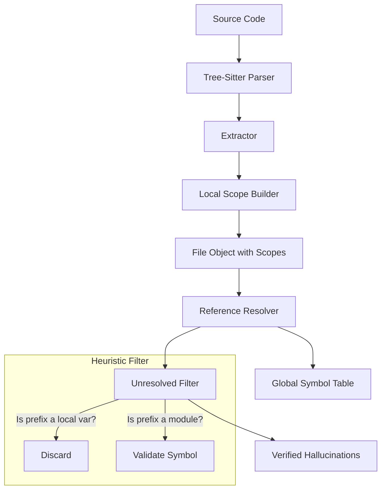

# Resolver Upgrades: Reducing Hallucination False Positives
# docs/resolver-upgrades.md

## Overview

The current implementation of the `ReferenceResolver` in `internal/resolver/resolver.go` suffers from a high volume of false positives (currently ~430+ in the `code-watch` project itself). This is primarily because the resolver cannot distinguish between a module-level function call and a method call on a variable or struct instance.

### The Problem

```go
// In Go extractor:
p.RegisterExtractor("go", &parser.GoExtractor{})
```

The resolver sees `p.RegisterExtractor`. It checks if `p` is a known module. Since `p` is a local variable, it fails the check and marks the reference as unresolved.

---

## Proposed Solutions

### 1. Local Scope Tracking (Short-term)

Implement a basic symbol table that tracks variables defined within the scope of a function or method. If a reference starts with an identifier that exists in the local scope, it should be ignored by the "Hallucination" detector.

#### Data Structure Change

Update `parser.File` to include local definitions or scope information.

```go
type Scope struct {
    Variables []string
    Parent    *Scope
}

type Definition struct {
    // ... existing fields
    Scope *Scope // Pointer to the scope where it's defined
}
```

### 2. Heuristic Filter for Selectors

Modify `resolveReference` to apply a heuristic: if a name contains a dot (e.g., `a.B`), only treat it as a module reference if `a` matches a known import alias or a fully qualified module name.

---

## Architectural Data Flow



---

## Implementation Plan

| Phase | Task | Description |
|:---|:---|:---|
| **Phase 1** | **Scope Extraction** | Update Go and Python extractors to track variable declarations (e.g., `var`, `:=`, `self.`, parameters). |
| **Phase 2** | **Resolver Logic** | Update `resolveReference` to check the local scope before attempting global module resolution. |
| **Phase 3** | **Exclusion List** | Add a configuration option to ignore specific high-noise prefixes (e.g., `self.`, `ctx.`). |

### Phase 1: Code Snippet (Go Extractor)

```go
func (e *GoExtractor) extractVariable(node *sitter.Node, source []byte, file *File) {
    // Logic to find 'short_var_declaration' or 'variable_declaration'
    // Add identifiers to the current function's scope
}
```

### Phase 2: Resolver Update

```go
func (r *Resolver) resolveReference(file *parser.File, ref parser.Reference) bool {
    // 0. Check Local Scope
    if r.isLocalVariable(file, ref) {
        return true // It's a method call or local var usage, not a module reference
    }
    
    // ... rest of resolution logic
}
```

---

## Best Practices & Standards

1.  **KISS Principle:** Avoid building a full type-checker. The goal is to reduce noise, not to prove correctness.
2.  **Language Neutrality:** Keep the scope tracking logic as generic as possible to support both Go and Python.
3.  **Efficiency:** Use hash maps for scope lookups to prevent performance degradation during large codebase scans.

## New Components Required

| File | Purpose | Known Functions |
|:---|:---|:---|
| `internal/parser/scope.go` | Manage hierarchical symbol tables. | `NewScope()`, `Scope.Add()`, `Scope.Exists()` |
| `internal/resolver/heuristics.go`| Pattern matching for common non-module prefixes. | `IsKnownNonModule(name string)` |

---

## DO's and DONT's

| DO | DONT |
|:---|:---|
| Track function parameters as local variables. | Don't attempt to resolve the actual type of a variable. |
| Handle `self` (Python) and `this` or receivers (Go) as special local cases. | Don't mark `fmt.Println` as unresolved if `fmt` is imported. |
| Use the Tree-Sitter `node-types.json` to identify declaration nodes. | Don't build a complex global pointer analysis. |
